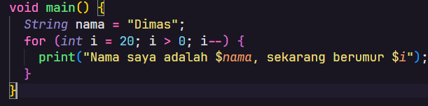
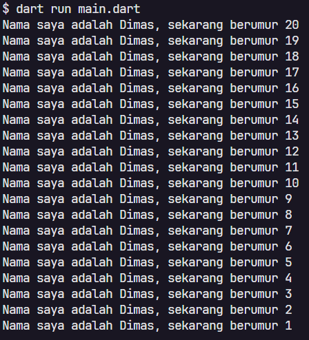
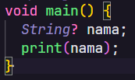
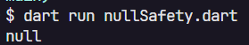
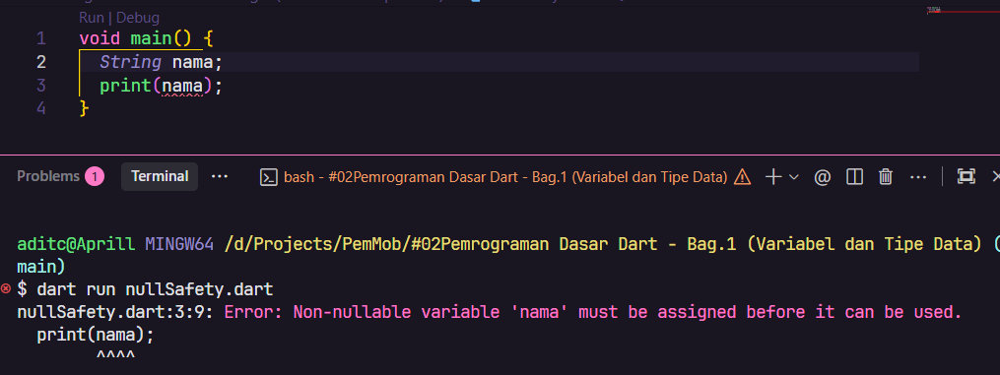
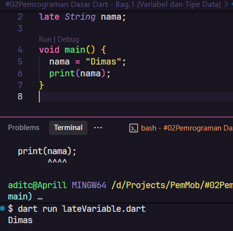
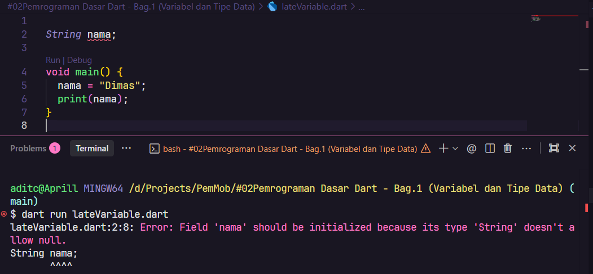
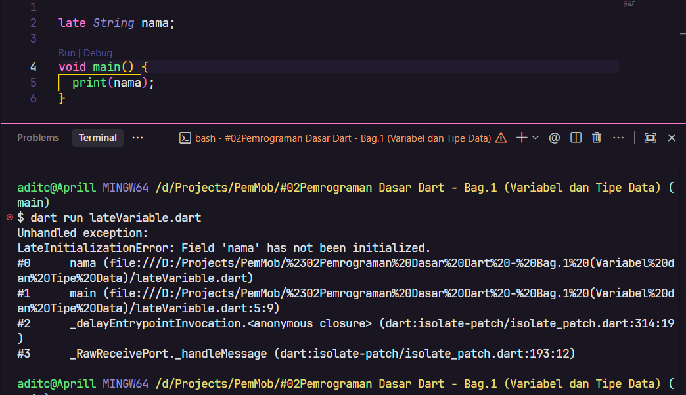

# Laporan Praktikum #02 - Pemrograman Dasar Dart - Bag.1 (Variabel dan Tipe Data)

## Identitas Mahasiswa

| Atribut | Nilai                   |
| ------- | ----------------------- |
| Nama    | Dimas Adit Thalia Putra |
| NIM     | 244107060037            |
| Kelas   | SIB-2E                  |

---

## Tugas Praktikum 2

### Soal 1

Modifikasilah kode pada baris 3 di VS Code atau Editor Code favorit Anda berikut ini agar mendapatkan keluaran (output) sesuai yang diminta!

```dart
void main() {
  for (int i = 0; i < 10; i++) {
    print("Hello ${i + 2}");
  }
}
```

**Jawaban:**





---

### Soal 2

Mengapa sangat penting untuk memahami bahasa pemrograman Dart sebelum kita menggunakan framework Flutter? Jelaskan!

**Jawaban:**

Belajar Dart sangat penting sebelum menggunakan Flutter karena Flutter dibangun menggunakan bahasa Dart.

Mengerti fitur unik dari dart memungkinkan untuk sepenuhnya memanfaatkan kekuatan dan fleksibilitas yang ditawarkan oleh Flutter yang dirancang khusus sesuai dengan cara kerja dart, sehingga kita dapat membuat aplikasi Flutter dengan lebih baik.

---

### Soal 3

Rangkumlah materi dari codelab ini menjadi poin-poin penting yang dapat Anda gunakan untuk membantu proses pengembangan aplikasi mobile menggunakan framework Flutter.

**Jawaban:**

Berikut adalah rangkuman materi dari codelab yang dapat digunakan untuk membantu proses pengembangan aplikasi mobile menggunakan framework Flutter:

1. **Variabel**
   - Variabel adalah wadah untuk menyimpan nilai.
   - Variabel dideklarasikan menggunakan kata kunci `var`, `final`, atau `const`.
   - Variabel dapat menyimpan nilai dari berbagai tipe data, seperti integer, double, string, boolean, dan lain-lain.

2. **Tipe Data**
   - Tipe data adalah jenis data yang dapat disimpan dalam variabel.
   - Tipe data pada Dart meliputi: `int`, `double`, `String`, `bool`, `List`, `Map`, dan lain-lain.

3. **Null Safety**
   - Null safety adalah fitur yang diperkenalkan pada Dart 2.0 yang memungkinkan pengembang untuk menentukan apakah suatu variabel dapat bernilai null atau tidak.
   - Null safety mencegah kesalahan yang diakibatkan oleh akses variabel yang tidak disengaja yang bernilai null.

4. **Late Variabel**
   - Late variabel adalah fitur yang memungkinkan pengembang untuk menunda inisialisasi variabel sampai variabel tersebut digunakan.
   - Late keyword adalah kontrak antara pengembang dan dart. pengembang memberitahu dart bahwa variabel tersebut akan diinisialisasi sebelum digunakan. Jika variabel tersebut tidak diinisialisasi sebelum digunakan, maka akan terjadi kesalahan runtime.

---

### Soal 4

Buatlah penjelasan dan contoh eksekusi kode tentang perbedaan Null Safety dan Late variabel!

**Jawaban:**

#### Null Safety

Null Safety adalah fitur yang diperkenalkan pada Dart 2.0 yang memungkinkan pengembang untuk menentukan apakah suatu variabel dapat bernilai null atau tidak.

Null safety mencegah kesalahan yang diakibatkan oleh akses variabel yang tidak disengaja yang bernilai null.

Sebagai contoh, jika sebuah method mengharapkan nilai integer tetapi menerima null, aplikasi akan mengalami runtime error. Jenis kesalahan ini, yang disebut null dereference error, dan bisa sulit untuk di debug.




Jika kode null safety dihilangkan, maka akan terjadi kesalahan compile karena variabel non-nullable tidak boleh tanpa nilai awal. Seperti hasil dibawah ini.



#### Late Variabel

Late Variabel adalah fitur yang memungkinkan pengembang untuk menunda inisialisasi variabel sampai variabel tersebut digunakan.

Late keyword adalah kontrak antara pengembang dan dart. pengembang memberitahu dart bahwa variabel tersebut akan diinisialisasi sebelum digunakan. Jika variabel tersebut tidak diinisialisasi sebelum digunakan, maka akan terjadi kesalahan runtime.



Jika late keyword dihilangkan, maka akan terjadi kesalahan compile karena tipe variabel 'String' tidak mengizinkan nilai null. Seperti hasil dibawah ini.



Jika variable tidak diinisialisasi setelah deklarasi late, maka akan terjadi kesalahan runtime. Seperti hasil dibawah ini.


