# Laporan Praktikum #04 Pemrograman Dasar Dart - Bag.3 (Collections dan Functions)

## Identitas Mahasiswa

| Atribut | Nilai                   |
| ------- | ----------------------- |
| Nama    | Dimas Adit Thalia Putra |
| NIM     | 244107060037            |
| Kelas   | SIB-2E                  |

---

## Praktikum 1: Menerapkan List dan Operasi Dasar

### Langkah 1

Ketik atau salin kode program berikut ke dalam fungsi `main()`.

```dart
void main() {
  var list = [1, 2, 3];
  assert(list.length == 3);
  assert(list[1] == 2);
  print(list.length);
  print(list[1]);

  list[1] = 1;
  assert(list[1] == 1);
  print(list[1]);
}
```

### Langkah 2

Silakan coba eksekusi (Run) kode pada langkah 1 tersebut. Apa yang terjadi? Jelaskan!

**Jawaban:**

Kode pada langkah 1 berhasil dieksekusi **tanpa error**. Berikut penjelasan tiap bagian kode:

- `var list = [1, 2, 3];` — Membuat sebuah **List** dengan tiga elemen bertipe `int`.
- `assert(list.length == 3);` — Memverifikasi bahwa panjang list adalah `3`. Karena benar, program tidak melempar exception.
- `assert(list[1] == 2);` — Memverifikasi bahwa elemen pada indeks ke-1 bernilai `2` (indeks list dimulai dari `0`). Kondisi ini benar, sehingga tidak ada error.
- `print(list.length);` — Mencetak panjang list, yaitu `3`.
- `print(list[1]);` — Mencetak nilai elemen indeks ke-1, yaitu `2`.
- `list[1] = 1;` — Mengubah nilai elemen pada indeks ke-1 menjadi `1`.
- `assert(list[1] == 1);` — Memverifikasi bahwa elemen indeks ke-1 kini bernilai `1`. Kondisi ini benar.
- `print(list[1]);` — Mencetak nilai elemen indeks ke-1 setelah diubah, yaitu `1`.

> **Apa itu `assert`?**
> `assert` adalah pernyataan bawaan Dart yang digunakan untuk **memverifikasi kondisi** selama pengembangan. Jika kondisi di dalam `assert(kondisi)` bernilai `false`, program akan melempar `AssertionError` dan berhenti. Jika kondisi bernilai `true`, program terus berjalan seperti biasa. `assert` hanya aktif di **mode debug** dan diabaikan di mode production.

Output yang dihasilkan:

```
3
2
1
```

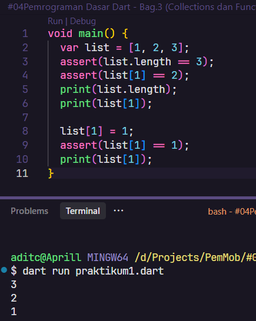

### Langkah 3

Ubah kode pada langkah 1 menjadi variabel final yang mempunyai index = 5 dengan default value = null. Isilah nama dan NIM Anda pada elemen index ke-1 dan ke-2. Lalu print dan capture hasilnya.

Apa yang terjadi ? Jika terjadi error, silakan perbaiki.

**Jawaban:**

Kode di atas mengalami **error** saat dieksekusi:

```
Error: A value of type 'String' can't be assigned to a variable of type 'Null'.
```

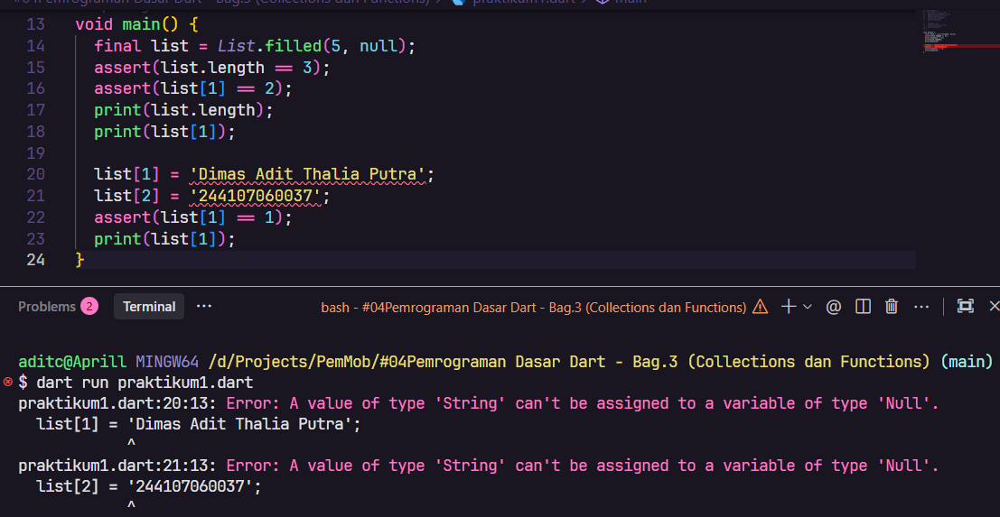

Hal ini terjadi karena `List.filled(5, null)` tanpa tipe eksplisit menyebabkan Dart menginferensi tipe list menjadi `List<Null>`. Akibatnya, elemen-elemen dalam list hanya dapat menyimpan nilai `null`, sehingga ketika mencoba mengisinya dengan `String`, Dart langsung menolaknya.

Berikut kode yang sudah diperbaiki dengan mendeklarasikan tipe `List<String?>` secara eksplisit:

```dart
void main() {
  final List<String?> list = List.filled(5, null);
  assert(list.length == 5);
  assert(list[1] == null);
  print(list.length);
  print(list[1]);

  list[1] = 'Dimas Adit Thalia Putra';
  list[2] = '244107060037';
  assert(list[1] == 'Dimas Adit Thalia Putra');
  assert(list[2] == '244107060037');
  print(list[1]);
  print(list[2]);
}
```

Dengan mendeklarasikan tipe secara eksplisit, Dart mengetahui bahwa list boleh menyimpan nilai `String` maupun `null`, sehingga assignment String berhasil tanpa error. Tipe yang dapat digunakan antara lain:

- **`List<String?>`** digunakan jika semua elemen pasti bertipe `String` atau `null`. Ini tipe yang paling tepat untuk kasus ini.
- **`List<Object?>`** adalah alternatif jika elemen bisa bertipe apa saja (int, String, dll.) atau `null`. `Object` adalah tipe dasar semua objek di Dart.

Output setelah diperbaiki:

```
5
null
Dimas Adit Thalia Putra
244107060037
```

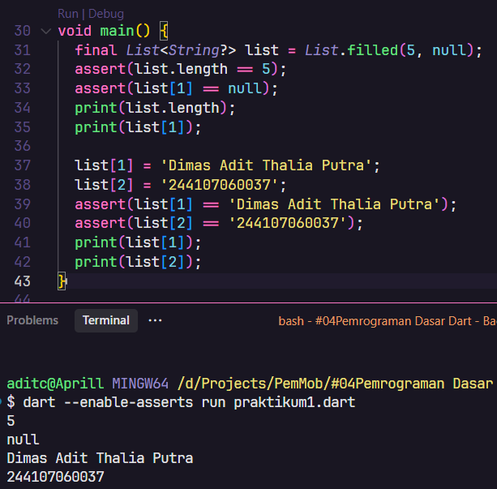

---

## Praktikum 2: Eksperimen Tipe Data Set

### Langkah 1

Ketik atau salin kode program berikut ke dalam fungsi `main()`.

```dart
void main() {
  var halogens = {'fluorine', 'chlorine', 'bromine', 'iodine', 'astatine'};
  print(halogens);
}
```

### Langkah 2

Silakan coba eksekusi (Run) kode pada langkah 1 tersebut. Apa yang terjadi? Jelaskan! Lalu perbaiki jika terjadi error.

**Jawaban:**

Waktu kode ini dijalankan, tidak ada error sama sekali. Dart mengenali `{'fluorine', 'chlorine', 'bromine', 'iodine', 'astatine'}` sebagai sebuah **Set**, bukan Map, karena isinya hanya berupa nilai-nilai tanpa pasangan key-value. Karena semua elemennya bertipe `String`, Dart otomatis menginferensi tipenya menjadi `Set<String>` tanpa perlu ditulis secara eksplisit.

Set dibandingkan dengan List, Set tidak boleh punya elemen duplikat. Kalau ada dua nilai yang sama, yang kedua otomatis diabaikan. Selain itu, urutan elemennya tidak selalu sesuai dengan urutan saat ditambahkan, berbeda dengan List yang menjaga urutannya.

Output yang dihasilkan:

```
{fluorine, chlorine, bromine, iodine, astatine}
```

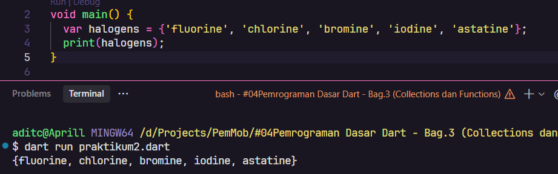

### Langkah 3

Tambahkan kode program berikut, lalu coba eksekusi (Run) kode Anda.

```dart
var names1 = <String>{};
Set<String> names2 = {}; // This works, too.
var names3 = {}; // Creates a map, not a set.

print(names1);
print(names2);
print(names3);
```

Apa yang terjadi ? Jika terjadi error, silakan perbaiki namun tetap menggunakan ketiga variabel tersebut. Tambahkan elemen nama dan NIM Anda pada kedua variabel Set tersebut dengan dua fungsi berbeda yaitu `.add()` dan `.addAll()`. Untuk variabel Map dihapus, nanti kita coba di praktikum selanjutnya.

**Jawaban:**

Kode awal berjalan tanpa error, namun terdapat perbedaan pada ketiga variabel tersebut:

- `var names1 = <String>{};` — Membuat **Set kosong** bertipe `Set<String>` menggunakan sintaks type annotation eksplisit `<String>`.
- `Set<String> names2 = {};` — Cara lain membuat **Set kosong** bertipe `Set<String>` dengan deklarasi tipe pada variabelnya.
- `var names3 = {};` — Ini **bukan Set**, melainkan **Map kosong** (`Map<dynamic, dynamic>`). Karena tidak ada type annotation, Dart menginferensi `{}` kosong sebagai Map.

Pada instruksi, `names3` (Map) dihapus. Elemen nama dan NIM ditambahkan ke `names1` menggunakan `.add()` dan ke `names2` menggunakan `.addAll()`:

```dart
void main() {
  var names1 = <String>{};
  Set<String> names2 = {};

  names1.add('Dimas Adit Thalia Putra');
  names1.add('244107060037');

  names2.addAll(['Dimas Adit Thalia Putra', '244107060037']);

  print("ini names1");
  print(names1);
  print("ini names2");
  print(names2);
}
```

Output yang dihasilkan:

```
ini names1
{Dimas Adit Thalia Putra, 244107060037}
ini names2
{Dimas Adit Thalia Putra, 244107060037}
```

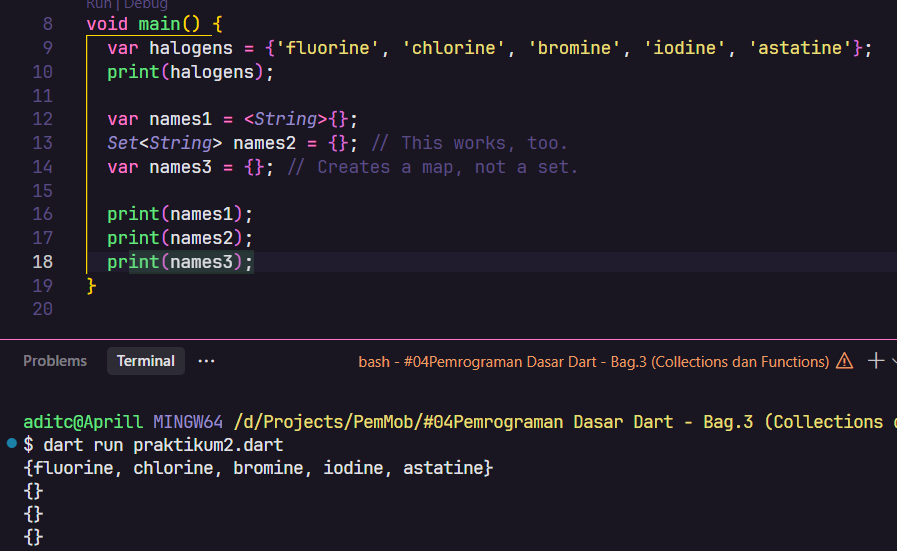

---

## Praktikum 3: Eksperimen Tipe Data Maps

### Langkah 1

Ketik atau salin kode program berikut ke dalam fungsi `main()`.

```dart
void main() {
  var gifts = {
    // Key:    Value
    'first': 'partridge',
    'second': 'turtledoves',
    'fifth': 1
  };

  var nobleGases = {
    2: 'helium',
    10: 'neon',
    18: 2,
  };

  print(gifts);
  print(nobleGases);
}
```

### Langkah 2

Silakan coba eksekusi (Run) kode pada langkah 1 tersebut. Apa yang terjadi? Jelaskan! Lalu perbaiki jika terjadi error.

**Jawaban:**

> **Pada dokumentasi Dart ([dart.dev/language/collections#maps](https://dart.dev/language/collections#maps)), dijelaskan bahwa Map adalah:**
> _"In a map, each element is a key-value pair. Each key within a pair is associated with a value, and both keys and values can be any type of object. Each key can occur only once, although the same value can be associated with multiple different keys. Dart support for maps is provided by map literals and the Map type."_

Waktu kode ini dijalankan, tidak ada error, tapi ada sesuatu yang menarik dan perlu diperhatikan. Dart mengenali literal `{key: value, ...}` sebagai **Map**, dan tipe tiap Map diinferensi dari isinya.

Pada variabel `gifts`, key-nya semua `String`, tapi value-nya terdapat campuran. Ada `'partridge'` (String) dan ada `1` (int). Karena ada dua tipe berbeda di value, Dart menginferensi tipenya menjadi `Map<String, Object>`, bukan `Map<String, String>`. Ini yang nanti bisa jadi masalah kalau suata saat mencoba assign value dengan tipe yg berbeda.

Hal serupa terjadi pada `nobleGases`, key-nya `int`, tapi value-nya campuran `String` dan `int`, sehingga tipenya menjadi `Map<int, Object>`.

Output yang dihasilkan:

```
{first: partridge, second: turtledoves, fifth: 1}
{2: helium, 10: neon, 18: 2}
```

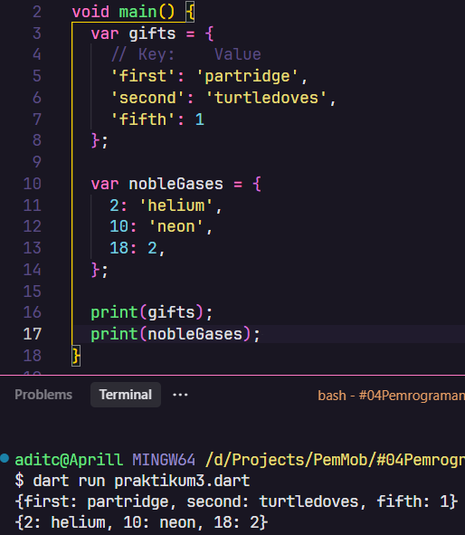

### Langkah 3

Tambahkan kode program berikut, lalu coba eksekusi (Run) kode Anda.

```dart
var mhs1 = Map<String, String>();
gifts['first'] = 'partridge';
gifts['second'] = 'turtledoves';
gifts['fifth'] = 'golden rings';

var mhs2 = Map<int, String>();
nobleGases[2] = 'helium';
nobleGases[10] = 'neon';
nobleGases[18] = 'argon';
```

Apa yang terjadi ? Jika terjadi error, silakan perbaiki. Tambahkan elemen nama dan NIM Anda pada tiap variabel di atas (`gifts`, `nobleGases`, `mhs1`, dan `mhs2`).

**Jawaban:**

Kode berjalan tanpa error. Mengganti value `gifts['fifth']` dari `1` (int) menjadi `'golden rings'` (String), dan `nobleGases[18]` dari `2` (int) menjadi `'argon'` (String). Karena tipe Map-nya sudah `Map<String, Object>` dan `Map<int, Object>` (diinferensi dari Langkah 1), assignment String ke value tetap berhasil dan valid.

`mhs1` dan `mhs2` dideklarasikan menggunakan konstruktor `Map<K, V>()`, ini merupakan cara alternatif membuat Map selain secara literal. Tipe key dan value-nya sudah ditentukan secara eksplisit, sehingga lebih aman dibanding Map yang tipenya diinferensi otomatis dari literal campuran.

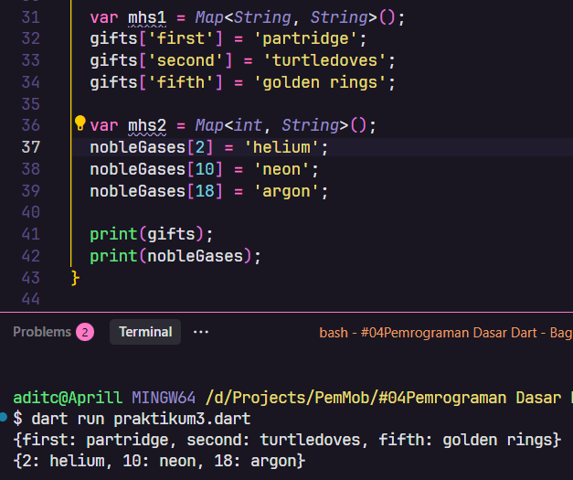

Berikut kode lengkap setelah ditambahkan nama dan NIM:

```dart
void main() {
  var gifts = {
    // Key:    Value
    'first': 'partridge',
    'second': 'turtledoves',
    'fifth': 1,
    'nama': 'Dimas Adit Thalia Putra',
    'nim': '244107060037',
  };

  var nobleGases = {
    2: 'helium',
    10: 'neon',
    18: 'argon',
    'nama': 'Dimas Adit Thalia Putra',
    'nim': '244107060037',
  };

  gifts['first'] = 'partridge';
  gifts['second'] = 'turtledoves';
  gifts['fifth'] = 'golden rings';

  nobleGases[2] = 'helium';
  nobleGases[10] = 'neon';
  nobleGases[18] = 'argon';

  var mhs1 = Map<String, String>();
  mhs1['nama'] = "Dimas Adit Thalia Putra";
  mhs1['nim'] = "244107060037";

  var mhs2 = Map<int, String>();
  mhs2[1] = "Dimas Adit Thalia Putra";
  mhs2[2] = "244107060037";

  print("ini variabel gifts");
  print(gifts);
  print("ini variabel nobleGases");
  print(nobleGases);
  print("ini variabel mhs1");
  print(mhs1);
  print("ini variabel mhs2");
  print(mhs2);
}
```

Output yang dihasilkan:

```
ini variabel gifts
{first: partridge, second: turtledoves, fifth: golden rings, nama: Dimas Adit Thalia Putra, nim: 244107060037}
ini variabel nobleGases
{2: helium, 10: neon, 18: argon, nama: Dimas Adit Thalia Putra, nim: 244107060037}
ini variabel mhs1
{nama: Dimas Adit Thalia Putra, nim: 244107060037}
ini variabel mhs2
{1: Dimas Adit Thalia Putra, 2: 244107060037}
```

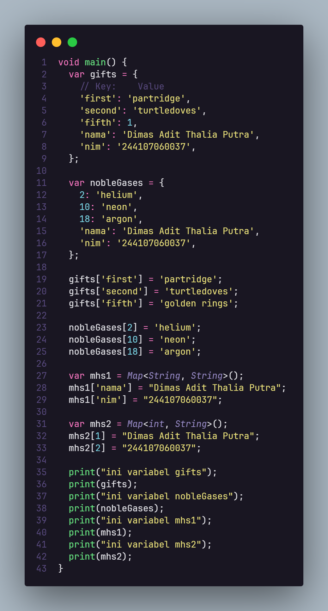
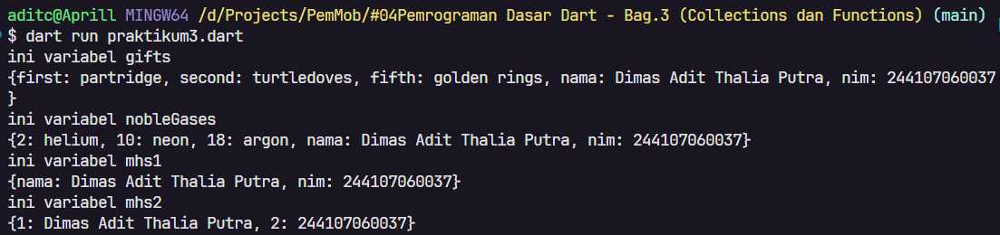

---

## Praktikum 4: Eksperimen Tipe Data List: Spread dan Control-flow Operators

### Langkah 1

Ketik atau salin kode program berikut ke dalam fungsi `main()`.

```dart
var list = [1, 2, 3];
var list2 = [0, ...list];
print(list1);
print(list2);
print(list2.length);
```

### Langkah 2

Silakan coba eksekusi (Run) kode pada langkah 1 tersebut. Apa yang terjadi? Jelaskan! Lalu perbaiki jika terjadi error.

**Jawaban:**

Saat dijalankan, terjadi compile error:

```
Error: Undefined name 'list1'.
```

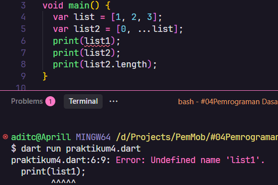

Penyebabnya adalah di baris `print(list1)`, nama variabel yang ditulis adalah `list1`, padahal tidak ada variabel yang dideklarasikan bernama `list1`.

Selain itu, pada syntax `[0, ...list]` menggunakan **Spread Operator** (`...`). Operator ini "membuka" isi list dan memasukkan semua elemennya ke dalam list baru secara berurutan. Jadi `[0, ...list]` hasilnya adalah `[0, 1, 2, 3]`, bukan nested list.

> Spread operators evaluate an expression that yields a collection, unpacks the resulting values, and inserts them into another collection.
>
> The spread operator isn't actually an operator expression. The `.../...?` syntax is part of the collection literal itself. So, you can learn more about spread operators on the Collections page.
>
> Because it isn't an operator, the syntax doesn't have any "operator precedence". Effectively, it has the lowest "precedence" — any kind of expression is valid as the spread target.
>
> — _Sumber: [dart.dev/language/operators#spread-operators](https://dart.dev/language/operators#spread-operators)_

Setelah diperbaiki (`list1` → `list`):

```dart
void main() {
  var list = [1, 2, 3];
  var list2 = [0, ...list];
  print(list);
  print(list2);
  print(list2.length);
}
```

Output:

```
[1, 2, 3]
[0, 1, 2, 3]
4
```

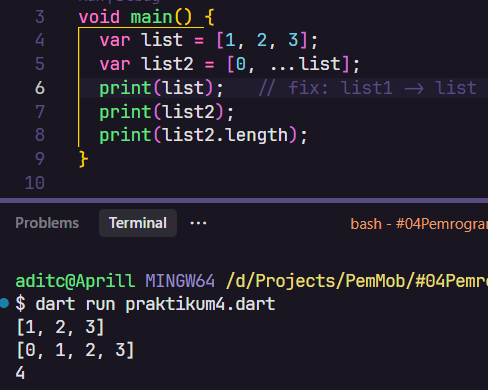

### Langkah 3

Tambahkan kode program berikut, lalu coba eksekusi (Run) kode Anda.

```dart
list1 = [1, 2, null];
print(list1);
var list3 = [0, ...?list1];
print(list3.length);
```

Apa yang terjadi ? Jika terjadi error, silakan perbaiki. Tambahkan variabel list berisi NIM Anda menggunakan Spread Operators.

**Jawaban:**

Kode tersebut punya dua masalah.

1. Variabel list bernama `list1` tidak terdefinisi sama seperti sebelumnya, harusnya `list`.
2. Jika kita assign `[1, 2, null]` ke variabel `list` yang sudah ada (bertipe `List<int>`), Dart akan error karena `null` tidak bisa masuk ke `List<int>`.

Solusinya adalah ubah tipe variabelnya menjadi `List<int?>` atau mendeklarasikan variabel list1.

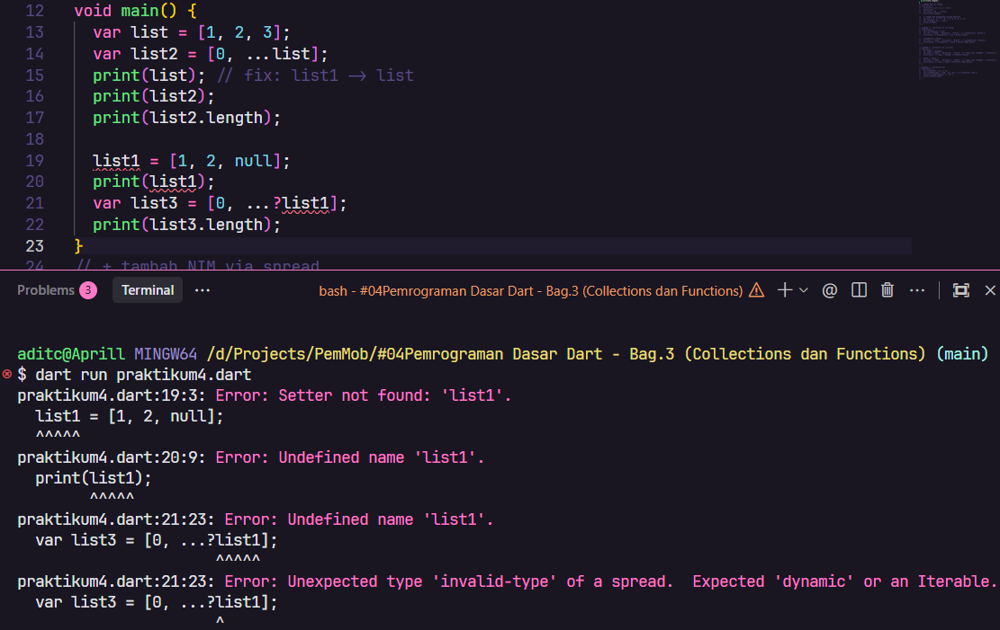

Di sini juga diperkenalkan **Null-aware Spread Operator** (`...?`). Bedanya dengan `...` biasa, kalau list-nya bernilai `null`, `...?` akan diabaikan (tidak throw error), sedangkan `...` biasa akan crash.

Setelah diperbaiki dan ditambahkan variabel NIM menggunakan Spread Operator:

```dart
void main() {
  var list = [1, 2, 3];
  var list2 = [0, ...list];
  print(list);
  print(list2);
  print(list2.length);

  var list1 = [1, 2, null];
  print(list1);
  var list3 = [0, ...?list1];
  print(list3.length);

  var charNIM = [2, 4, 4, 1, 0, 7, 0, 6, 0, 0, 3, 7];
  var nim = [...charNIM];
  print(nim);
}
```

Output:

```
[1, 2, 3]
[0, 1, 2, 3]
4
[1, 2, null]
4
[2, 4, 4, 1, 0, 7, 0, 6, 0, 0, 3, 7]
```

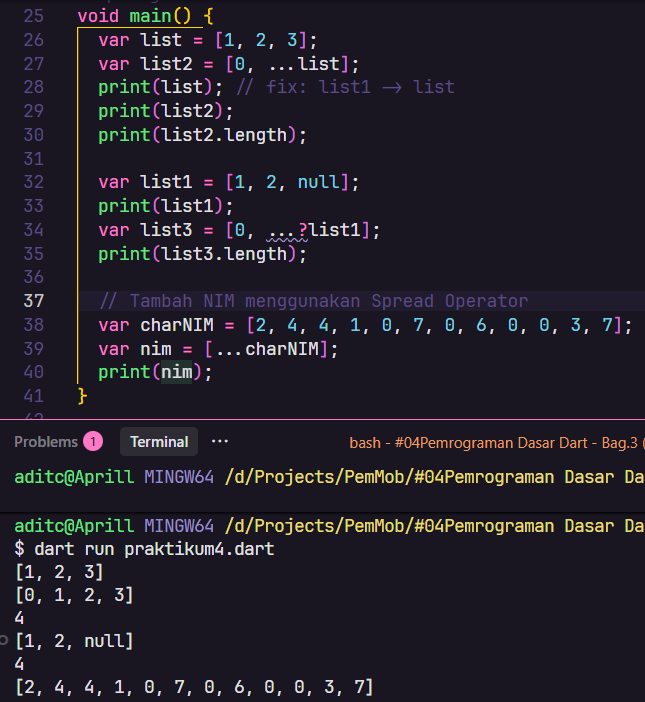

### Langkah 4

Tambahkan kode program berikut, lalu coba eksekusi (Run) kode Anda.

```dart
var nav = ['Home', 'Furniture', 'Plants', if (promoActive) 'Outlet'];
print(nav);
```

Apa yang terjadi ? Jika terjadi error, silakan perbaiki. Tunjukkan hasilnya jika variabel `promoActive` ketika `true` dan `false`.

**Jawaban:**

Kode error karena `promoActive` belum dideklarasikan.

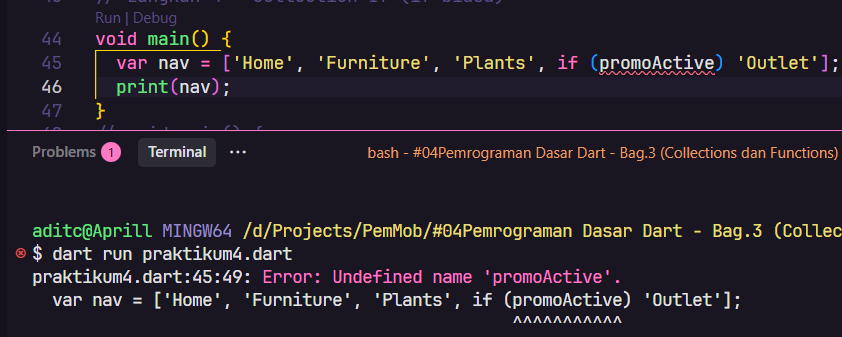

Setelah ditambahkan deklarasi variabelnya, kode berjalan dengan baik.

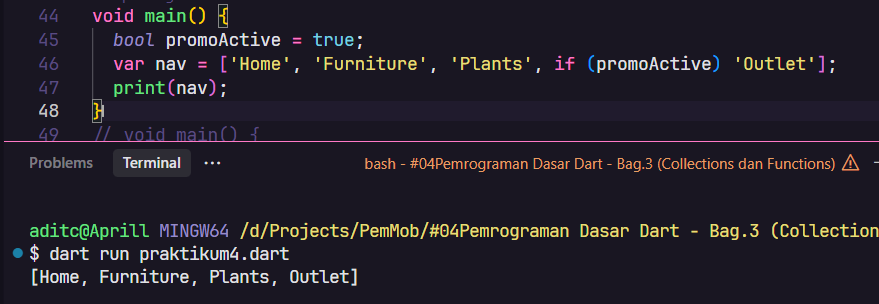

Fitur yang digunakan di sini adalah **Collection If** dimana kita bisa menyisipkan elemen ke dalam list secara kondisional langsung di dalam literal list. Kalau kondisinya `true`, elemen ditambahkan; kalau `false`, elemen dilewati begitu saja tanpa error.

> _"The collection-if feature allows you to conditionally include an element in a Dart collection. This is particularly useful when you want to include or exclude items based on some condition without having to write verbose code."_
>
> — _Sumber: [devalimaher.medium.com — Collection If and Collection For in Dart](https://devalimaher.medium.com/collection-if-and-collection-for-in-dart-f844a752459f)_

```dart
void main() {
  bool promoActive = true;
  var nav = ['Home', 'Furniture', 'Plants', if (promoActive) 'Outlet'];
  print(nav); // promoActive = true

  promoActive = false;
  var nav2 = ['Home', 'Furniture', 'Plants', if (promoActive) 'Outlet'];
  print(nav2); // promoActive = false
}
```

Output saat `promoActive = true`:

```
[Home, Furniture, Plants, Outlet]
```

Output saat `promoActive = false`:

```
[Home, Furniture, Plants]
```

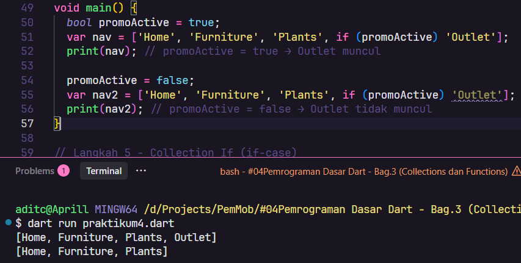

### Langkah 5

Tambahkan kode program berikut, lalu coba eksekusi (Run) kode Anda.

```dart
var nav2 = ['Home', 'Furniture', 'Plants', if (login case 'Manager') 'Inventory'];
print(nav2);
```

Apa yang terjadi ? Jika terjadi error, silakan perbaiki. Tunjukkan hasilnya jika variabel `login` mempunyai kondisi lain.

**Jawaban:**

Terjadi error karena `login` belum dideklarasikan dan diinisialisasi.

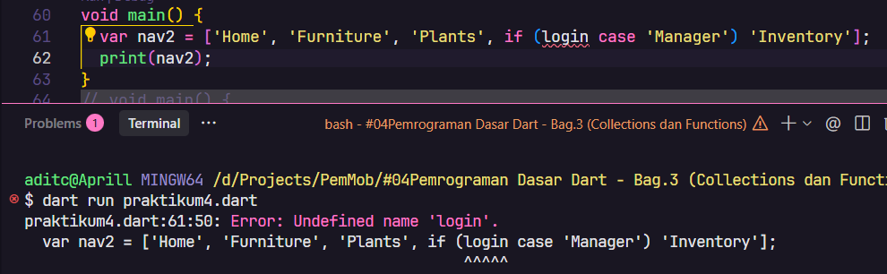

Setelah ditambahkan, kode berjalan normal.

Yang menarik di sini adalah penggunaan **`if-case`** di dalam Collection If. Berbeda dengan `if` biasa yang mengecek nilai boolean, `if (login case 'Manager')` menggunakan **pattern matching**, yang membuat elemen `'Inventory'` hanya akan ditambahkan jika nilai `login` persis cocok dengan string `'Manager'`.

```dart
void main() {
  var login = 'Manager';
  var nav2 = ['Home', 'Furniture', 'Plants', if (login case 'Manager') 'Inventory'];
  print(nav2);

  login = 'Staff';
  var nav3 = ['Home', 'Furniture', 'Plants', if (login case 'Manager') 'Inventory'];
  print(nav3);
}
```

Output saat `login = 'Manager'`:

```
[Home, Furniture, Plants, Inventory]
```

Output saat `login = 'Staff'`:

```
[Home, Furniture, Plants]
```

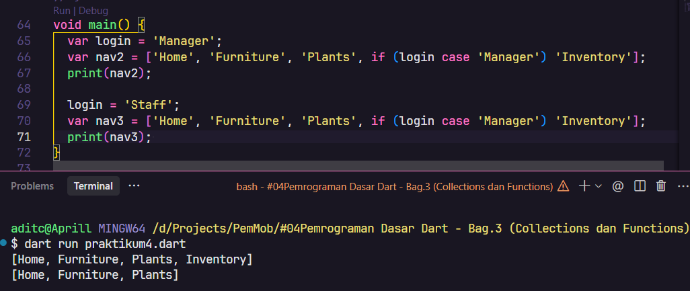

### Langkah 6

Tambahkan kode program berikut, lalu coba eksekusi (Run) kode Anda.

```dart
var listOfInts = [1, 2, 3];
var listOfStrings = ['#0', for (var i in listOfInts) '#$i'];
assert(listOfStrings[1] == '#1');
print(listOfStrings);
```

Apa yang terjadi ? Jika terjadi error, silakan perbaiki. Jelaskan manfaat Collection For dan dokumentasikan hasilnya.

**Jawaban:**

Kode ini berjalan baik tanpa error. Fitur yang digunakan adalah **Collection For**,dimana kita bisa mengisi elemen list secara otomatis menggunakan perulangan `for` langsung di dalam literal list.

Manfaat Collection for sangat berguna ketika ingin membuat list baru berdasarkan elemen dari list lain, tanpa perlu menulis loop terpisah di luar.

Pada contoh ini, `for (var i in listOfInts) '#$i'` akan menghasilkan `'#1'`, `'#2'`, `'#3'` secara berurutan, lalu digabungkan dengan elemen pertama `'#0'`, sehingga hasilnya adalah `['#0', '#1', '#2', '#3']`.

Fungsi `assert(listOfStrings[1] == '#1')` pada kode tersebut bertugas memverifikasi bahwa elemen di indeks ke-1 dari `listOfStrings` bernilai `'#1'`. Kalau kondisi ini tidak terpenuhi, program akan melempar `AssertionError` di mode debug. Karena Collection For menghasilkan elemen secara berurutan mulai dari `'#1'`, kondisi ini benar dan program berjalan normal.

> _"The collection-for feature enables you to insert multiple elements into a collection. It is especially useful when you want to include elements from another collection or generate a series of elements dynamically."_
>
> — _Sumber: [devalimaher.medium.com — Collection If and Collection For in Dart](https://devalimaher.medium.com/collection-if-and-collection-for-in-dart-f844a752459f)_

Output:

```
[#0, #1, #2, #3]
```

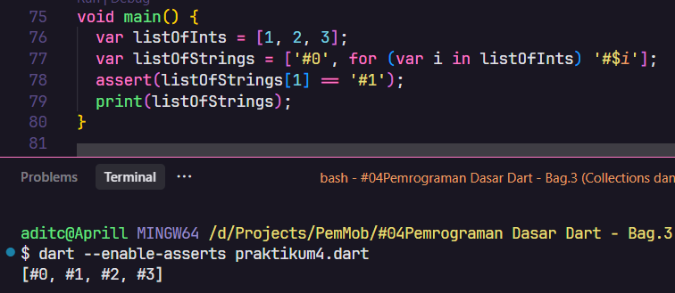

---

## Praktikum 5: Eksperimen Tipe Data Records

> **Catatan:** Tipe data Records mulai diperkenalkan pada Dart versi 3.0. Pastikan sudah setup menggunakan Dart 3.0 atau yang lebih baru.

### Langkah 1

Ketik atau salin kode program berikut ke dalam fungsi `main()`.

```dart
var record = ('first', a: 2, b: true, 'last');
print(record)
```

### Langkah 2

Silakan coba eksekusi (Run) kode pada langkah 1 tersebut. Apa yang terjadi? Jelaskan! Lalu perbaiki jika terjadi error.

**Jawaban:**

Kode ini mengalami error saat kompilasi karena ada **semicolon (`;`) yang hilang** di baris `print(record)`. Setelah ditambahkan, kode berjalan normal.

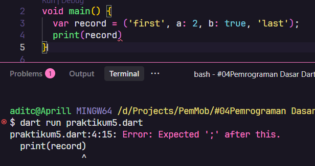

Record di Dart adalah tipe data yang bisa menyimpan beberapa nilai dengan tipe berbeda secara bersamaan, mirip tuple. Record bisa punya field **positional** (berurutan tanpa nama) dan field **named** (dengan nama). Pada contoh ini, `'first'` dan `'last'` adalah positional fields, sedangkan `a: 2` dan `b: true` adalah named fields.

Saat di-print, Dart menampilkan named fields setelah semua positional fields, terlepas dari urutan penulisannya di kode. Jadi meskipun `a: 2` ditulis di tengah, outputnya tetap menampilkan positional fields lebih dulu.

```dart
void main() {
  var record = ('first', a: 2, b: true, 'last');
  print(record);
}
```

Output:

```
(first, last, a: 2, b: true)
```

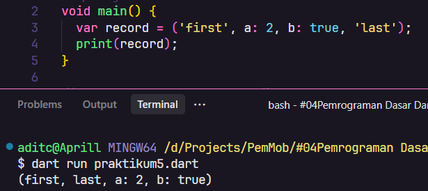

### Langkah 3

Tambahkan kode program berikut di luar scope `void main()`, lalu coba eksekusi (Run) kode Anda.

```dart
(int, int) tukar((int, int) record) {
  var (a, b) = record;
  return (b, a);
}
```

Apa yang terjadi ? Jika terjadi error, silakan perbaiki. Gunakan fungsi `tukar()` di dalam `main()` sehingga tampak jelas proses pertukaran value field di dalam Records.

**Jawaban:**

Kode ini berjalan tanpa error. Fungsi `tukar()` menerima sebuah Record bertipe `(int, int)` dan mengembalikan Record baru dengan posisi elemen yang dibalik menggunakan **destructuring** — `var (a, b) = record` artinya kita "membongkar" isi record ke dalam dua variabel terpisah `a` dan `b`, lalu dikembalikan dalam urutan terbalik `(b, a)`.

```dart
(int, int) tukar((int, int) record) {
  var (a, b) = record;
  return (b, a);
}

void main() {
  var before = (10, 20);
  print('Sebelum tukar: $before');
  var after = tukar(before);
  print('Sesudah tukar: $after');
}
```

Output:

```
Sebelum tukar: (10, 20)
Sesudah tukar: (20, 10)
```

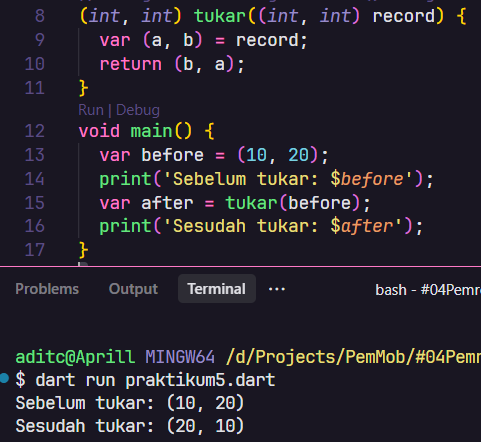

### Langkah 4

Tambahkan kode program berikut di dalam scope `void main()`, lalu coba eksekusi (Run) kode Anda.

```dart
// Record type annotation in a variable declaration:
(String, int) mahasiswa;
print(mahasiswa);
```

Apa yang terjadi ? Jika terjadi error, silakan perbaiki. Inisialisasi field nama dan NIM Anda pada variabel record `mahasiswa` di atas.

**Jawaban:**

Kode ini error karena variabel `mahasiswa` dideklarasikan tapi belum diinisialisasi, kemudian langsung di-print.

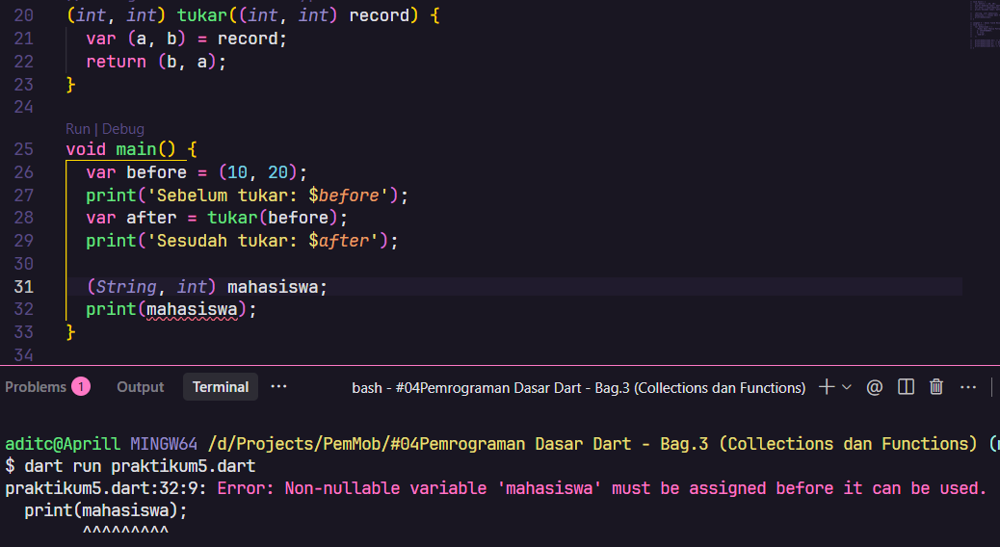

Setelah ditambahkan inisialisasi dengan nama dan NIM:

```dart
void main() {
  (String, int) mahasiswa;
  mahasiswa = ('Dimas Adit Thalia Putra', 244107060037);
  print(mahasiswa);
}
```

Output:

```
(Dimas Adit Thalia Putra, 244107060037)
```

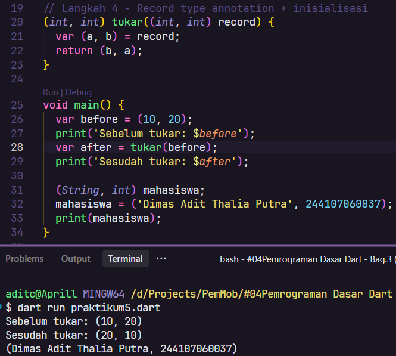

### Langkah 5

Tambahkan kode program berikut di dalam scope `void main()`, lalu coba eksekusi (Run) kode Anda.

```dart
var mahasiswa2 = ('first', a: 2, b: true, 'last');

print(mahasiswa2.$1); // Prints 'first'
print(mahasiswa2.a);  // Prints 2
print(mahasiswa2.b);  // Prints true
print(mahasiswa2.$2); // Prints 'last'
```

Apa yang terjadi ? Jika terjadi error, silakan perbaiki. Gantilah salah satu isi record dengan nama dan NIM Anda, lalu dokumentasikan hasilnya.

**Jawaban:**

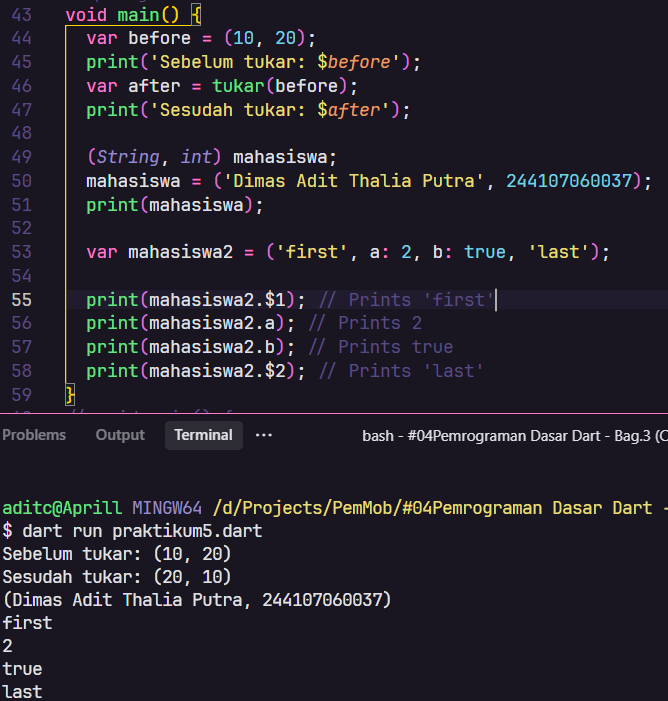

Kode ini berjalan tanpa error. Kode digunakan untuk mengakses field di dalam Record:

- **`.$1`, `.$2`, dst.** untuk mengakses positional fields berdasarkan urutan (index mulai dari 1)
- **`.namaField`** untuk mengakses named fields langsung dengan namanya

Setelah mengganti isi record dengan nama dan NIM:

```dart
void main() {
  var mahasiswa2 = ('Dimas Adit Thalia Putra', a: 244107060037, b: true, 'SIB-2E');

  print(mahasiswa2.$1); // nama
  print(mahasiswa2.a);  // NIM
  print(mahasiswa2.b);  // status aktif
  print(mahasiswa2.$2); // kelas
}
```

Output:

```
Dimas Adit Thalia Putra
244107060037
true
SIB-2E
```

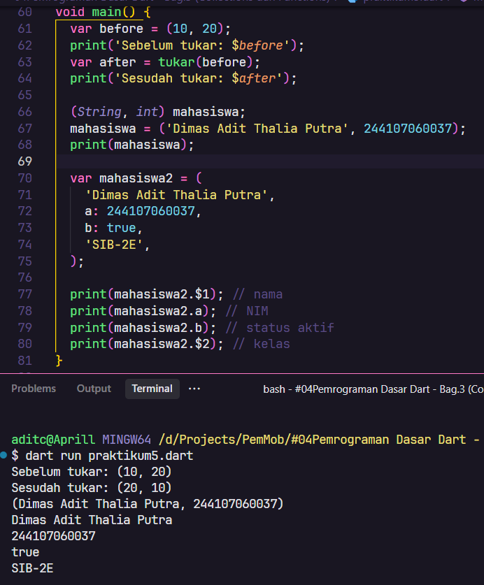

---

## Tugas

### Dokumentasi Praktikum 1 sampai 5

Seluruh hasil praktikum telah didokumentasikan lengkap di atas (Praktikum 1–5), masing-masing disertai kode program, penjelasan langkah demi langkah, output yang dihasilkan, serta screenshot run.

| Praktikum   | Topik                           | Screenshot Output             |
| ----------- | ------------------------------- | ----------------------------- |
| Praktikum 1 | List dan Operasi Dasar          |   |
| Praktikum 2 | Tipe Data Set                   |   |
| Praktikum 3 | Tipe Data Maps                  |   |
| Praktikum 4 | Spread & Control-Flow Operators |  |
| Praktikum 5 | Tipe Data Records               |   |

---

### 1. Jelaskan yang dimaksud Functions dalam bahasa Dart!

**Functions** dalam Dart adalah blok kode yang dapat diberi nama dan dipanggil ulang sesuai kebutuhan. Dart merupakan bahasa yang _object-oriented_, sehingga function pun merupakan objek dengan tipe [`Function`](https://api.dart.dev/stable/dart-core/Function-class.html). Artinya function bisa disimpan ke variabel, dijadikan argumen, bahkan dikembalikan sebagai nilai dari function lain.

Secara umum, function di Dart menggunakan sintaks berikut:

```dart
// Deklarasi function dengan tipe return eksplisit
int tambah(int a, int b) {
  return a + b;
}

// Arrow syntax (untuk body satu ekspresi)
int kali(int a, int b) => a * b;

void main() {
  print(tambah(3, 4)); // 7
  print(kali(3, 4));   // 12
}
```

Penulisan tipe return seperti `int`, `String`, atau `void` dianjurkan untuk keterbacaan, meskipun Dart tetap bisa menginferensinya secara otomatis. Jika function tidak mengembalikan nilai apa pun, tipe return-nya adalah `void`.

> _"Dart is a true object-oriented language, so even functions are objects and have a type, Function. This means that functions can be assigned to variables or passed as arguments to other functions."_
>
> — _Sumber: [dart.dev/language/functions](https://dart.dev/language/functions)_

---

### 2. Jelaskan jenis-jenis parameter di Functions beserta contoh sintaksnya!

Dart mendukung empat jenis parameter, masing-masing dengan peran yang berbeda:

#### a. Required Positional Parameter

Parameter wajib yang urutan pemberiannya harus sesuai dengan deklarasinya.

```dart
String sapa(String nama, int umur) {
  return 'Halo, $nama! Umurku $umur tahun.';
}

void main() {
  print(sapa('Dimas', 20));
}
```

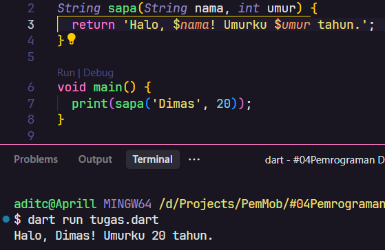

#### b. Optional Positional Parameter

Parameter yang boleh tidak diisi, diapit oleh tanda kurung siku `[]`. Bisa diberi nilai default.

```dart
String sapa(String nama, [String kota = 'Malang']) {
  return '$nama dari $kota';
}

void main() {
  print(sapa('Dimas'));
  print(sapa('Dimas', 'Batu'));
}
```

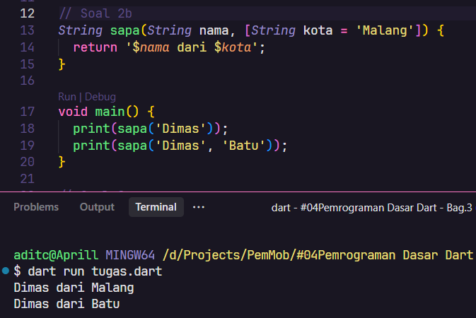

#### c. Named Parameter

Parameter yang dipanggil dengan nama, diapit tanda kurung kurawal `{}`. Secara default bersifat opsional, kecuali ditandai `required`.

```dart
void info({required String nama, int nim = 0}) {
  print('Nama: $nama, NIM: $nim');
}

void main() {
  info(nama: 'Dimas', nim: 244107060037);
  info(nama: 'Adit');
}
```

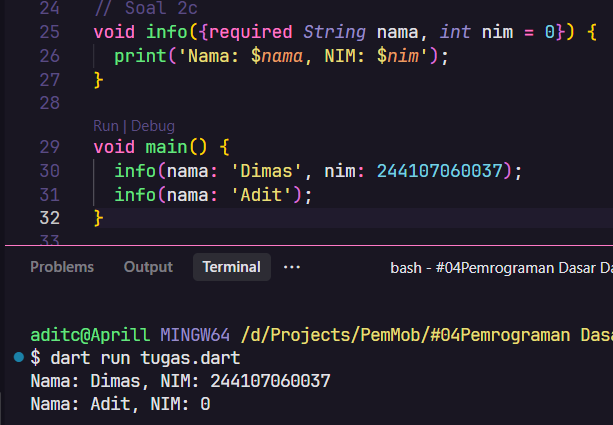

#### d. Parameter dengan Tipe Function (Callback)

Parameter yang menerima sebuah function lain sebagai argumen, umum digunakan untuk callback.

```dart
void proses(int nilai, int Function(int) operasi) {
  print(operasi(nilai));
}

void main() {
  proses(5, (x) => x * x);
}
```

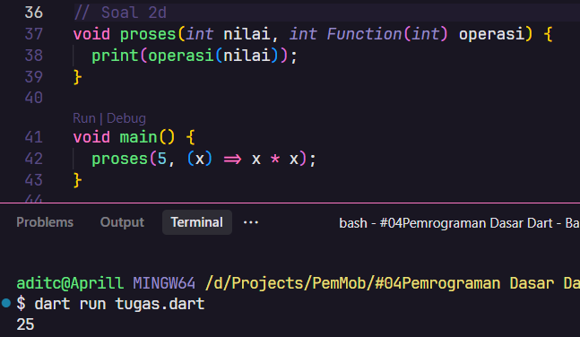

> _Sumber: [dart.dev/language/functions#parameters](https://dart.dev/language/functions#parameters)_

---

### 3. Jelaskan maksud Functions sebagai first-class objects beserta contoh sintaknya!

_First-class object_ artinya sebuah entitas bisa diperlakukan layaknya nilai biasa: disimpan ke variabel, dijadikan argumen fungsi, maupun dikembalikan dari fungsi lain. Di Dart, function adalah first-class object karena semua itu bisa dilakukan terhadapnya.

```dart
int kuadrat(int x) => x * x;

void main() {
  var fn = kuadrat;
  print(fn(4));

  var list = [3, 1, 4, 1, 5];
  list.sort((a, b) => a.compareTo(b));
  print(list);

  Function multiplier(int faktor) {
    return (int x) => x * faktor;
  }

  var kaliTiga = multiplier(3);
  print(kaliTiga(7));
}
```

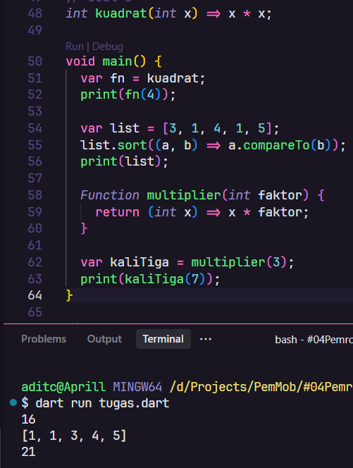

Konsep ini memungkinkan pola pemrograman yang lebih fleksibel, seperti _higher-order functions_, _callbacks_, dan _functional programming style_ yang banyak digunakan dalam Dart modern.

> _"You can pass a function as a parameter to another function."_
>
> — _Sumber: [dart.dev/language/functions#functions-as-first-class-objects](https://dart.dev/language/functions#functions-as-first-class-objects)_

---

### 4. Apa itu Anonymous Functions? Jelaskan dan berikan contohnya!

**Anonymous Functions** (fungsi anonim) adalah function yang tidak memiliki nama. Dalam Dart, bentuk ini sering disebut juga _lambda_ atau _closure_. Karena tidak punya nama, biasanya langsung digunakan di tempat pembuatannya, misalnya sebagai argumen ke fungsi lain.

Sintaks umumnya:

```dart
(parameter) {
  // body
}

// Atau versi arrow (satu ekspresi)
(parameter) => ekspresi
```

Contoh penggunaan nyata:

```dart
void main() {
  // Anonymous function sebagai argumen forEach
  var angka = [1, 2, 3, 4, 5];
  angka.forEach((n) {
    print('Nilai: $n, Kuadrat: ${n * n}');
  });

  // Disimpan ke variabel
  var salam = (String nama) => 'Halo, $nama!';
  print(salam('Dimas')); // Halo, Dimas!
}
```

Output:

```
Nilai: 1, Kuadrat: 1
Nilai: 2, Kuadrat: 4
Nilai: 3, Kuadrat: 9
Nilai: 4, Kuadrat: 16
Nilai: 5, Kuadrat: 25
Halo, Dimas!
```


Anonymous function sangat praktis saat dibutuhkan logika singkat yang hanya dipakai sekali, sehingga tidak perlu repot membuat function bernama secara tersendiri.

> _"An anonymous function looks similar to a named function—zero or more parameters, separated by commas and optional type annotations, between parentheses."_
>
> — _Sumber: [dart.dev/language/functions#anonymous-functions](https://dart.dev/language/functions#anonymous-functions)_

---

### 5. Jelaskan perbedaan Lexical scope dan Lexical closures! Berikan contohnya!

#### Lexical Scope

**Lexical scope** adalah aturan yang menentukan di mana sebuah variabel bisa diakses, berdasarkan posisi penulisannya dalam kode (secara struktural/statis), bukan saat program berjalan. Variabel yang dideklarasikan di dalam blok hanya bisa diakses di dalam blok itu dan blok-blok yang bersarang di dalamnya.

```dart
var a = 'top-level';

void fungsiLuar() {
  var b = 'dalam fungsiLuar';

  void fungsiDalam() {
    var c = 'dalam fungsiDalam';
    print(a);
    print(b);
    print(c);
  }

  fungsiDalam();
  // Di sini TIDAK bisa mengakses c
}

void main() {
  fungsiLuar();
  // Di sini hanya bisa mengakses a
}
```

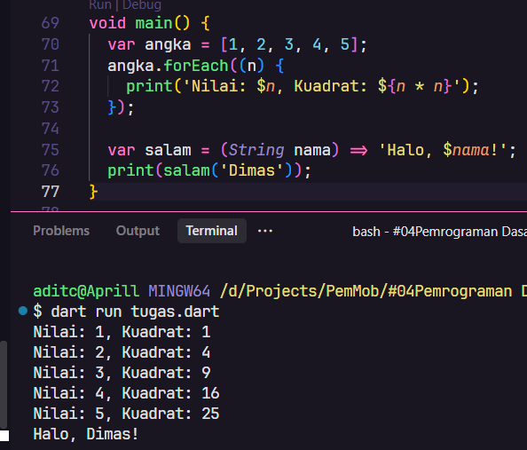

#### Lexical Closures

**Lexical closure** adalah function yang "mengingat" variabel dari scope tempat ia diciptakan, bahkan setelah scope tersebut sudah tidak aktif. Ini memungkinkan function menyimpan dan memodifikasi state secara persisten.

```dart
Function buat_counter() {
  int hitungan = 0;

  return () {
    hitungan++;
    print('Hitungan: $hitungan');
  };
}

void main() {
  var counter = buat_counter();
  counter();
  counter();
  counter();

  var counter2 = buat_counter();
  counter2();
}
```

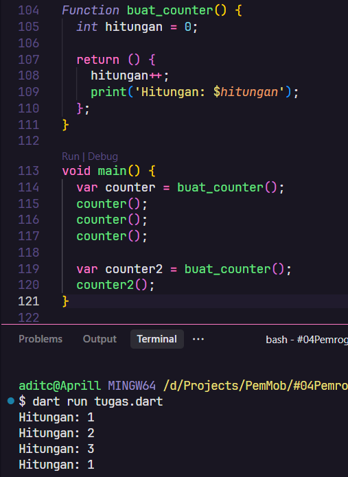

| Aspek    | Lexical Scope                                    | Lexical Closure                                              |
| -------- | ------------------------------------------------ | ------------------------------------------------------------ |
| Definisi | Aturan akses variabel berdasarkan penulisan kode | Function yang menyimpan referensi ke variabel dari scope-nya |
| Sifat    | Statis (ditentukan saat penulisan kode)          | Dinamis (variabel bertahan selama closure ada)               |
| Tujuan   | Membatasi visibilitas variabel                   | Menyimpan state antar pemanggilan function                   |

> _"Closures can capture variables from their enclosing scope, even when used outside of their original scope."_
>
> — _Sumber: [dart.dev/language/functions#lexical-closures](https://dart.dev/language/functions#lexical-closures)_

---

### 6. Jelaskan dengan contoh cara membuat return multiple value di Functions!

Dart tidak mendukung pengembalian beberapa nilai secara langsung seperti beberapa bahasa lain. Namun ada beberapa cara idiomatik yang bisa digunakan:

#### a. Menggunakan Record (Dart 3.0+) — Cara yang Direkomendasikan

Record adalah tipe data ringan yang bisa menampung beberapa nilai dengan tipe berbeda sekaligus, tanpa perlu membuat class baru.

```dart
(String, int, String) getInfoMahasiswa() {
  return ('Dimas Adit Thalia Putra', 244107060037, 'SIB-2E');
}

void main() {
  var (nama, nim, kelas) = getInfoMahasiswa(); // destructuring
  print('Nama : $nama');
  print('NIM  : $nim');
  print('Kelas: $kelas');
}
```

Output:

```
Nama : Dimas Adit Thalia Putra
NIM  : 244107060037
Kelas: SIB-2E
```

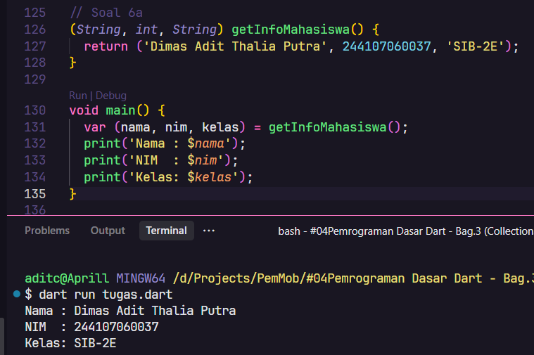

#### b. Menggunakan Named Record Fields

Untuk keterbacaan lebih baik, bisa menggunakan named fields pada Record:

```dart
({String nama, int nim}) getMahasiswa() {
  return (nama: 'Dimas', nim: 244107060037);
}

void main() {
  var mhs = getMahasiswa();
  print(mhs.nama); // Dimas
  print(mhs.nim);  // 244107060037
}
```

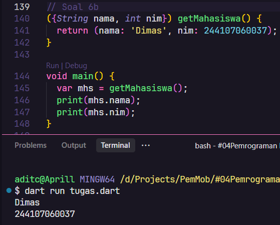

#### c. Menggunakan Map (cara klasik)

Sebelum Records, cara umum yang digunakan adalah mengembalikan `Map`:

```dart
Map<String, dynamic> getInfo() {
  return {
    'nama': 'Dimas Adit Thalia Putra',
    'nim': 244107060037,
    'kelas': 'SIB-2E',
  };
}

void main() {
  var info = getInfo();
  print(info['nama']);  // Dimas Adit Thalia Putra
  print(info['nim']);   // 244107060037
}
```

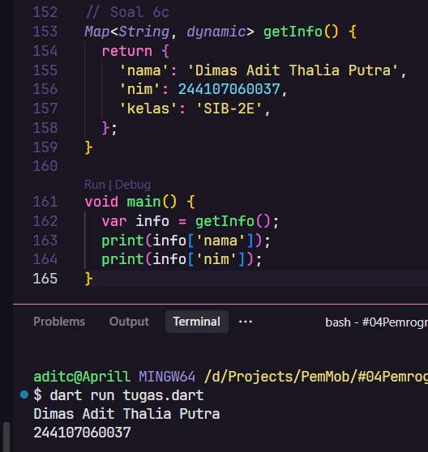

Cara dengan **Record** (poin a dan b) adalah yang paling direkomendasikan di Dart modern karena type-safe, ringkas, dan tidak memerlukan class tambahan.

> _"Records can return multiple values from a function."_
>
> — _Sumber: [dart.dev/language/records#multiple-returns](https://dart.dev/language/records#multiple-returns)_

---

## Daftar Pustaka

1. Dart API Reference. _Function class - dart:core library_. Diakses dari: https://api.dart.dev/stable/dart-core/Function-class.html
2. Dart Documentation. _Collections: Maps_. Diakses dari: https://dart.dev/language/collections#maps
3. Dart Documentation. _Functions_ (termasuk referensi ke bagian _Parameters_, _First-class objects_, _Anonymous functions_, dan _Lexical closures_). Diakses dari: https://dart.dev/language/functions
4. Dart Documentation. _Operators: Spread operators_. Diakses dari: https://dart.dev/language/operators#spread-operators
5. Dart Documentation. _Records: Multiple returns_. Diakses dari: https://dart.dev/language/records#multiple-returns
6. Limaher, Deva. _Collection If and Collection For in Dart_. Medium. Diakses dari: https://devalimaher.medium.com/collection-if-and-collection-for-in-dart-f844a752459f
