# Laporan Praktikum #05 Aplikasi Pertama dan Widget Dasar Flutter

## Identitas Mahasiswa

| Atribut | Nilai                   |
| ------- | ----------------------- |
| Nama    | Dimas Adit Thalia Putra |
| NIM     | 244107060037            |
| Kelas   | SIB-2E                  |

---

## Praktikum Membuat Project Flutter Pertama Anda

### Langkah 1: Membuat Project

Luncurkan Visual Studio Code dan buka palet perintah (dengan `F1`, `Ctrl+Shift+P`, atau `Shift+Cmd+P`). Ketik "flutter new". Pilih perintah **Flutter: New Project**.

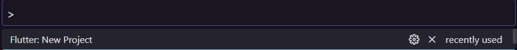

Pilih **Application** lalu pilih folder tempat project akan dibuat.

Terakhir, beri nama proyek Anda. Beri nama seperti `namer_app` atau `my_awesome_namer`.

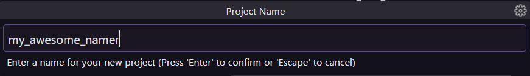

> **Catatan:** Jika VS Code menampilkan jendela modal yang menanyakan untuk mempercayai isi folder tersebut, pilih **Ya**.

---

### Langkah 2: Menyalin & Menempelkan Aplikasi Awal

Anda sekarang akan menimpa isi 3 file dengan scaffold dasar aplikasi.

#### `pubspec.yaml`

Buka file `pubspec.yaml` pada project Anda, lalu ganti isinya dengan kode berikut:

```yaml
name: namer_app
description: A new Flutter project.

publish_to: "none" # Remove this line if you wish to publish to pub.dev

version: 0.0.1+1

environment:
  sdk: ">=2.19.4 <4.0.0"

dependencies:
  flutter:
    sdk: flutter

  english_words: ^4.0.0
  provider: ^6.0.0

dev_dependencies:
  flutter_test:
    sdk: flutter

  flutter_lints: ^2.0.0

flutter:
  uses-material-design: true
```

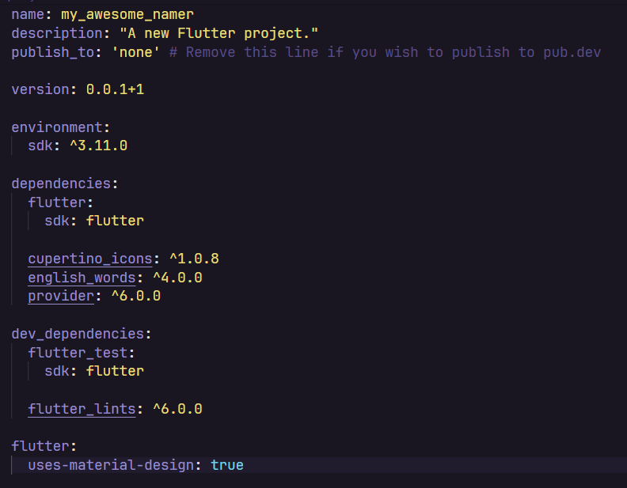

#### `analysis_options.yaml`

Buka file `analysis_options.yaml` pada project Anda, lalu ganti isinya dengan kode berikut:

```yaml
include: package:flutter_lints/flutter.yaml

linter:
  rules:
    prefer_const_constructors: false
    prefer_final_fields: false
    use_key_in_widget_constructors: false
    prefer_const_literals_to_create_immutables: false
    prefer_const_constructors_in_immutables: false
    avoid_print: false
```

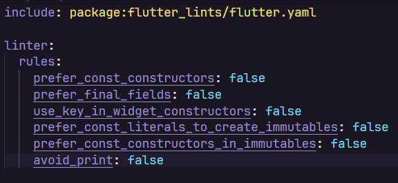

#### `lib/main.dart`

Buka file `main.dart` pada direktori `lib/`, lalu ganti isinya dengan kode berikut:

```dart
import 'package:english_words/english_words.dart';
import 'package:flutter/material.dart';
import 'package:provider/provider.dart';

void main() {
  runApp(MyApp());
}

class MyApp extends StatelessWidget {
  const MyApp({super.key});

  @override
  Widget build(BuildContext context) {
    return ChangeNotifierProvider(
      create: (context) => MyAppState(),
      child: MaterialApp(
        title: 'Namer App',
        theme: ThemeData(
          useMaterial3: true,
          colorScheme: ColorScheme.fromSeed(seedColor: Colors.deepOrange),
        ),
        home: MyHomePage(),
      ),
    );
  }
}

class MyAppState extends ChangeNotifier {
  var current = WordPair.random();
}

class MyHomePage extends StatelessWidget {
  @override
  Widget build(BuildContext context) {
    var appState = context.watch<MyAppState>();

    return Scaffold(
      body: Column(
        children: [
          Text('A random idea:'),
          Text(appState.current.asLowerCase),
        ],
      ),
    );
  }
}
```

> 50 baris kode ini adalah keseluruhan aplikasi sejauh ini. Pada bagian berikutnya, jalankan aplikasi dalam mode debug dan mulai kembangkan aplikasi Anda.

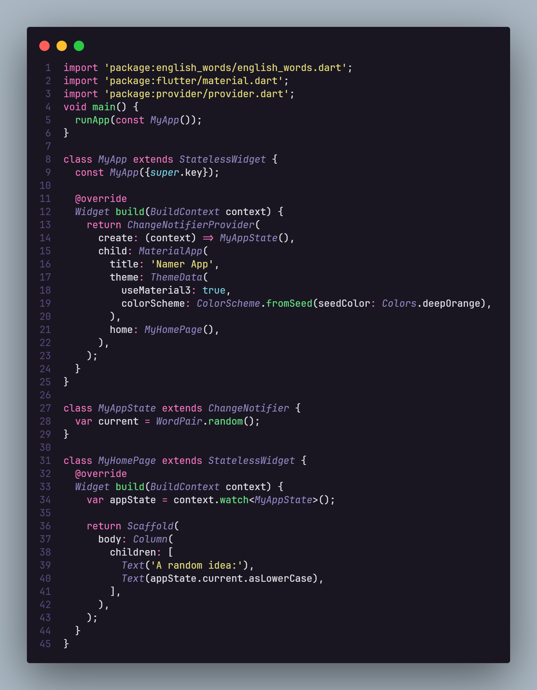

---

### Langkah 3: Menambahkan Tombol

Langkah ini menambahkan tombol **Next** untuk menghasilkan pasangan kata baru.

#### Meluncurkan aplikasi

Pertama, buka `lib/main.dart` dan pastikan Anda memilih perangkat target. Di bagian pojok kanan bawah VS Code, Anda akan menemukan tombol yang menampilkan perangkat target saat ini. Klik tombol untuk mengubahnya.

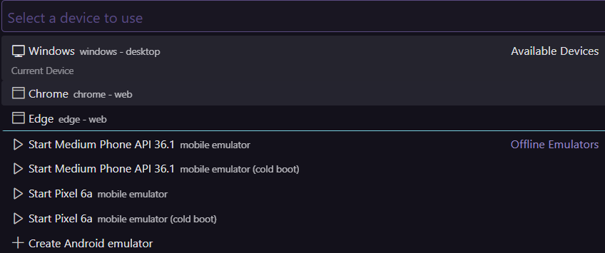

Selagi `lib/main.dart` terbuka, temukan tombol "play" di pojok kanan atas jendela VS Code lalu klik tombol tersebut.

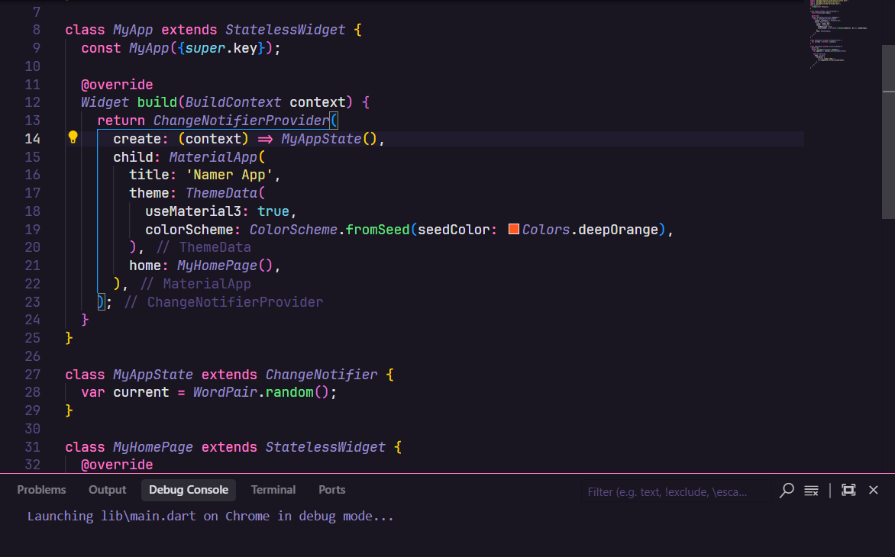

Setelah beberapa saat, aplikasi Anda diluncurkan dalam mode debug. Tampilannya masih terlihat biasa saja.

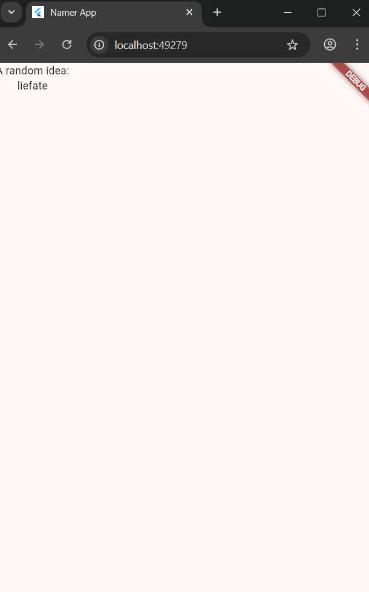

> **Catatan:** Jika target pengembangan Anda adalah perangkat seluler, kemungkinan sebagian teks terhalang oleh notch atau status bar. Anda akan segera mempelajari cara memperbaiki ini.

**Screenshot:**

<!-- TODO: Tambahkan screenshot aplikasi diluncurkan di sini -->

#### Hot Reload Pertama

Di bagian bawah `lib/main.dart`, tambahkan sesuatu pada string di objek `Text` pertama, dan simpan file tersebut (dengan `Ctrl+S` atau `Cmd+S`). Misalnya:

```dart
// ...

    return Scaffold(
      body: Column(
        children: [
          Text('A random AWESOME idea:'),  // ← Example change.
          Text(appState.current.asLowerCase),
        ],
      ),
    );

// ...
```

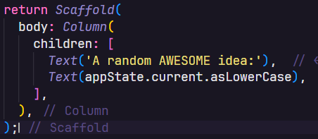

Perhatikan bagaimana aplikasi segera berubah tetapi kata yang acak tetap sama. Situasi ini menunjukkan fitur _stateful Hot Reload_ Flutter terkenal yang sedang bekerja. Hot reload dipicu saat Anda menyimpan perubahan untuk file sumber.

**Screenshot:**

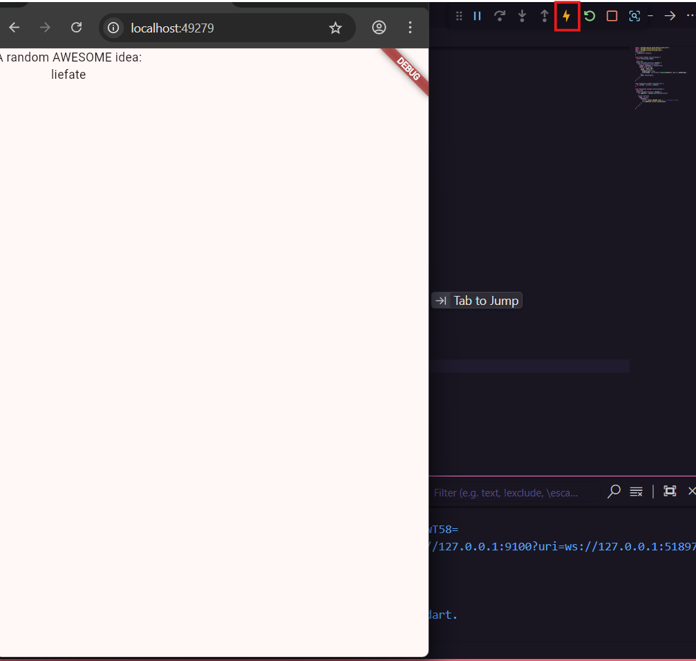

#### Menambahkan tombol

Berikutnya, tambahkan tombol di bagian bawah `Column`, tepat di bawah instance `Text` kedua.

```dart
// ...

    return Scaffold(
      body: Column(
        children: [
          Text('A random AWESOME idea:'),
          Text(appState.current.asLowerCase),

          // ↓ Add this.
          ElevatedButton(
            onPressed: () {
              print('button pressed!');
            },
            child: Text('Next'),
          ),

        ],
      ),
    );

// ...
```

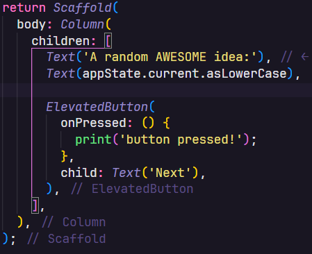

Saat Anda menyimpan perubahan, aplikasi diperbarui kembali: Sebuah tombol muncul dan, saat Anda mengklik tombol tersebut, _Konsol Debug_ di VS Code menampilkan pesan **button pressed!**.

**Screenshot:**

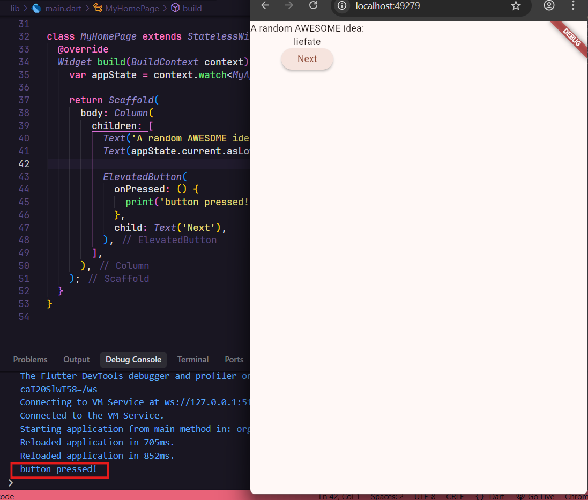

#### Perilaku pertama Anda

Scroll ke `MyAppState` pada `lib/main.dart` lalu tambahkan metode `getNext`.

```dart
// ...

class MyAppState extends ChangeNotifier {
  var current = WordPair.random();

  // ↓ Add this.
  void getNext() {
    current = WordPair.random();
    notifyListeners();
  }
}

// ...
```

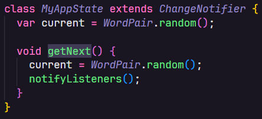

Metode `getNext()` menetapkan ulang `current` dengan `WordPair` acak baru. Ia juga memanggil `notifyListeners()` yang memastikan bahwa semua widget yang mendengarkan `MyAppState` diberi tahu tentang pembaruan ini.

Tindakan terakhir adalah memanggil metode `getNext` dari callback tombol tersebut.

```dart
// ...

          ElevatedButton(
            onPressed: () {
              appState.getNext();  // ← This instead of print().
            },
            child: Text('Next'),
          ),

// ...
```

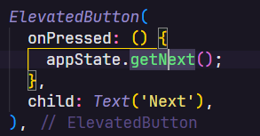

Simpan dan uji coba aplikasi sekarang. Aplikasi akan menghasilkan pasangan kata acak baru setiap kali Anda menekan tombol **Next**.

**Screenshot:**

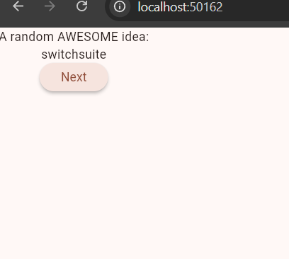

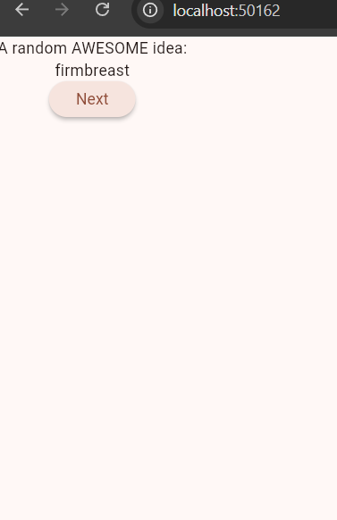

---

### Memperindah tampilan aplikasi

#### Mengekstrak widget

Baris yang bertanggung jawab untuk menampilkan pasangan kata saat ini kini tampak seperti berikut: `Text(appState.current.asLowerCase)`. Untuk mengubahnya menjadi sesuatu yang lebih kompleks, disarankan untuk mengekstrak baris ini ke widget terpisah. Memiliki beberapa widget untuk beberapa bagian logis dari UI Anda adalah cara penting dalam mengelola kompleksitas pada Flutter.

Flutter menyediakan pembantu pemfaktoran ulang untuk mengekstrak widget, tetapi sebelum Anda menggunakannya, pastikan bahwa baris yang akan diekstrak hanya mengakses yang diperlukan. Sekarang baris tersebut mengakses `appState`, tetapi sebenarnya baris tersebut hanya perlu mengetahui apa pasangan kata saat ini.

Oleh karena itu, tulis ulang widget `MyHomePage` sebagai berikut:

##### `lib/main.dart`

```dart
// ...

class MyHomePage extends StatelessWidget {
  @override
  Widget build(BuildContext context) {
    var appState = context.watch<MyAppState>();
    var pair = appState.current;                 // ← Add this.

    return Scaffold(
      body: Column(
        children: [
          Text('A random AWESOME idea:'),
          Text(pair.asLowerCase),                // ← Change to this.
          ElevatedButton(
            onPressed: () {
              appState.getNext();
            },
            child: Text('Next'),
          ),
        ],
      ),
    );
  }
}

// ...
```

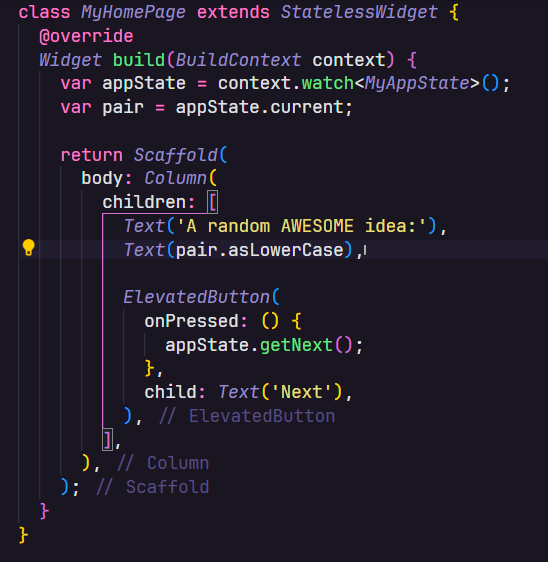

Bagus. Widget `Text` tidak lagi merujuk kepada keseluruhan `appState`.

Sekarang, panggil menu **Refactor**. Pada VS Code, Anda melakukan ini melalui salah satu dari dua cara:

1. Klik kanan potongan kode yang ingin Anda faktorkan ulang (dalam hal ini `Text`) dan pilih **Refactor...** dari menu drop-down,
2. ATAU Pindahkan kursor Anda ke potongan kode yang ingin Anda faktorkan ulang (dalam hal ini, `Text`), lalu tekan `Ctrl+.` (Win/Linux) atau `Cmd+.` (Mac).

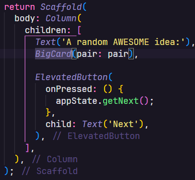

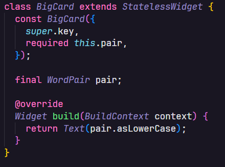

Pada menu **Refactor**, pilih **Extract Widget**. Tetapkan nama, seperti **BigCard**, lalu klik `Enter`.

Tindakan ini secara otomatis membuat class baru, `BigCard`, di akhir file saat ini. Class tersebut akan terlihat seperti berikut:

##### `lib/main.dart`

```dart
// ...

class BigCard extends StatelessWidget {
  const BigCard({
    super.key,
    required this.pair,
  });

  final WordPair pair;

  @override
  Widget build(BuildContext context) {
    return Text(pair.asLowerCase);
  }
}

// ...
```

Perhatikan bagaimana aplikasi tetap berjalan meskipun pemfaktoran ulang sedang berlangsung.

#### Menambahkan Kartu

Sekarang saatnya membuat widget baru ini menjadi UI tebal yang kita bayangkan di awal bagian ini.

Temukan class `BigCard` dan metode `build()` yang berada di dalamnya. Sama seperti sebelumnya, panggil menu **Refactor** pada widget `Text`. Namun, kali ini Anda tidak akan mengekstrak widget.

Sebagai gantinya, pilih **Wrap with Padding**. Tindakan ini menciptakan widget induk baru di sekitar widget `Text` bernama `Padding`. Setelah menyimpannya, Anda akan melihat bahwa kata acak tersebut telah memiliki ruang yang lebih luas.

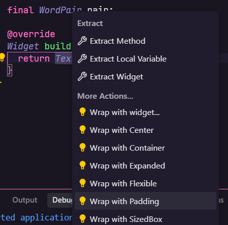

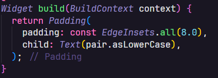

Tingkatkan padding dari nilai default `8.0`. Misalnya, gunakan `20` untuk padding yang lebih luas.

> **Catatan**: Flutter menggunakan Komposisi, bukan Pewarisan, kapan pun tersedia. Di sini, padding tidak menjadi _atribut_ dari `Text`, melainkan sebuah widget! Dengan begitu, widget dapat fokus pada tanggung jawab masing-masing, dan Anda, sebagai developer, memiliki kebebasan penuh mengenai cara menyusun UI.

Berikutnya, tempatkan kursor Anda pada widget `Padding`, buka menu **Refactor**, lalu pilih **Wrap with widget...**.

Tindakan ini memungkinkan Anda untuk menentukan widget induk. Ketik "Card" dan tekan **Enter**.

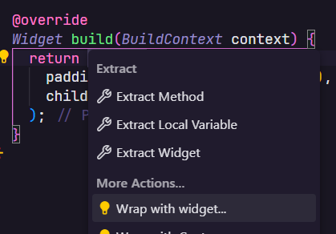

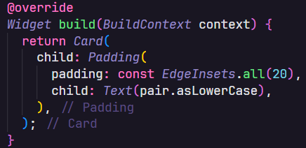

Kode ini menggabungkan widget `Padding`, dan juga `Text`, dengan widget `Card`.

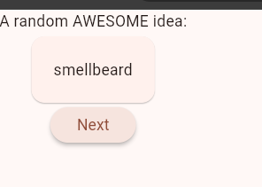

#### Tema dan gaya

Untuk membuat kartu menjadi lebih menarik, beri warna yang lebih kaya pada kartu tersebut. Karena ada baiknya untuk menjaga skema warna yang konsisten, gunakan `Theme` aplikasi untuk memilih warna.

Buat perubahan berikut untuk metode `build()` `BigCard`.

##### `lib/main.dart`

```dart
// ...

  @override
  Widget build(BuildContext context) {
    final theme = Theme.of(context);       // ← Add this.

    return Card(
      color: theme.colorScheme.primary,    // ← And also this.
      child: Padding(
        padding: const EdgeInsets.all(20),
        child: Text(pair.asLowerCase),
      ),
    );
  }

// ...
```

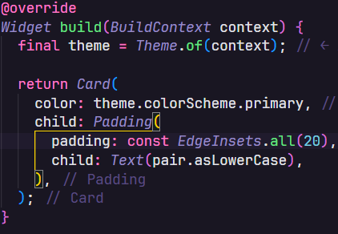

Kedua baris baru ini melakukan banyak hal:

- Pertama, kode ini meminta tema aplikasi saat ini dengan `Theme.of(context)`.
- Kemudian, kode ini menentukan warna kartu agar sama dengan properti `colorScheme` dari tema. Skema warna menampung banyak warna, dan `primary` adalah warna aplikasi yang paling terlihat dan mencolok.

Kini, kartu telah diwarnai dengan warna primer aplikasi.

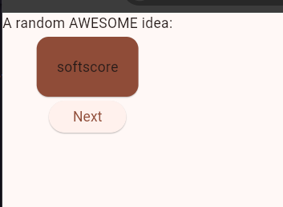

Anda dapat mengubah warna ini serta skema warna keseluruhan aplikasi dengan men-scroll ke atas ke `MyApp` dan mengubah warna seed untuk `ColorScheme` di sana.

> **Tips**: Class `Colors` Flutter memberikan akses mudah ke palet warna pilihan kepada Anda, seperti `Colors.deepOrange` atau `Colors.red`.

Perhatikan bagaimana warna berubah dengan halus. Perubahan ini disebut **animasi implisit**. Banyak widget Flutter akan berinterpolasi antarnilai dengan lancar agar UI tidak hanya "berpindah" antarstatus.

#### TextTheme

Kartu tersebut masih memiliki masalah: ukuran teks terlalu kecil dan warnanya membuat teks sulit dibaca. Untuk memperbaiki masalah ini, buat perubahan berikut pada metode `build()` `BigCard`.

##### `lib/main.dart`

```dart
// ...

  @override
  Widget build(BuildContext context) {
    final theme = Theme.of(context);
    // ↓ Add this.
    final style = theme.textTheme.displayMedium!.copyWith(
      color: theme.colorScheme.onPrimary,
    );

    return Card(
      color: theme.colorScheme.primary,
      child: Padding(
        padding: const EdgeInsets.all(20),
        // ↓ Change this line.
        child: Text(pair.asLowerCase, style: style),
      ),
    );
  }

// ...
```

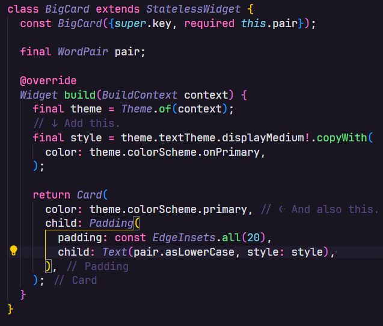

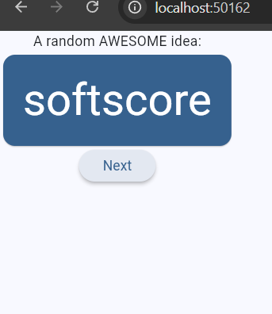

#### Meningkatkan aksesibilitas

Flutter membuat aplikasi dapat diakses secara default. Misalnya, setiap aplikasi Flutter menampilkan semua teks dan elemen interaktif di aplikasi dengan tepat untuk pembaca layar, seperti TalkBack dan VoiceOver.

Namun, Anda mungkin ingin mempertahankan kesederhanaan visual pair.asLowerCase. Gunakan properti semanticsLabel Text untuk mengganti konten visual widget teks dengan konten semantik yang lebih sesuai untuk pembaca layar:

##### `lib/main.dart`

```dart
// ...

  @override
  Widget build(BuildContext context) {
    final theme = Theme.of(context);
    final style = theme.textTheme.displayMedium!.copyWith(
      color: theme.colorScheme.onPrimary,
    );

    return Card(
      color: theme.colorScheme.primary,
      child: Padding(
        padding: const EdgeInsets.all(20),

        // ↓ Make the following change.
        child: Text(
          pair.asLowerCase,
          style: style,
          semanticsLabel: "${pair.first} ${pair.second}",
        ),
      ),
    );
  }

// ...
```

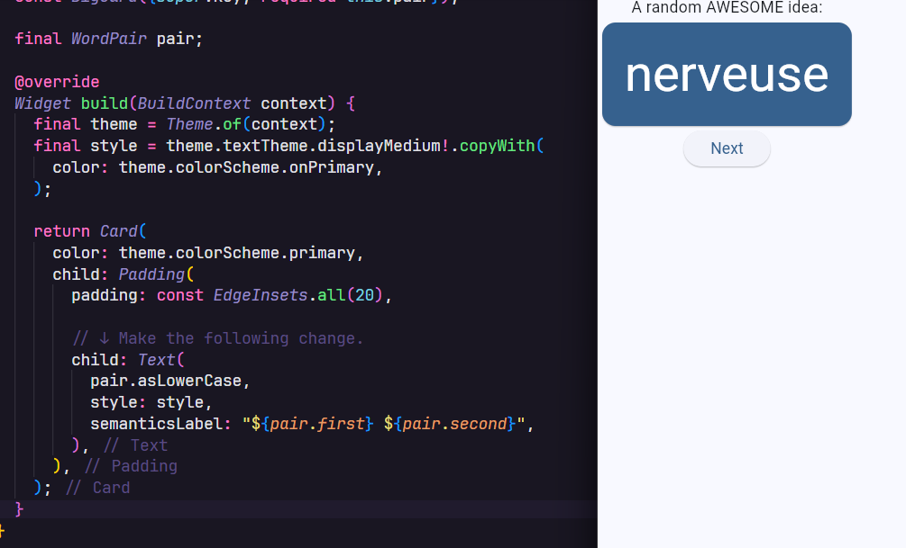

Kini, pembaca layar melafalkan setiap pasangan kata yang dihasilkan dengan tepat, namun UI tidak berubah.

#### Menempatkan UI di tengah

Setelah pasangan kata acak dihadirkan dengan gaya visual yang cukup, saatnya menempatkan UI di tengah jendela/layar aplikasi.

Pertama, buka metode `build()` `MyHomePage`, dan buat perubahan berikut:

##### `lib/main.dart`

```dart
// ...

class MyHomePage extends StatelessWidget {
  @override
  Widget build(BuildContext context) {
    var appState = context.watch<MyAppState>();
    var pair = appState.current;

    return Scaffold(
      body: Column(
        mainAxisAlignment: MainAxisAlignment.center,  // ← Add this.
        children: [
          Text('A random AWESOME idea:'),
          BigCard(pair: pair),
          ElevatedButton(
            onPressed: () {
              appState.getNext();
            },
            child: Text('Next'),
          ),
        ],
      ),
    );
  }
}

// ...
```

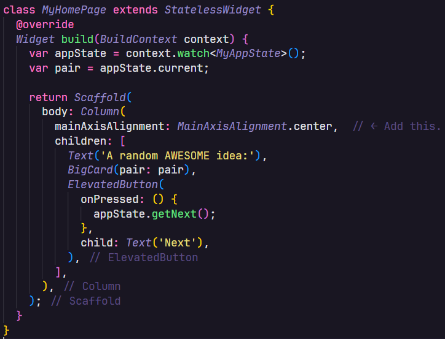

Tindakan ini menempatkan turunan dalam `Column` di tengah pada sumbu utamanya (vertikal).

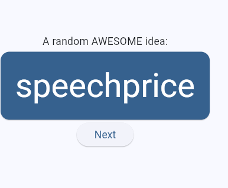

Widget Inspector itu sendiri berada di luar cakupan codelab ini, tetapi Anda dapat melihat bahwa ketika Column ditandai, kode ini tidak menghabiskan keseluruhan lebar aplikasi. Kode ini hanya menghabiskan ruang horizontal sebanyak yang diperlukan oleh turunan UI.

Anda dapat menempatkan kolom itu sendiri di tengah. Letakkan kursor Anda di Column, buka menu Refactor (dengan Ctrl+. atau Cmd+.), lalu pilih Wrap with Center.

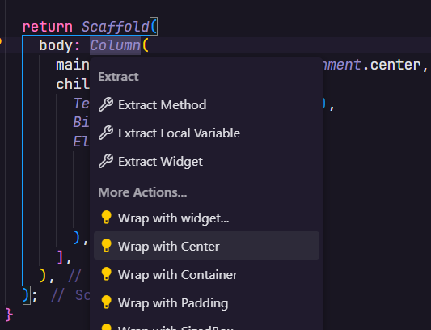

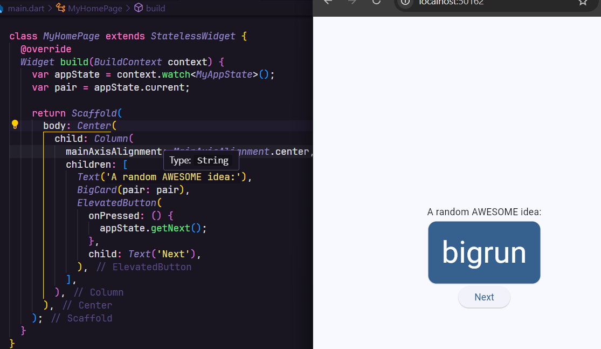

##### `lib/main.dart`

```dart
// ...

    return Scaffold(
      body: Center(
        child: Column(
          mainAxisAlignment: MainAxisAlignment.center,
          children: [
            BigCard(pair: pair),
            SizedBox(height: 10),
            ElevatedButton(
              onPressed: () {
                appState.getNext();
              },
              child: Text('Next'),
            ),
          ],
        ),
      ),
    );

// ...
```

**Screenshot:**

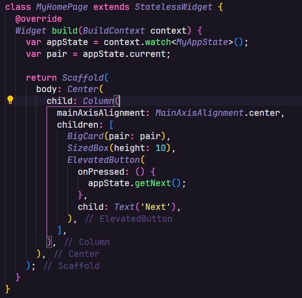
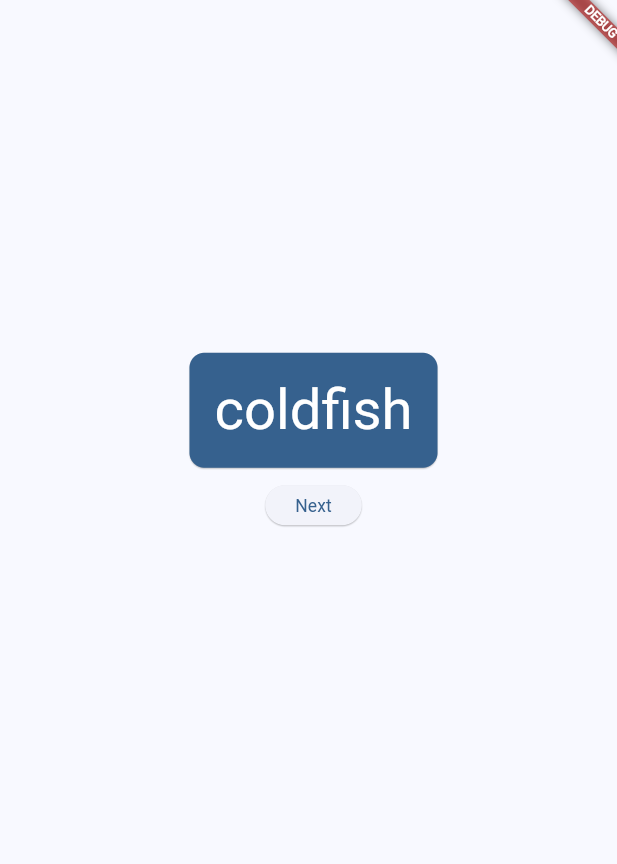

## 6. Menambahkan fungsi

Aplikasi berjalan dengan baik, dan bahkan terkadang menyediakan pasangan kata yang menarik. Namun, setiap kali pengguna mengklik Next, setiap pasangan kata hilang selamanya. Akan lebih baik untuk memiliki cara "mengingat" saran terbaik: seperti tombol 'Like'.

### Menambahkan logika bisnis

Scroll ke `MyAppState` dan tambahkan kode berikut:

##### `lib/main.dart`

```dart
// ...

class MyAppState extends ChangeNotifier {
  var current = WordPair.random();

  void getNext() {
    current = WordPair.random();
    notifyListeners();
  }

  // ↓ Add the code below.
  var favorites = <WordPair>[];

  void toggleFavorite() {
    if (favorites.contains(current)) {
      favorites.remove(current);
    } else {
      favorites.add(current);
    }
    notifyListeners();
  }
}

// ...
```

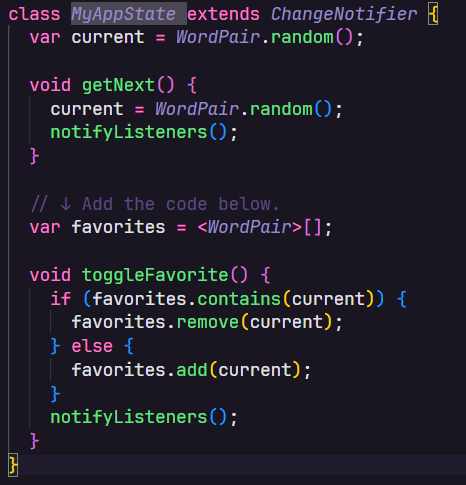

#### Periksa perubahannya:

- Anda menambahkan properti baru pada `MyAppState` yang bernama `favorites`. Properti ini diinisialisasi dengan daftar kosong: `[]`.
- Anda juga menentukan bahwa daftar tersebut hanya dapat berisi pasangan kata: `<WordPair>[]`, menggunakan generik. Hal ini membantu membuat aplikasi Anda menjadi lebih lengkap—Dart bahkan menolak menjalankan aplikasi jika Anda mencoba menambahkan apa pun selain `WordPair`. Oleh karena itu, Anda dapat menggunakan daftar `favorites` karena tidak boleh ada objek yang tidak diinginkan (seperti `null`) yang bersembunyi di dalamnya.
- **Catatan**: Dart memiliki jenis koleksi selain `List` (ditunjukkan dengan `[]`). Anda dapat berpendapat bahwa `Set` (ditunjukkan dengan `{}`) akan lebih masuk akal untuk koleksi favorit. Untuk membuat codelab ini sesederhana mungkin, kita hanya menggunakan satu daftar. Namun, jika mau, Anda dapat menggunakan `Set` sebagai gantinya. Kode ini tidak akan mengubah banyak.
- Anda juga menambahkan metode baru, `toggleFavorite()`, yang menghapus pasangan kata saat ini dari daftar favorit (jika sudah ada), atau menambahkannya (jika belum ada). Dalam kedua kasus tersebut, kode memanggil `notifyListeners();` setelahnya.

### Menambahkan tombol

Dengan terselesaikannya "logika bisnis", saatnya untuk mengerjakan antarmuka pengguna kembali. Meletakkan tombol ‘Like' di sebelah kiri tombol ‘Next' memerlukan `Row`. Widget `Row` adalah padanan horizontal dari `Column`, yang telah Anda lihat sebelumnya.

Pertama, gabungkan tombol yang ada pada `Row`. Buka metode `build()` `MyHomePage`, letakkan kursor pada `ElevatedButton`, buka menu **Refactor** dengan `Ctrl+.` atau `Cmd+.`, lalu pilih **Wrap with Row**.

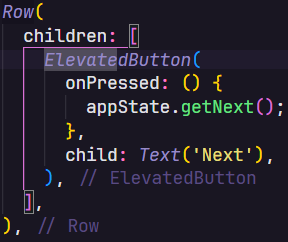

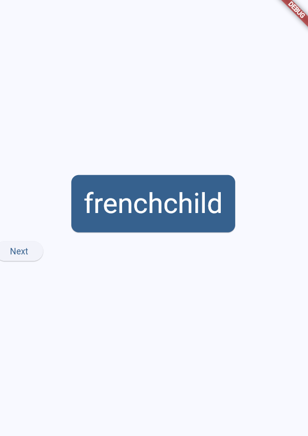

Saat menyimpan, Anda akan menyadari bahwa `Row` bertindak mirip dengan `Column`—secara default, kode ini mengumpulkan turunannya ke sebelah kiri. (`Column` mengumpulkan turunannya ke atas.) Untuk memperbaiki masalah ini, Anda dapat menggunakan pendekatan yang sama seperti sebelumnya, tetapi dengan `mainAxisAlignment`. Namun, untuk tujuan mendidik (pembelajaran), gunakan `mainAxisSize`. Kode ini memberi tahu `Row` agar tidak mengambil semua ruang horizontal yang tersedia.

Buat perubahan berikut:

##### `lib/main.dart`

```dart
// ...

class MyHomePage extends StatelessWidget {
  @override
  Widget build(BuildContext context) {
    var appState = context.watch<MyAppState>();
    var pair = appState.current;

    return Scaffold(
      body: Center(
        child: Column(
          mainAxisAlignment: MainAxisAlignment.center,
          children: [
            BigCard(pair: pair),
            SizedBox(height: 10),
            Row(
              mainAxisSize: MainAxisSize.min,   // ← Add this.
              children: [
                ElevatedButton(
                  onPressed: () {
                    appState.getNext();
                  },
                  child: Text('Next'),
                ),
              ],
            ),
          ],
        ),
      ),
    );
  }
}

// ...
```

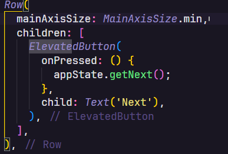

UI kembali ke tempat sebelumnya.

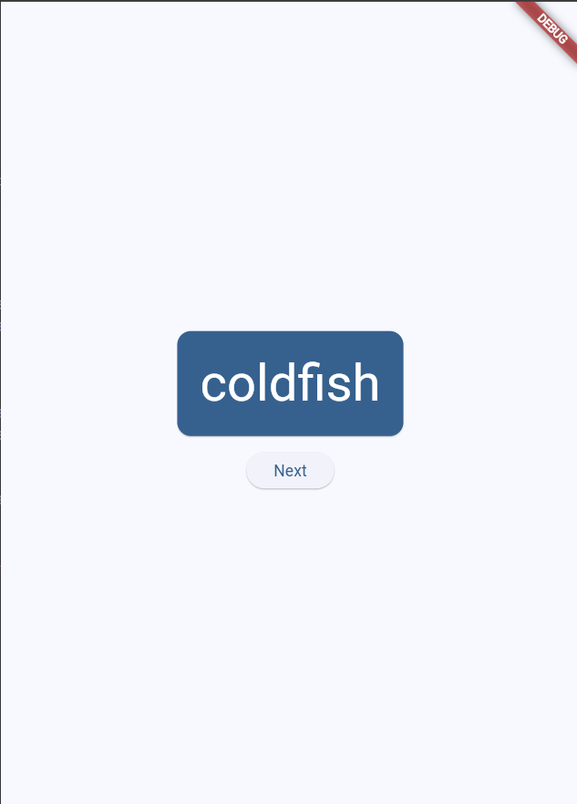

Berikutnya, tambahkan tombol **Like** dan hubungkan ke `toggleFavorite()`. Sebagai tantangan, coba lakukan sendiri untuk pertama kali, tanpa melihat blok kode di bawah.

Tidak apa-apa jika Anda tidak melakukannya dengan cara yang sama seperti yang ditunjukkan di bawah. Bahkan, jangan pikirkan tentang ikon hati kecuali Anda benar-benar menginginkan tantangan yang besar.

Tidak apa-apa jika Anda gagal—lagipula, ini pertama kalinya Anda menggunakan Flutter.

Berikut satu cara untuk menambahkan tombol kedua untuk `MyHomePage`. Kali ini, gunakan konstruktor `ElevatedButton.icon()` untuk membuat tombol dengan ikon. Di bagian atas metode `build`, pilih ikon yang sesuai tergantung pada apakah pasangan kata saat ini sudah berada di favorit atau tidak. Selain itu, perhatikan penggunaan `SizedBox` lagi, untuk menjaga jarak antara kedua tombol.

##### `lib/main.dart`

```dart
// ...

class MyHomePage extends StatelessWidget {
  @override
  Widget build(BuildContext context) {
    var appState = context.watch<MyAppState>();
    var pair = appState.current;

    // ↓ Add this.
    IconData icon;
    if (appState.favorites.contains(pair)) {
      icon = Icons.favorite;
    } else {
      icon = Icons.favorite_border;
    }

    return Scaffold(
      body: Center(
        child: Column(
          mainAxisAlignment: MainAxisAlignment.center,
          children: [
            BigCard(pair: pair),
            SizedBox(height: 10),
            Row(
              mainAxisSize: MainAxisSize.min,
              children: [

                // ↓ And this.
                ElevatedButton.icon(
                  onPressed: () {
                    appState.toggleFavorite();
                  },
                  icon: Icon(icon),
                  label: Text('Like'),
                ),
                SizedBox(width: 10),

                ElevatedButton(
                  onPressed: () {
                    appState.getNext();
                  },
                  child: Text('Next'),
                ),
              ],
            ),
          ],
        ),
      ),
    );
  }
}

// ...
```

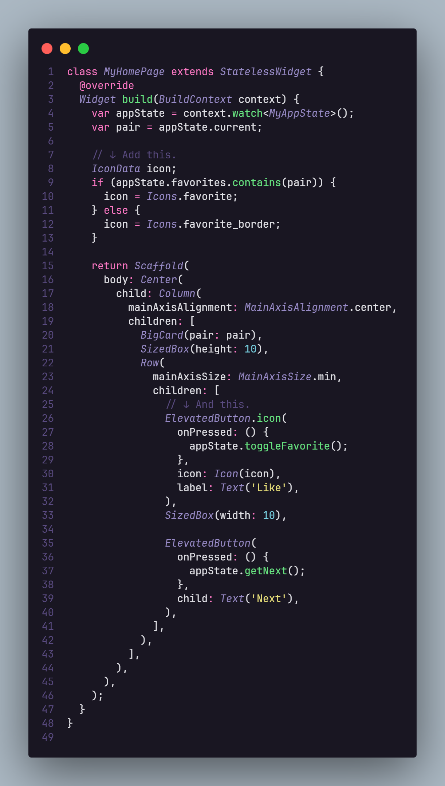

Aplikasi akan terlihat seperti berikut:

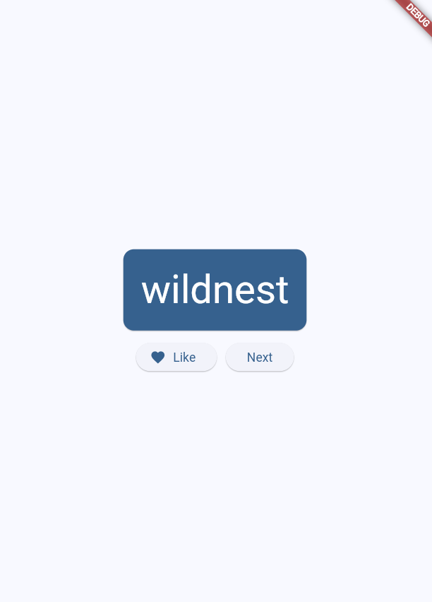

Sayangnya, pengguna tidak dapat melihat favorit. Saatnya menambahkan layar yang sepenuhnya terpisah untuk aplikasi kita. Sampai jumpa di bagian berikutnya!

## 7. Menambahkan kolom samping navigasi

Sebagian besar aplikasi tidak dapat memuat semuanya ke dalam satu layar. Aplikasi ini mungkin dapat melakukannya, tetapi untuk tujuan pembelajaran, Anda akan membuat layar terpisah untuk bagian favorit pengguna. Untuk beralih di antara dua layar, Anda akan menerapkan `StatefulWidget` pertama Anda.

Untuk mencapai inti dari langkah ini secepat mungkin, pisahkan `MyHomePage` menjadi 2 widget terpisah.

Pilih keseluruhan `MyHomePage`, hapus, dan gantikan dengan kode berikut:

##### `lib/main.dart`

```dart
// ...

class MyHomePage extends StatelessWidget {
  @override
  Widget build(BuildContext context) {
    return Scaffold(
      body: Row(
        children: [
          SafeArea(
            child: NavigationRail(
              extended: false,
              destinations: [
                NavigationRailDestination(
                  icon: Icon(Icons.home),
                  label: Text('Home'),
                ),
                NavigationRailDestination(
                  icon: Icon(Icons.favorite),
                  label: Text('Favorites'),
                ),
              ],
              selectedIndex: 0,
              onDestinationSelected: (value) {
                print('selected: $value');
              },
            ),
          ),
          Expanded(
            child: Container(
              color: Theme.of(context).colorScheme.primaryContainer,
              child: GeneratorPage(),
            ),
          ),
        ],
      ),
    );
  }
}

class GeneratorPage extends StatelessWidget {
  @override
  Widget build(BuildContext context) {
    var appState = context.watch<MyAppState>();
    var pair = appState.current;

    IconData icon;
    if (appState.favorites.contains(pair)) {
      icon = Icons.favorite;
    } else {
      icon = Icons.favorite_border;
    }

    return Center(
      child: Column(
        mainAxisAlignment: MainAxisAlignment.center,
        children: [
          BigCard(pair: pair),
          SizedBox(height: 10),
          Row(
            mainAxisSize: MainAxisSize.min,
            children: [
              ElevatedButton.icon(
                onPressed: () {
                  appState.toggleFavorite();
                },
                icon: Icon(icon),
                label: Text('Like'),
              ),
              SizedBox(width: 10),
              ElevatedButton(
                onPressed: () {
                  appState.getNext();
                },
                child: Text('Next'),
              ),
            ],
          ),
        ],
      ),
    );
  }
}

// ...
```

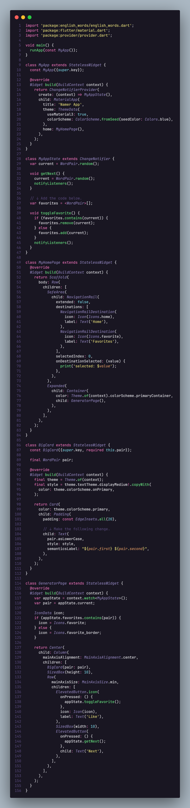

Saat disimpan, Anda akan melihat sisi visual UI telah siap—tetapi tidak bekerja. Mengklik ♥︎ (hati) pada kolom samping navigasi tidak melakukan apa pun.

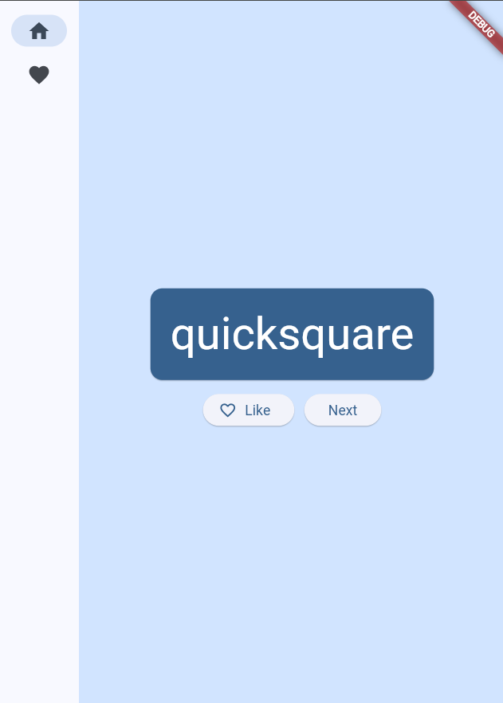

#### Periksa perubahannya:

- Pertama, perhatikan bahwa seluruh konten `MyHomePage` diekstrak ke dalam widget baru, `GeneratorPage`. Satu-satunya bagian dari widget `MyHomePage` lama yang tidak diekstrak adalah `Scaffold`.
- `MyHomePage` baru berisi `Row` dengan dua turunan. Widget pertama adalah `SafeArea`, dan yang kedua adalah widget `Expanded`.
- `SafeArea` memastikan bahwa turunannya tidak terhalang oleh notch hardware atau status bar. Dalam aplikasi ini, widget mengemas `NavigationRail` untuk mencegah tombol navigasi terhalang oleh status bar perangkat seluler, misalnya.
- Anda dapat mengubah baris `extended: false` pada `NavigationRail` menjadi `true`. Kode ini menampilkan label di samping ikon. Pada langkah mendatang, Anda akan mempelajari cara melakukan ini secara otomatis saat aplikasi memiliki ruang horizontal yang cukup.
- Kolom samping navigasi memiliki dua tujuan (Beranda dan Favorit), dengan ikon dan label masing-masing. Kolom samping navigasi juga menentukan `selectedIndex` saat ini. Indeks pilihan nol memilih tujuan pertama, indeks pilihan satu memilih tujuan kedua, dan seterusnya. Untuk saat ini, kolom samping navigasi di-hard code ke nol.
- Kolom samping navigasi juga menentukan apa yang terjadi saat pengguna memilih salah satu tujuan dengan `onDestinationSelected`. Saat ini, aplikasi hanya menghasilkan nilai indeks yang diminta dengan `print()`.
- Turunan kedua `Row` adalah widget `Expanded`. Widget yang diperluas sangat berguna dalam baris dan kolom—widget tersebut memungkinkan Anda mengekspresikan tata letak tempat beberapa turunan hanya mengambil ruang sebanyak yang diperlukan (dalam hal ini, `NavigationRail`) dan widget lainnya harus mengambil ruang yang tersisa sebanyak mungkin (dalam hal ini, `Expanded`). Satu sudut pandang tentang widget `Expanded` adalah bahwa widget ini "serakah".

Jika Anda ingin lebih memahami peran widget ini, coba gabungkan widget `NavigationRail` dengan `Expanded` lainnya. Tata letak yang dihasilkan terlihat seperti berikut:

Dua widget `Expanded` saling berbagi semua ruang horizontal yang tersedia, meskipun kolom samping navigasi hanya memerlukan sepotong kecil ruang di sisi kiri.

Di dalam widget `Expanded`, ada `Container` berwarna, dan ada `GeneratorPage` di dalam container.

### Widget stateless versus stateful

Sampai sekarang, `MyAppState` telah memenuhi semua kebutuhan status Anda. Itulah mengapa semua widget yang telah Anda tulis sejauh ini adalah stateless. Widget-widget tersebut tidak memiliki status yang dapat diubah. Tidak ada widget yang dapat mengubah widget itu sendiri—widget tersebut harus melalui `MyAppState`.

Hal ini akan segera berubah.

Anda memerlukan suatu cara untuk menyimpan nilai `selectedIndex` kolom samping navigasi. Anda juga ingin dapat mengubah nilai ini dari dalam callback `onDestinationSelected`.

Anda dapat menambahkan `selectedIndex` sebagai properti tambahan `MyAppState`. Kode tersebut akan berfungsi. Namun, Anda dapat membayangkan bahwa status aplikasi akan tumbuh dengan cepat di luar kendali jika setiap widget menyimpan nilai masing-masing di dalamnya.

Sebagian status hanya relevan untuk satu widget, sehingga status tersebut harus tetap dengan widget tersebut.

Masukkan `StatefulWidget`, jenis widget yang memiliki `State`. Pertama, konversi `MyHomePage` menjadi widget stateful.

Tempatkan kursor Anda di baris pertama `MyHomePage` (baris yang diawali dengan `class MyHomePage...`), lalu buka menu **Refactor** menggunakan `Ctrl+.` atau `Cmd+.`. Kemudian, pilih **Convert to StatefulWidget**.

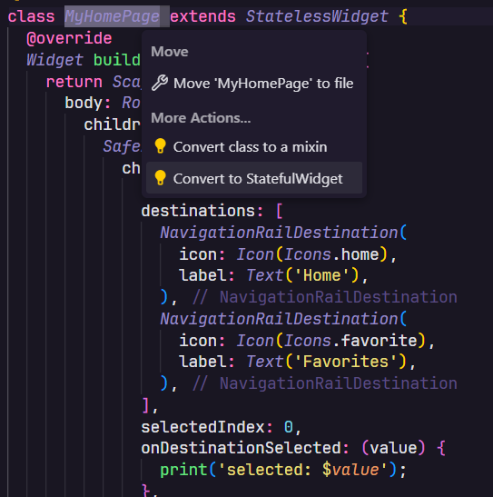

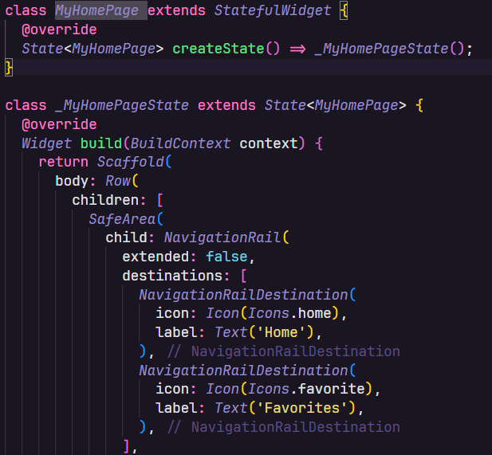

IDE membuat class baru untuk Anda, `_MyHomePageState`. Class ini memperluas `State` sehingga dapat mengelola nilainya sendiri. (Class ini dapat mengubah dirinya sendiri.) Perhatikan juga bahwa metode `build` dari widget stateless yang lama telah berpindah ke `_MyHomePageState` (bukannya tetap di widget). Metode berpindah secara bertahap—tidak ada yang diubah dalam metode `build`. Metode ini sekarang menetap di tempat lain.

Garis bawah (`_`) di awal `_MyHomePageState` membuat class tersebut menjadi class pribadi dan diterapkan oleh compiler. Jika Anda ingin mengetahui lebih lanjut tentang Dart dan topik-topik lainnya, baca artikel Tur Bahasa.

### setState

Widget stateful baru hanya perlu melacak satu variabel: `selectedIndex`. Buat 3 perubahan berikut untuk `_MyHomePageState`:

##### `lib/main.dart`

```dart
// ...

class _MyHomePageState extends State<MyHomePage> {

  var selectedIndex = 0;     // ← Add this property.

  @override
  Widget build(BuildContext context) {
    return Scaffold(
      body: Row(
        children: [
          SafeArea(
            child: NavigationRail(
              extended: false,
              destinations: [
                NavigationRailDestination(
                  icon: Icon(Icons.home),
                  label: Text('Home'),
                ),
                NavigationRailDestination(
                  icon: Icon(Icons.favorite),
                  label: Text('Favorites'),
                ),
              ],
              selectedIndex: selectedIndex,    // ← Change to this.
              onDestinationSelected: (value) {

                // ↓ Replace print with this.
                setState(() {
                  selectedIndex = value;
                });

              },
            ),
          ),
          Expanded(
            child: Container(
              color: Theme.of(context).colorScheme.primaryContainer,
              child: GeneratorPage(),
            ),
          ),
        ],
      ),
    );
  }
}

// ...
```


#### Periksa perubahannya:

- Anda memperkenalkan variabel baru, `selectedIndex`, dan melakukan inisialisasi menjadi 0.
- Anda menggunakan variabel baru ini dalam definisi `NavigationRail` sebagai ganti 0 yang di-hard-code dan ada di sana sampai sekarang.
- Saat callback `onDestinationSelected` dipanggil, sebagai ganti hanya mencetak nilai baru ke konsol, Anda menetapkan nilai tersebut ke `selectedIndex` di dalam panggilan `setState()`. Panggilan ini mirip dengan metode `notifyListeners()` yang digunakan sebelumnya—metode ini memastikan bahwa UI selalu diupdate.

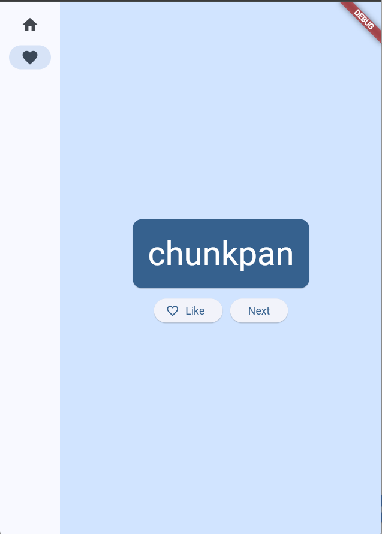

Kolom samping navigasi kini merespons interaksi pengguna. Namun, area yang diperluas di sebelah kanan tetap sama. Hal itu karena kode tidak menggunakan `selectedIndex` untuk menentukan apa yang ditampilkan di layar.

### Menggunakan selectedIndex

Tempatkan kode berikut di bagian atas metode `build` `_MyHomePageState`, tepat sebelum `return Scaffold`:

##### `lib/main.dart`

```dart
// ...

Widget page;
switch (selectedIndex) {
  case 0:
    page = GeneratorPage();
    break;
  case 1:
    page = Placeholder();
    break;
  default:
    throw UnimplementedError('no widget for $selectedIndex');
}

// ...
```

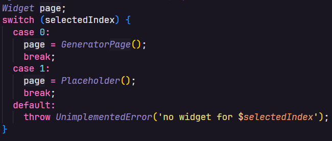

#### Periksa potongan kode berikut:

- Kode tersebut mendeklarasikan variabel baru, `page`, dari jenis `Widget`.
- Kemudian, pernyataan `switch` menetapkan layar untuk `page`, berdasarkan nilai saat ini pada `selectedIndex`.
- Karena belum ada `FavoritesPage`, gunakan `Placeholder`; sebuah widget praktis yang menggambar kotak silang di tempat yang Anda pilih, menandai bagian UI tersebut sebagai tidak tuntas.

Dengan menerapkan prinsip gagal cepat, pernyataan `switch` juga memastikan untuk menampilkan kesalahan jika `selectedIndex` bukan 0 atau 1. Hal ini membantu mencegah munculnya bug. Jika Anda menambahkan tujuan baru ke kolom samping navigasi dan lupa mengupdate kode ini, program akan mengalami error dalam pengembangan.

Kini, setelah `page` berisi widget yang ingin Anda tampilkan di sebelah kanan, Anda mungkin dapat menebak perubahan apa lagi yang diperlukan.

Berikut tampilan `_MyHomePageState` setelah satu perubahan tersebut:

##### `lib/main.dart`

```dart
// ...

class _MyHomePageState extends State<MyHomePage> {
  var selectedIndex = 0;

  @override
  Widget build(BuildContext context) {
    Widget page;
    switch (selectedIndex) {
      case 0:
        page = GeneratorPage();
        break;
      case 1:
        page = Placeholder();
        break;
      default:
        throw UnimplementedError('no widget for $selectedIndex');
    }

    return Scaffold(
      body: Row(
        children: [
          SafeArea(
            child: NavigationRail(
              extended: false,
              destinations: [
                NavigationRailDestination(
                  icon: Icon(Icons.home),
                  label: Text('Home'),
                ),
                NavigationRailDestination(
                  icon: Icon(Icons.favorite),
                  label: Text('Favorites'),
                ),
              ],
              selectedIndex: selectedIndex,
              onDestinationSelected: (value) {
                setState(() {
                  selectedIndex = value;
                });
              },
            ),
          ),
          Expanded(
            child: Container(
              color: Theme.of(context).colorScheme.primaryContainer,
              child: page,  // ← Here.
            ),
          ),
        ],
      ),
    );
  }
}

// ...
```

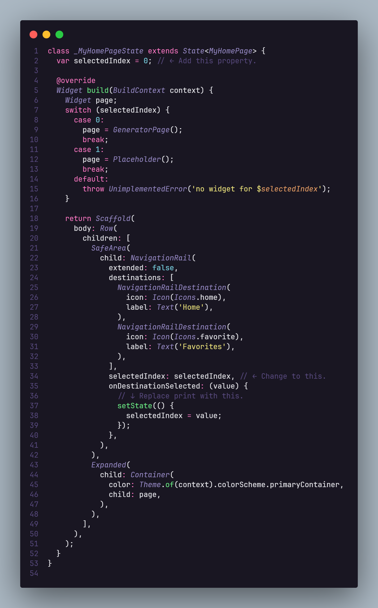

Aplikasi sekarang beralih di antara `GeneratorPage` kita dan placeholder yang akan segera menjadi halaman Favorites.

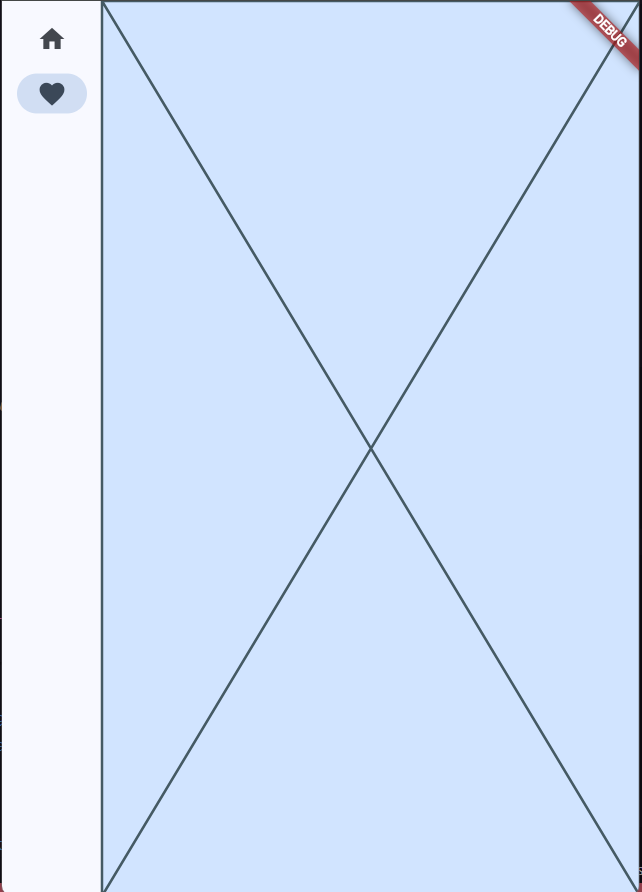

### Tingkat respons

Berikutnya, buat kolom samping navigasi menjadi responsif. Dengan kata lain, buat agar kolom samping navigasi menampilkan label secara otomatis (menggunakan `extended: true`) saat ada ruang yang cukup.

Flutter menyediakan berbagai widget yang membantu membuat aplikasi Anda menjadi responsif secara otomatis. Misalnya, `Wrap` adalah widget yang mirip dengan `Row` atau `Column` yang secara otomatis menggabungkan turunan ke "baris" berikutnya saat ruang vertikal atau horizontal tidak mencukupi. Ada `FittedBox`, sebuah widget yang secara otomatis memasukkan turunannya ke dalam ruang yang tersedia berdasarkan spesifikasi Anda.

Namun, `NavigationRail` tidak secara otomatis menampilkan label saat ruang tidak cukup karena kode tersebut tidak dapat mengetahui apa sebenarnya yang dimaksud dengan ruang yang cukup dalam setiap konteks. Pengambilan keputusan itu tergantung pada Anda sebagai developer.

Misalnya, Anda memutuskan untuk menampilkan label hanya jika lebar `MyHomePage` setidaknya 600 piksel.

> **Catatan**: Flutter bekerja dengan piksel logis sebagai unit panjang. Piksel ini juga terkadang disebut dengan piksel yang tidak tergantung perangkat. Ada sekitar 38 piksel logis per sentimeter, atau sekitar 96 piksel logis per inci, dari layar fisik.

Dalam hal ini, widget yang digunakan adalah `LayoutBuilder`. Widget ini memungkinkan Anda mengubah pohon widget tergantung pada seberapa banyak ruang yang tersedia yang dimiliki.

Sekali lagi, gunakan menu **Refactor** Flutter di VS Code untuk membuat perubahan yang diperlukan:

1. Dalam metode `build` `_MyHomePageState`, letakkan kursor Anda pada `Scaffold`.
2. Buka menu **Refactor** dengan `Ctrl+.` atau `Cmd+.`.
3. Pilih **Wrap with Builder** dan tekan **Enter**.
4. Modifikasi nama `Builder` yang baru ditambahkan menjadi `LayoutBuilder`.
5. Modifikasi daftar parameter callback dari `(context)` menjadi `(context, constraints)`.

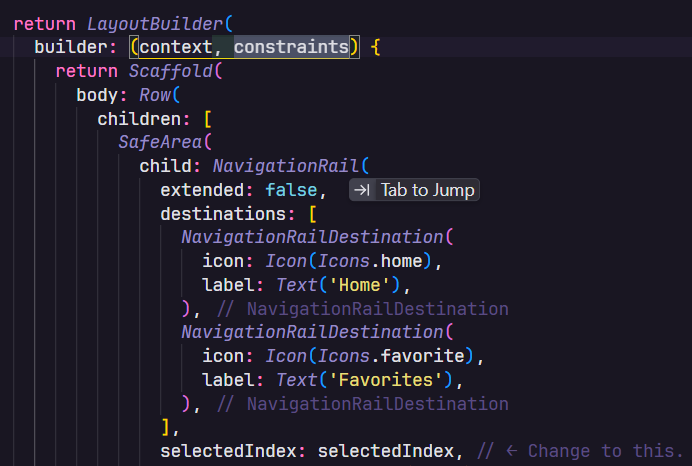

Callback builder `LayoutBuilder` dipanggil setiap kali batasan berubah. Sekarang kode Anda dapat memutuskan untuk menampilkan label dengan membuat kueri `constraints` saat ini.

Buat perubahan baris tunggal berikut untuk metode `build` `_MyHomePageState`:

##### `lib/main.dart`

```dart
// ...

class _MyHomePageState extends State<MyHomePage> {
  var selectedIndex = 0;

  @override
  Widget build(BuildContext context) {
    Widget page;
    switch (selectedIndex) {
      case 0:
        page = GeneratorPage();
        break;
      case 1:
        page = Placeholder();
        break;
      default:
        throw UnimplementedError('no widget for $selectedIndex');
    }

    return LayoutBuilder(builder: (context, constraints) {
      return Scaffold(
        body: Row(
          children: [
            SafeArea(
              child: NavigationRail(
                extended: constraints.maxWidth >= 600,  // ← Here.
                destinations: [
                  NavigationRailDestination(
                    icon: Icon(Icons.home),
                    label: Text('Home'),
                  ),
                  NavigationRailDestination(
                    icon: Icon(Icons.favorite),
                    label: Text('Favorites'),
                  ),
                ],
                selectedIndex: selectedIndex,
                onDestinationSelected: (value) {
                  setState(() {
                    selectedIndex = value;
                  });
                },
              ),
            ),
            Expanded(
              child: Container(
                color: Theme.of(context).colorScheme.primaryContainer,
                child: page,
              ),
            ),
          ],
        ),
      );
    });
  }
}

// ...
```

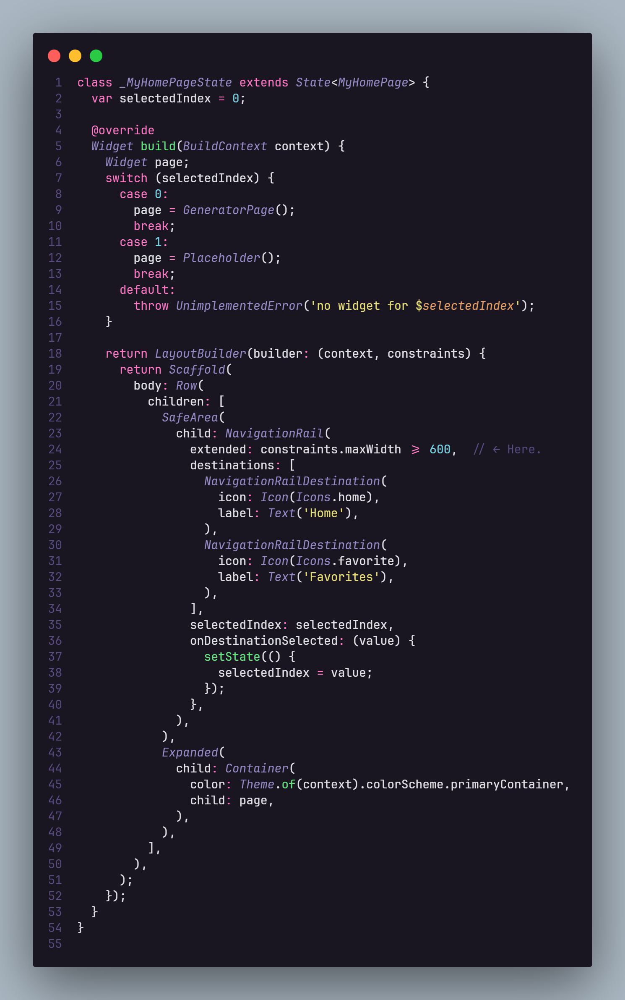

Sekarang aplikasi Anda merespons lingkungannya, seperti ukuran layar, orientasi, dan platform. Dengan kata lain, aplikasi Anda sudah responsif.

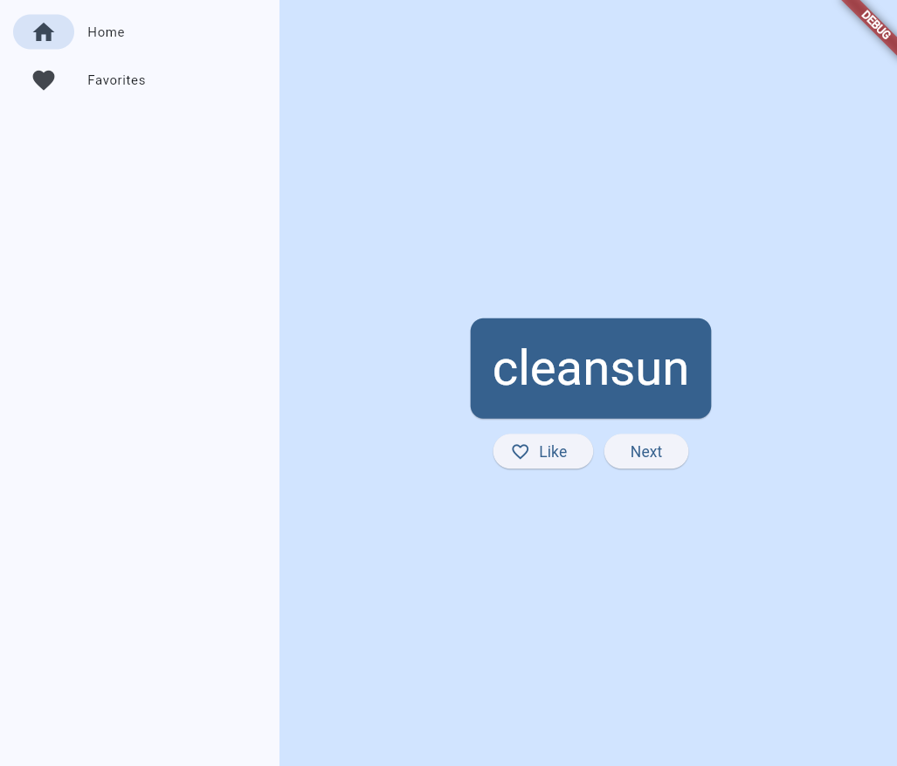

Pekerjaan yang tersisa hanya mengganti `Placeholder` itu dengan layar Favorites yang sebenarnya. Pembahasan itu dibahas di bagian berikutnya.

### Menambahkan halaman baru

Anda ingat widget `Placeholder` yang kita gunakan sebagai ganti halaman Favorites?

Saatnya memperbaiki hal ini.

Jika Anda ingin mencoba hal baru, coba lakukan langkah ini sendiri. Tujuan Anda adalah menampilkan daftar `favorites` dalam widget stateless baru, `FavoritesPage`, lalu menampilkan widget tersebut, bukan `Placeholder`.

#### Berikut beberapa petunjuk untuk Anda:

- Jika Anda menginginkan `Column` yang dapat di-scroll, gunakan widget `ListView`.
- Ingat, akses instans `MyAppState` dari widget apa pun menggunakan `context.watch<MyAppState>()`.
- Jika Anda juga ingin mencoba widget baru, `ListTile` memiliki properti seperti `title` (umumnya untuk teks), `leading` (untuk ikon atau avatar), dan `onTap` (untuk interaksi). Namun, Anda dapat mencapai efek serupa dengan widget yang sudah Anda ketahui.
- Dart memungkinkan penggunaan loop `for` dalam literal koleksi. Misalnya, jika `messages` berisi daftar string, Anda dapat memiliki kode seperti berikut:

Di sisi lain, jika Anda lebih terbiasa dengan pemrograman fungsional, Dart juga memungkinkan Anda menulis kode seperti `messages.map((m) => Text(m)).toList()`. Tentu saja Anda selalu dapat membuat daftar widget dan mengisinya secara imperatif di dalam metode `build`.

Keuntungan menambahkan sendiri halaman `Favorites` adalah Anda belajar lebih banyak dengan membuat keputusan sendiri. Kekurangannya adalah Anda mungkin menemui masalah yang belum dapat Anda pecahkan sendiri. Ingat: tidak apa-apa untuk gagal, dan kegagalan adalah salah satu elemen terpenting pembelajaran. Tidak ada yang mengharapkan Anda berhasil dalam pengembangan Flutter pertama Anda, dan Anda pun seharusnya begitu.

Berikut ini hanyalah salah satu cara untuk menerapkan halaman favorit. Bagaimana halaman ini diterapkan (semoga) akan menginspirasi Anda untuk bermain dengan kode—meningkatkan UI dan membuat UI sesuai keinginan Anda.

Berikut class `FavoritesPage` baru:

##### `lib/main.dart`

```dart
// ...

class FavoritesPage extends StatelessWidget {
  @override
  Widget build(BuildContext context) {
    var appState = context.watch<MyAppState>();

    if (appState.favorites.isEmpty) {
      return Center(
        child: Text('No favorites yet.'),
      );
    }

    return ListView(
      children: [
        Padding(
          padding: const EdgeInsets.all(20),
          child: Text('You have '
              '${appState.favorites.length} favorites:'),
        ),
        for (var pair in appState.favorites)
          ListTile(
            leading: Icon(Icons.favorite),
            title: Text(pair.asLowerCase),
          ),
      ],
    );
  }
}
```

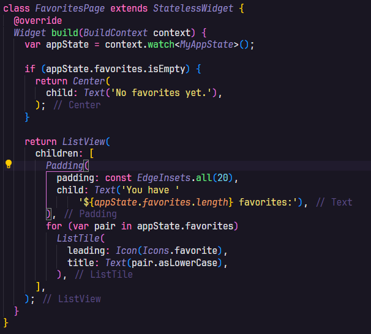

#### Inilah fungsi widget tersebut:

- Widget ini mendapatkan status aplikasi saat ini.
- Jika daftar favorit kosong, pesan terpusat berikut akan ditampilkan: _No favorites yet._
- Jika tidak, daftar (dapat di-scroll) akan ditampilkan.
- Daftar tersebut dimulai dengan ringkasan (misalnya, _You have 5 favorites._).
- Kode tersebut kemudian melakukan iterasi di seluruh favorit dan membuat widget `ListTile` untuk masing-masing favorit.

Yang tersisa sekarang adalah mengganti widget `Placeholder` dengan `FavoritesPage`. Dan selesai!

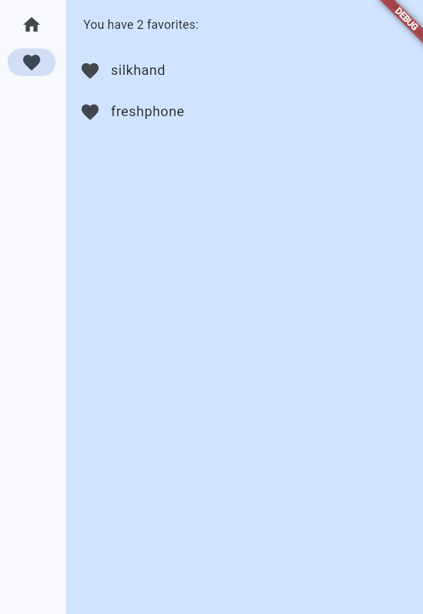

Anda bisa mendapatkan kode terakhir aplikasi ini melalui repo codelab di GitHub.
