# Laporan Praktikum #05 Aplikasi Pertama dan Widget Dasar Flutter

## Identitas Mahasiswa

| Atribut | Nilai                   |
| ------- | ----------------------- |
| Nama    | Dimas Adit Thalia Putra |
| NIM     | 244107060037            |
| Kelas   | SIB-2E                  |

---

## Praktikum 1: Membuat Aplikasi "Hello World" dengan Flutter

### Langkah 1

Buka VS Code, lalu tekan tombol **Ctrl + Shift + P** maka akan tampil **Command Palette**, lalu ketik **Flutter**. Pilih **New Application Project**.

> **Catatan:** Anda dapat mengakses Command Palette dengan cara lain, yaitu pilih menu **View > Command Palette**. Tombol shortcut `Ctrl + Shift + P` mungkin hanya berlaku di Windows.

**Screenshot:**

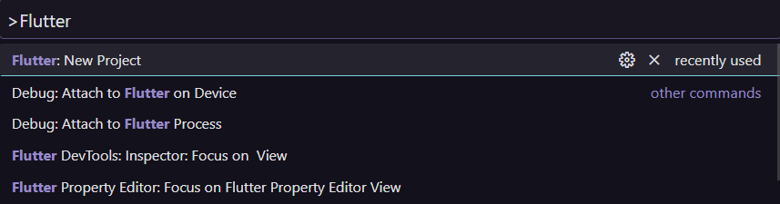

---

### Langkah 2

Kemudian buat folder sesuai style laporan praktikum yang Anda pilih. Disarankan pada folder dokumen atau desktop atau alamat folder lain yang tidak terlalu dalam atau panjang. Lalu pilih **Select a folder to create the project in**.

**Screenshot:**

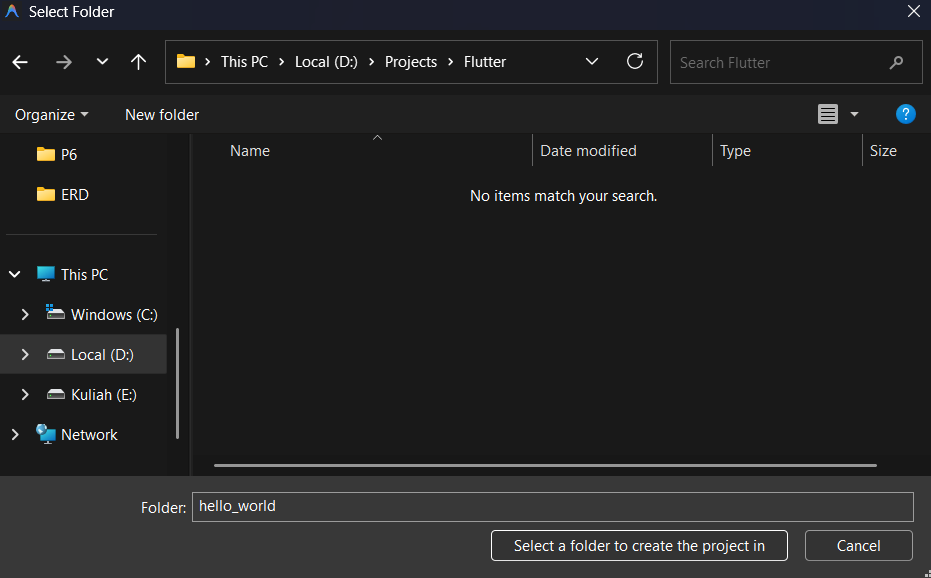

---

### Langkah 3

Buat nama project flutter **hello_world** seperti berikut, lalu tekan **Enter**. Tunggu hingga proses pembuatan project baru selesai.

> **Perhatian:** Nama project ini harus **lowercase** (huruf kecil semua) tanpa menggunakan spasi. Untuk memisahkan kata, bisa menggunakan underline (garis bawah). Nama project tidak dapat diawali dengan angka atau karakter khusus lain. Nama project ini bukan nama aplikasi yang akan tampil di Play Store atau App Store. Untuk nama aplikasi, nanti dapat diatur ketika melakukan deployment.

**Screenshot:**

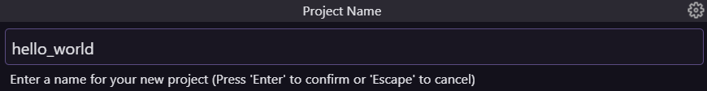

---

### Langkah 4

Jika sudah selesai proses pembuatan project baru, pastikan tampilan seperti berikut. Pesan akan tampil berupa **"Your Flutter Project is ready!"** artinya Anda telah berhasil membuat project Flutter baru.

**Screenshot:**

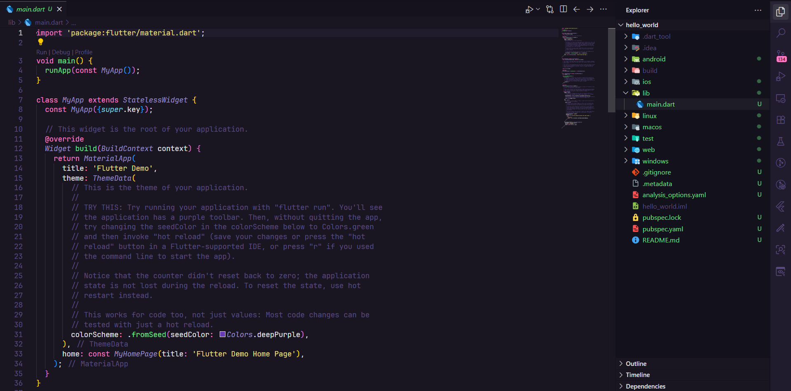

---

## Praktikum 2: Menghubungkan Perangkat Android atau Emulator

Melanjutkan dari praktikum 1, Anda diminta untuk menjalankan aplikasi ke perangkat fisik (device Android atau iOS). Silakan ikuti langkah-langkah pada codelab tautan berikut ini.

> https://developer.android.com/codelabs/basic-android-kotlin-compose-connect-device?hl=id#0

**Screenshot:**

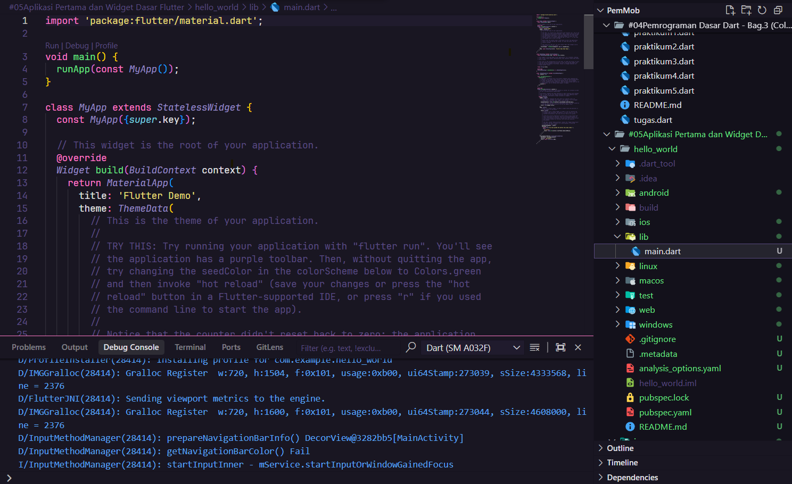

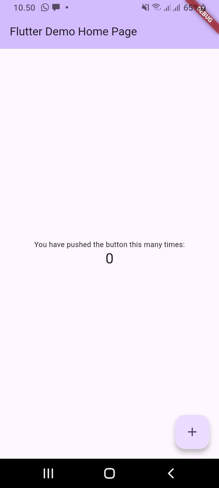

## Praktikum 3: Membuat Repository GitHub dan Laporan Praktikum

### Langkah 1

Login ke akun [GitHub](https://github.com/new) Anda, lalu buat repository baru dengan nama **"flutter-fundamental-part1"**.

**Screenshot:**

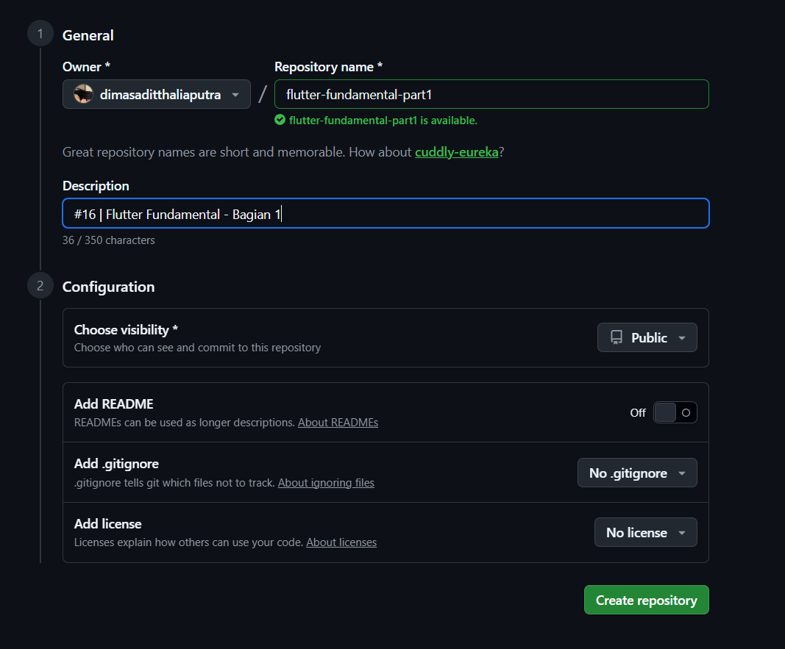

---

### Langkah 2

Lalu klik tombol **"Create repository"** dan akan tampil halaman repository yang baru dibuat.

**Screenshot:**

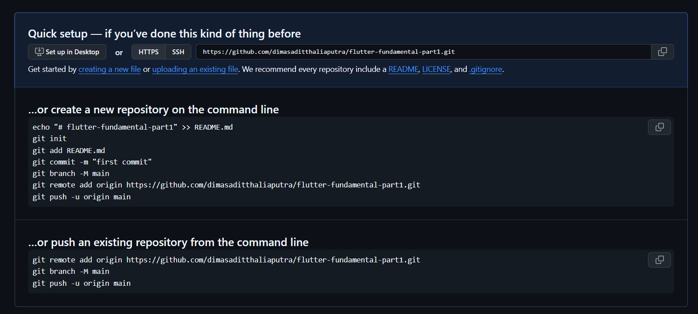

---

### Langkah 3

Kembali ke VS Code, project flutter `hello_world`, buka terminal pada menu **Terminal > New Terminal**. Lalu ketik perintah berikut untuk inisialisasi git pada project Anda.

```bash
git init
```

**Screenshot:**

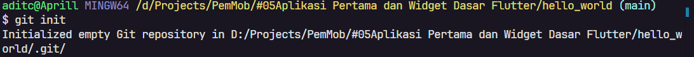

---

### Langkah 4

Pilih menu **Source Control** di bagian kiri, lalu lakukan **stages (+)** pada file `.gitignore` untuk mengunggah file pertama ke repository GitHub.

**Screenshot:**

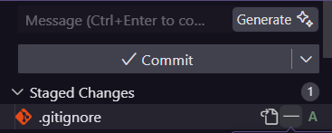

---

### Langkah 5

Beri pesan commit **"tambah gitignore"** lalu klik **Commit (✔)**.

**Screenshot:**

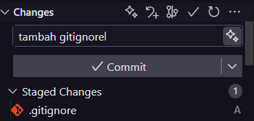

---

### Langkah 6

Lakukan push dengan klik bagian menu **titik tiga > Push**.

**Screenshot:**

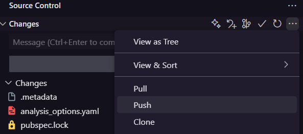

---

### Langkah 7

Di pojok kanan bawah akan tampil notifikasi. Klik **"Add Remote"**.

**Screenshot:**

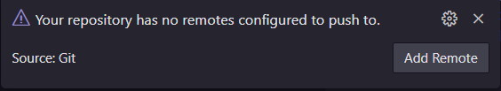

---

### Langkah 8

Salin tautan repository Anda dari browser ke bagian ini, lalu klik **Add remote**.

**Screenshot:**

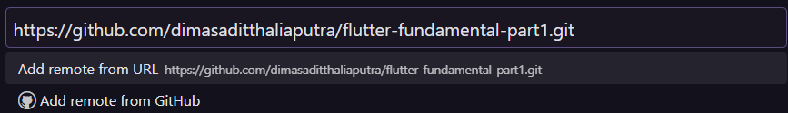

Setelah berhasil, tulis remote name dengan **"origin"**.

**Screenshot:**

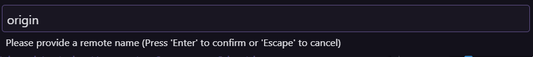

---

### Langkah 9

Lakukan hal yang sama pada file `README.md` mulai dari Langkah 4. Setelah berhasil melakukan push, masukkan username GitHub Anda dan password berupa token yang telah dibuat (pengganti password konvensional ketika Anda login di browser GitHub). Reload halaman repository GitHub Anda, maka akan tampil hasil push kedua file tersebut.

> **Perhatian:** Personal access token GitHub dapat Anda buat melalui [https://github.com/settings/tokens/new](https://github.com/settings/tokens/new) atau membaca dokumentasi [GitHub Token](https://docs.github.com/en/authentication/keeping-your-account-and-data-secure/creating-a-personal-access-token).

**Screenshot:**

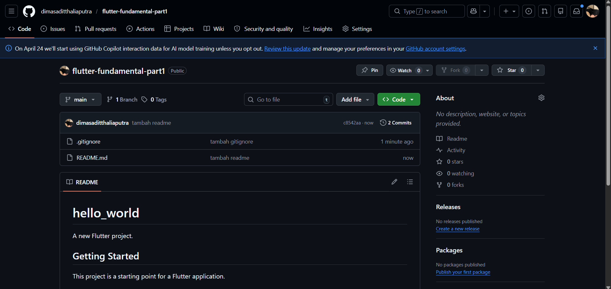

> Github : _https://github.com/dimasaditthaliaputra/flutter-fundamental-part1.git_

---

### Langkah 10

Lakukan push juga untuk semua file lainnya dengan pilih **Stage All Changes**. Beri pesan commit **"project hello_world"**. Maka akan tampil di repository GitHub Anda.

**Screenshot:**

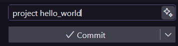

---

### Langkah 11

Kembali ke VS Code, ubah platform di pojok kanan bawah ke emulator atau device atau bisa juga menggunakan browser Chrome. Lalu coba running project `hello_world` dengan tekan **F5** atau **Run > Start Debugging**. Tunggu proses kompilasi hingga selesai, maka aplikasi Flutter pertama Anda akan tampil.

> **Perhatian:** Proses Run atau kompilasi untuk pertama kali akan memakan waktu cukup lama (3-5 menit). Namun, proses kompilasi berikutnya menjadi lebih cepat.

**Screenshot:**


---

### Langkah 12

Silakan screenshot seperti pada Langkah 11, namun teks yang ditampilkan dalam aplikasi berupa **nama lengkap Anda**. Simpan file screenshot dengan nama `01.png` pada folder `images` (buat folder baru jika belum ada) di project `hello_world` Anda. Lalu ubah isi `README.md` sehingga tampil hasil screenshot. Kemudian push ke repository Anda.

> **Perhatian:** Lakukan proses screenshot seperti pada Langkah 12 untuk setiap Laporan Praktikum yang Anda akan buat pada praktikum selanjutnya hingga pertemuan project final.

**Screenshot:**

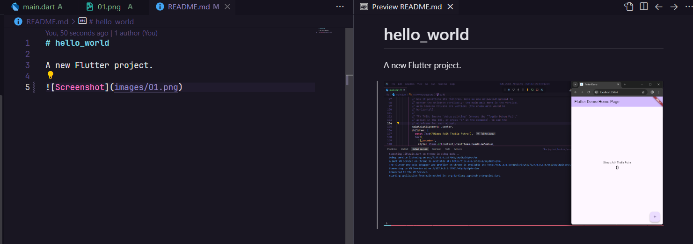

---

## Praktikum 4: Menerapkan Widget Dasar

### Langkah 1: Text Widget

Buat folder baru `basic_widgets` di dalam folder `lib`. Kemudian buat file baru di dalam `basic_widgets` dengan nama `text_widget.dart`. Ketik atau salin kode program berikut ke project `hello_world` Anda pada file `text_widget.dart`.

```dart
import 'package:flutter/material.dart';

class MyTextWidget extends StatelessWidget {
  const MyTextWidget({Key? key}) : super(key: key);

  @override
  Widget build(BuildContext context) {
    return const Text(
      "Nama saya Dimas Adit Thalia Putra, sedang belajar Pemrograman Mobile",
      style: TextStyle(color: Colors.red, fontSize: 14),
      textAlign: TextAlign.center,
    );
  }
}
```

Lakukan import file `text_widget.dart` ke `main.dart`, lalu ganti bagian text widget dengan kode di atas.

**Screenshot:**

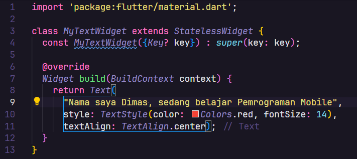

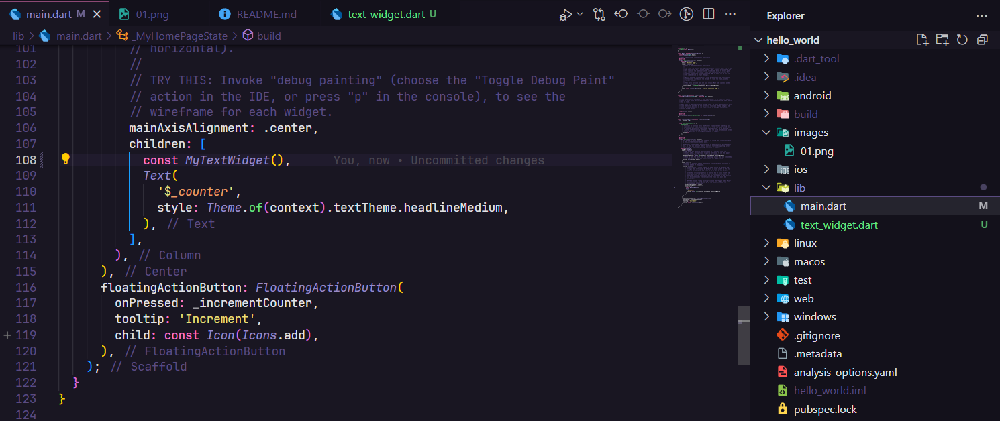

---

### Langkah 2: Image Widget

Buat sebuah file `image_widget.dart` di dalam folder `basic_widgets` dengan isi kode berikut.

```dart
import 'package:flutter/material.dart';

class MyImageWidget extends StatelessWidget {
  const MyImageWidget({Key? key}) : super(key: key);

  @override
  Widget build(BuildContext context) {
    return const Image(
      image: AssetImage("logo_polinema.jpg"),
    );
  }
}
```

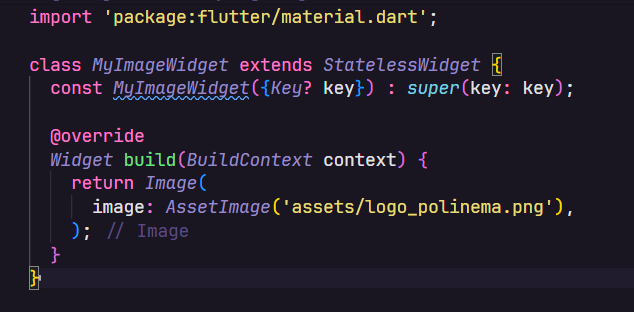

Lakukan penyesuaian asset pada file `pubspec.yaml` dan tambahkan file logo Anda di folder `assets` project `hello_world`.

```yaml
flutter:
  assets:
    - logo_polinema.jpg
```

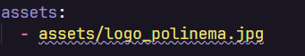

Jangan lupa sesuaikan kode dan import di file `main.dart` kemudian jalankan aplikasi.

**Screenshot:**

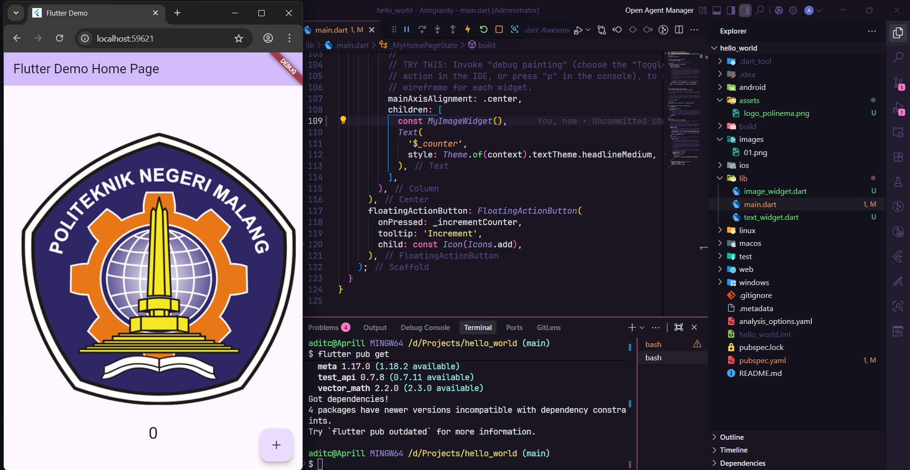

---

## Praktikum 5: Menerapkan Widget Material Design dan iOS Cupertino

Selesaikan langkah-langkah praktikum berikut ini dengan melanjutkan project `hello_world` Anda. Lakukan langkah yang sama seperti pada Praktikum 4, yaitu setiap widget dibuat file sendiri lalu import ke `main.dart` dan screenshot hasilnya.

### Langkah 1: Cupertino Button dan Loading Bar

Buat file di `basic_widgets` > `loading_cupertino.dart`. Import stateless widget dari material dan cupertino. Lalu isi kode di dalam method `Widget build` adalah sebagai berikut.

```dart
import 'package:flutter/cupertino.dart';
import 'package:flutter/material.dart';

class LoadingCupertino extends StatelessWidget {
  const LoadingCupertino({Key? key}) : super(key: key);

  @override
  Widget build(BuildContext context) {
    return MaterialApp(
      home: Container(
        margin: const EdgeInsets.only(top: 30),
        color: Colors.white,
        child: Column(
          children: <Widget>[
            CupertinoButton(
              child: const Text("Contoh button"),
              onPressed: () {},
            ),
            const CupertinoActivityIndicator(),
          ],
        ),
      ),
    );
  }
}
```

**Screenshot:**

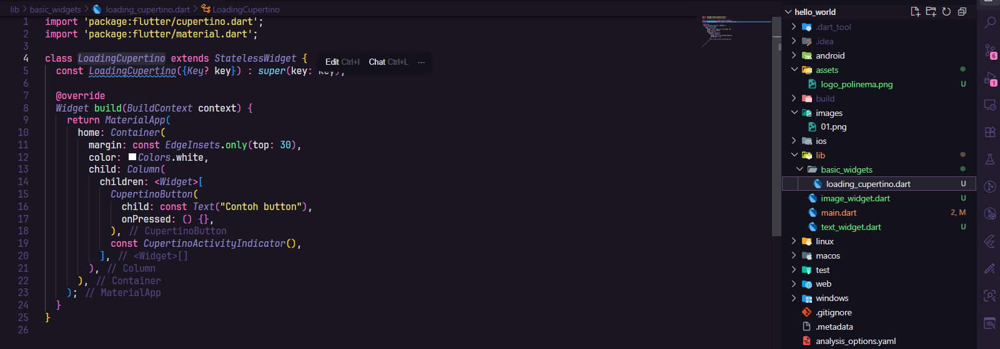
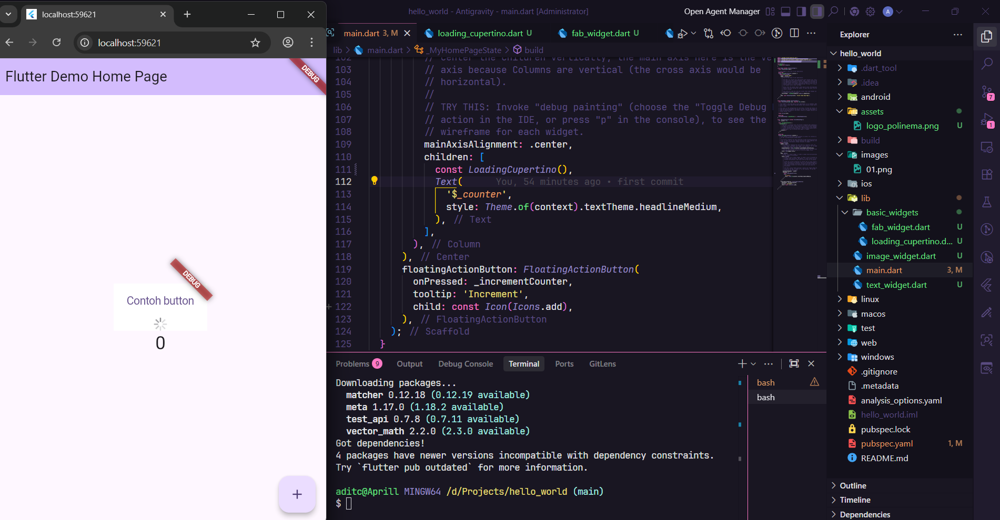

---

### Langkah 2: Floating Action Button (FAB)

Button widget terdapat beberapa macam pada Flutter yaitu `ButtonBar`, `DropdownButton`, `TextButton`, `FloatingActionButton`, `IconButton`, `OutlineButton`, `PopupMenuButton`, dan `ElevatedButton`.

Buat file di `basic_widgets` > `fab_widget.dart`. Import stateless widget dari material. Lalu isi kode di dalam method `Widget build` adalah sebagai berikut.

```dart
import 'package:flutter/material.dart';

class FabWidget extends StatelessWidget {
  const FabWidget({Key? key}) : super(key: key);

  @override
  Widget build(BuildContext context) {
    return MaterialApp(
      home: Scaffold(
        floatingActionButton: FloatingActionButton(
          onPressed: () {
            // Add your onPressed code here!
          },
          child: const Icon(Icons.thumb_up),
          backgroundColor: Colors.pink,
        ),
      ),
    );
  }
}
```

**Screenshot:**

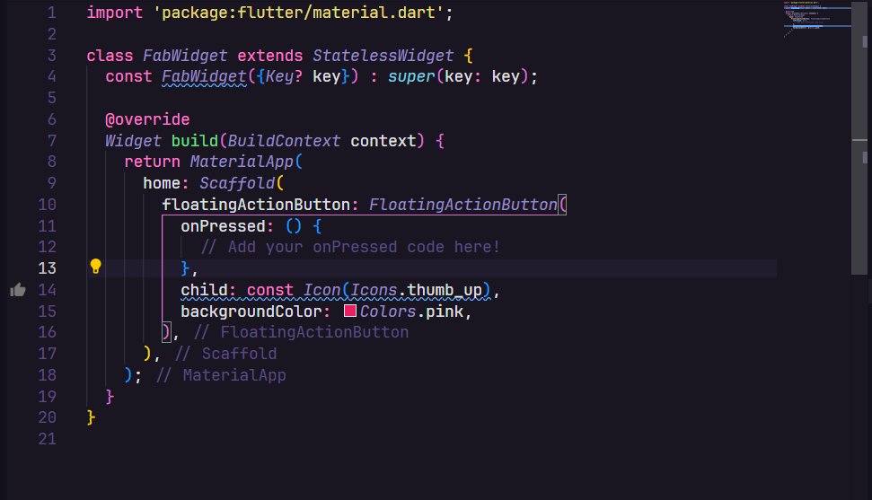

Terjadi **overflow** karena `FabWidget` memiliki `MaterialApp` dan `Scaffold` sendiri di dalamnya. Ketika widget tersebut diletakkan di dalam `Column` pada `Scaffold` lain, ia mencoba mengambil tinggi tak terbatas sehingga menyebabkan error **RenderFlex overflowed**.

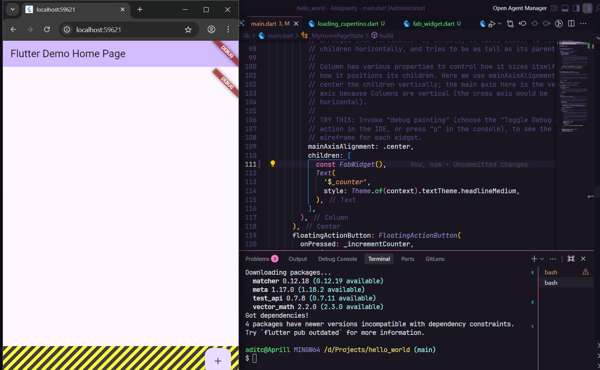

Terjadi overflow karena `FabWidget` awalnya memiliki `MaterialApp` dan `Scaffold` sendiri di dalamnya. Ketika widget tersebut diletakkan di dalam `Column` pada `Scaffold` lain, ia mencoba mengambil tinggi tak terbatas sehingga menyebabkan error **RenderFlex overflowed**.

**Cara mengatasinya:** Ubah `FabWidget` agar hanya me-return widget `FloatingActionButton` saja (tanpa membungkusnya dalam `MaterialApp` dan `Scaffold`), lalu gunakan `FabWidget()` pada properti `floatingActionButton` milik `Scaffold` — bukan di dalam `Column` pada `body`. Dengan demikian, FAB akan tampil di posisi yang semestinya (pojok kanan bawah) tanpa menyebabkan overflow.

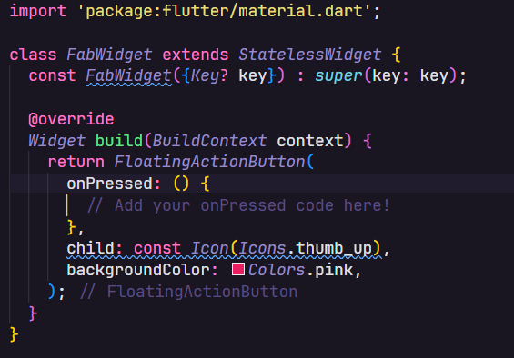

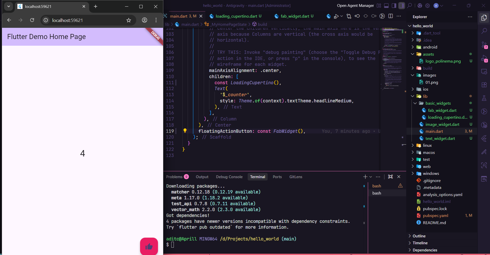

### Langkah 3: Scaffold Widget

Scaffold widget digunakan untuk mengatur tata letak sesuai dengan material design.

Ubah isi kode `main.dart` seperti berikut.

```dart
import 'package:flutter/material.dart';

void main() {
  runApp(const MyApp());
}

class MyApp extends StatelessWidget {
  const MyApp({Key? key}) : super(key: key);

  @override
  Widget build(BuildContext context) {
    return MaterialApp(
      title: 'Flutter Demo',
      theme: ThemeData(
        primarySwatch: Colors.red,
      ),
      home: const MyHomePage(title: 'My Increment App'),
    );
  }
}

class MyHomePage extends StatefulWidget {
  const MyHomePage({Key? key, required this.title}) : super(key: key);

  final String title;

  @override
  State<MyHomePage> createState() => _MyHomePageState();
}

class _MyHomePageState extends State<MyHomePage> {
  int _counter = 0;

  void _incrementCounter() {
    setState(() {
      _counter++;
    });
  }

  @override
  Widget build(BuildContext context) {
    return Scaffold(
      appBar: AppBar(
        title: Text(widget.title),
      ),
      body: Center(
        child: Column(
          mainAxisAlignment: MainAxisAlignment.center,
          children: <Widget>[
            const Text(
              'You have pushed the button this many times:',
            ),
            Text(
              '$_counter',
              style: Theme.of(context).textTheme.headline4,
            ),
          ],
        ),
      ),
      bottomNavigationBar: BottomAppBar(
        child: Container(
          height: 50.0,
        ),
      ),
      floatingActionButton: FloatingActionButton(
        onPressed: _incrementCounter,
        tooltip: 'Increment Counter',
        child: const Icon(Icons.add),
      ),
      floatingActionButtonLocation:
          FloatingActionButtonLocation.centerDocked,
    );
  }
}
```

**Screenshot:**

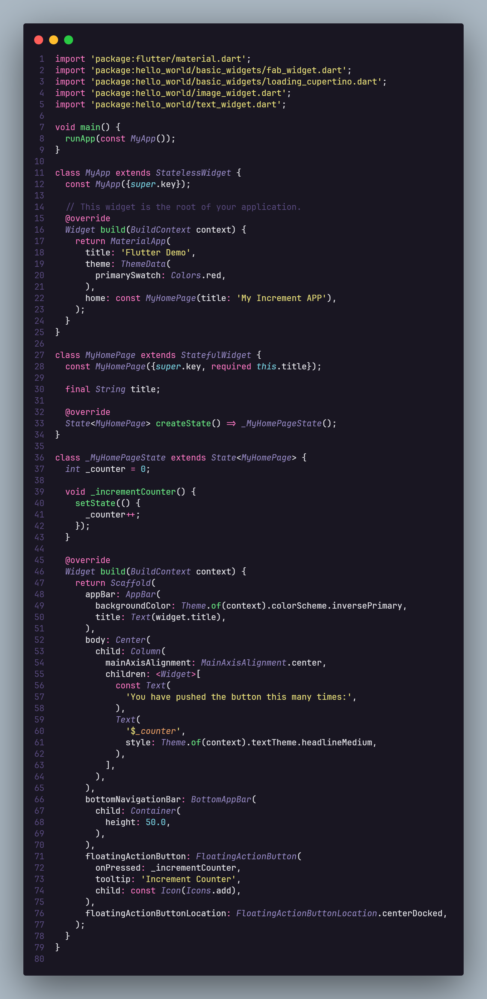

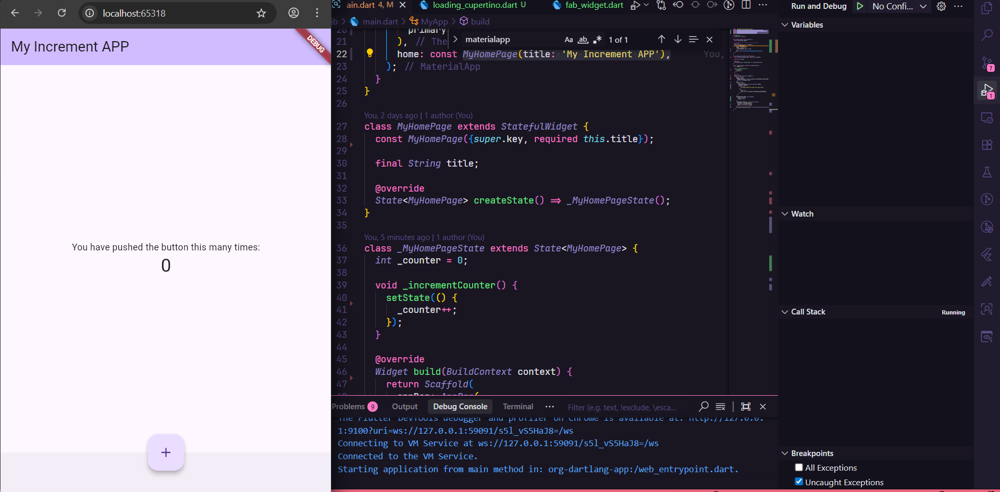

---

### Langkah 4: Dialog Widget

Dialog widget pada Flutter memiliki dua jenis dialog yaitu `AlertDialog` dan `SimpleDialog`.

Ubah isi kode `main.dart` seperti berikut.

```dart
import 'package:flutter/material.dart';

void main() {
  runApp(const MyApp());
}

class MyApp extends StatelessWidget {
  const MyApp({Key? key}) : super(key: key);

  @override
  Widget build(BuildContext context) {
    return const MaterialApp(
      home: Scaffold(
        body: MyLayout(),
      ),
    );
  }
}

class MyLayout extends StatelessWidget {
  const MyLayout({Key? key}) : super(key: key);

  @override
  Widget build(BuildContext context) {
    return Padding(
      padding: const EdgeInsets.all(8.0),
      child: ElevatedButton(
        child: const Text('Show alert'),
        onPressed: () {
          showAlertDialog(context);
        },
      ),
    );
  }
}

showAlertDialog(BuildContext context) {
  // set up the button
  Widget okButton = TextButton(
    child: const Text("OK"),
    onPressed: () {
      Navigator.pop(context);
    },
  );

  // set up the AlertDialog
  AlertDialog alert = AlertDialog(
    title: const Text("My title"),
    content: const Text("This is my message."),
    actions: [
      okButton,
    ],
  );

  // show the dialog
  showDialog(
    context: context,
    builder: (BuildContext context) {
      return alert;
    },
  );
}
```

**Screenshot:**

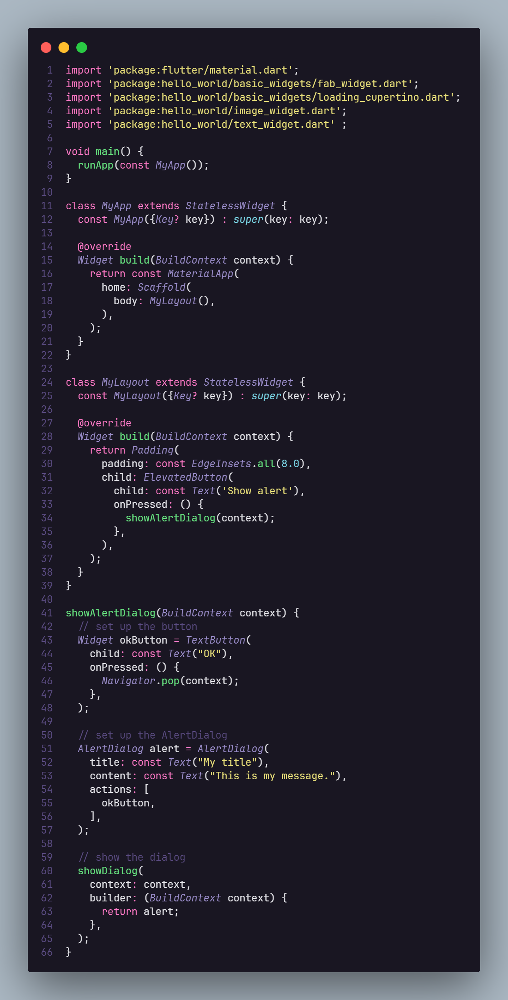

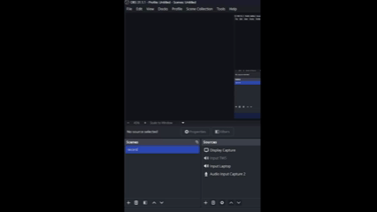

---

### Langkah 5: Input dan Selection Widget

Flutter menyediakan widget yang dapat menerima input dari pengguna aplikasi yaitu antara lain `Checkbox`, `Date and Time Pickers`, `Radio Button`, `Slider`, `Switch`, `TextField`.

Contoh penggunaan `TextField` widget adalah sebagai berikut:

```dart
import 'package:flutter/material.dart';

void main() {
  runApp(const MyApp());
}

class MyApp extends StatelessWidget {
  const MyApp({Key? key}) : super(key: key);

  @override
  Widget build(BuildContext context) {
    return MaterialApp(
      home: Scaffold(
        appBar: AppBar(title: const Text("Contoh TextField")),
        body: const TextField(
          obscureText: false,
          decoration: InputDecoration(
            border: OutlineInputBorder(),
            labelText: 'Nama',
          ),
        ),
      ),
    );
  }
}
```

**Screenshot:**

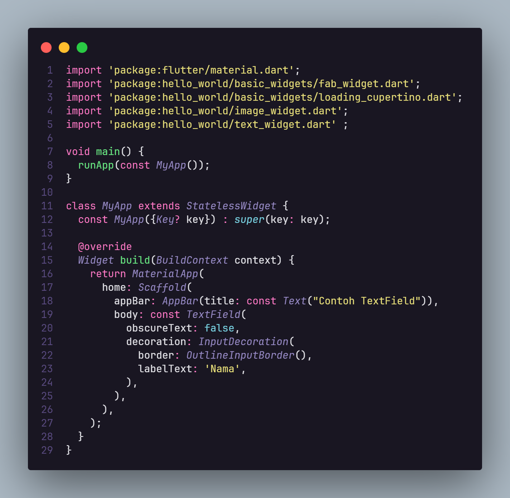

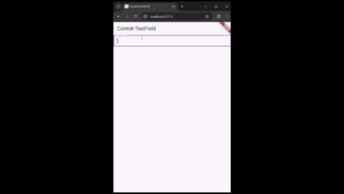

---

### Langkah 6: Date and Time Pickers

Date and Time Pickers termasuk pada kategori input dan selection widget, berikut adalah contoh penggunaan Date and Time Pickers.

```dart
import 'dart:async';
import 'package:flutter/material.dart';

void main() => runApp(const MyApp());

class MyApp extends StatelessWidget {
  const MyApp({Key? key}) : super(key: key);

  @override
  Widget build(BuildContext context) {
    return const MaterialApp(
      title: 'Contoh Date Picker',
      home: MyHomePage(title: 'Contoh Date Picker'),
    );
  }
}

class MyHomePage extends StatefulWidget {
  const MyHomePage({Key? key, required this.title}) : super(key: key);

  final String title;

  @override
  _MyHomePageState createState() => _MyHomePageState();
}

class _MyHomePageState extends State<MyHomePage> {
  DateTime selectedDate = DateTime.now();

  Future<void> _selectDate(BuildContext context) async {
    final DateTime? picked = await showDatePicker(
      context: context,
      initialDate: selectedDate,
      firstDate: DateTime(2015, 8),
      lastDate: DateTime(2101),
    );
    if (picked != null && picked != selectedDate) {
      setState(() {
        selectedDate = picked;
      });
    }
  }

  @override
  Widget build(BuildContext context) {
    return Scaffold(
      appBar: AppBar(
        title: Text(widget.title),
      ),
      body: Center(
        child: Column(
          mainAxisSize: MainAxisSize.min,
          children: <Widget>[
            Text("${selectedDate.toLocal()}".split(' ')[0]),
            const SizedBox(height: 20.0),
            ElevatedButton(
              onPressed: () => _selectDate(context),
              child: const Text('Pilih Tanggal'),
            ),
          ],
        ),
      ),
    );
  }
}
```

**Screenshot:**

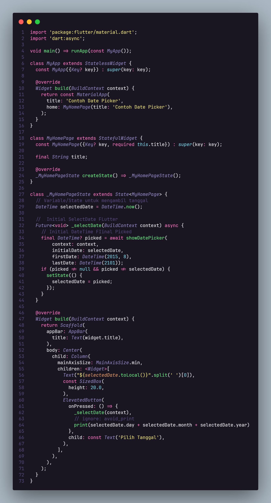

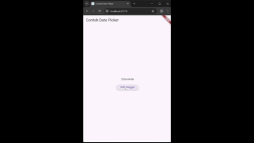

---

## Tugas Praktikum

1. Selesaikan Praktikum 1 sampai 5, lalu dokumentasikan dan push ke repository Anda berupa screenshot setiap hasil pekerjaan beserta penjelasannya di file `README.md`!
2. Selesaikan Praktikum 2 dan Anda wajib menjalankan aplikasi `hello_world` pada perangkat fisik (device Android/iOS) agar Anda mempunyai pengalaman untuk menghubungkan ke perangkat fisik. Capture hasil aplikasi di perangkat, lalu buatlah laporan praktikum pada file `README.md`.

**Screenshot:**


3. Pada praktikum 5 mulai dari Langkah 3 sampai 6, buatlah file widget tersendiri di folder `basic_widgets`, kemudian pada file `main.dart` cukup melakukan import widget sesuai masing-masing langkah tersebut!

**Screenshot:**

### Code and Result

1. Scaffold Widget

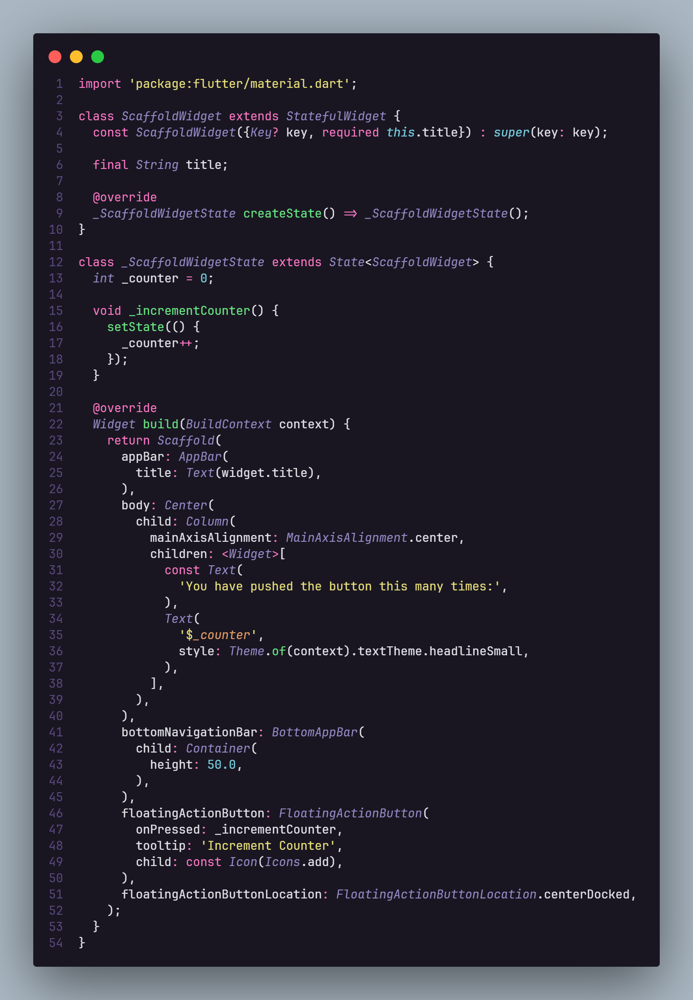

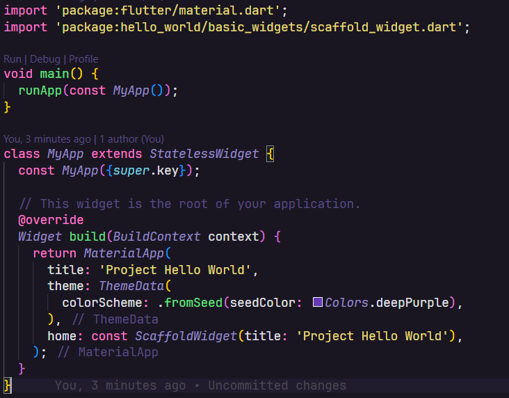

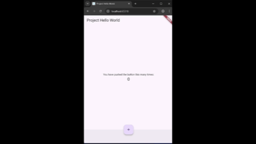

2. Dialog Widget

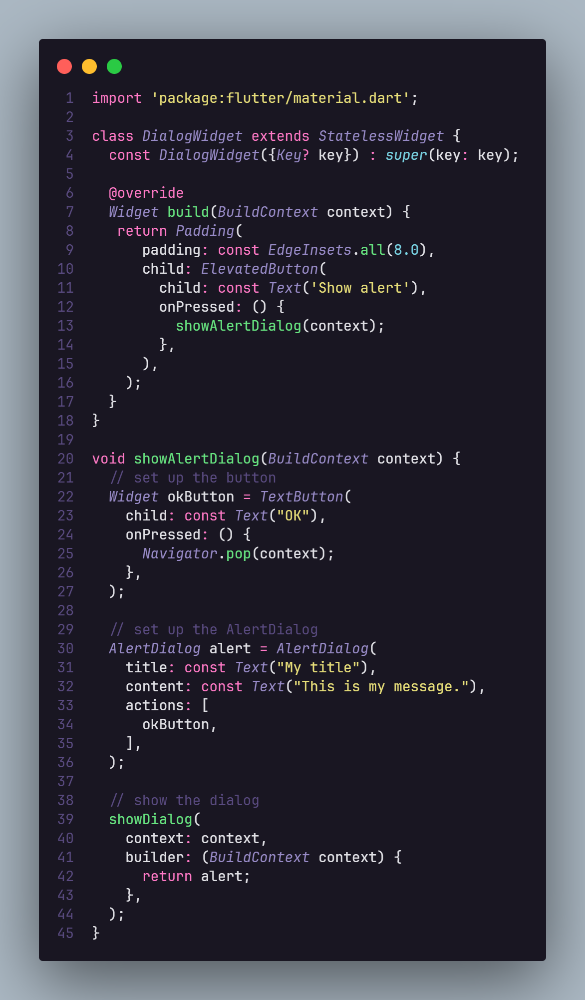

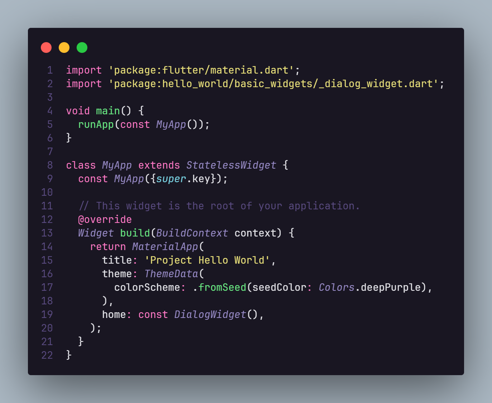


3. Input and Selection Widget

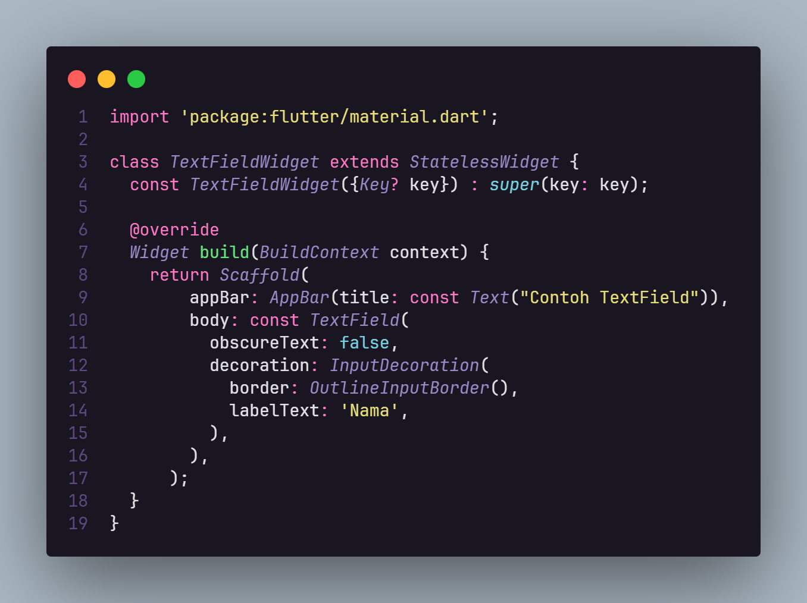


4. Date and Time Pickers

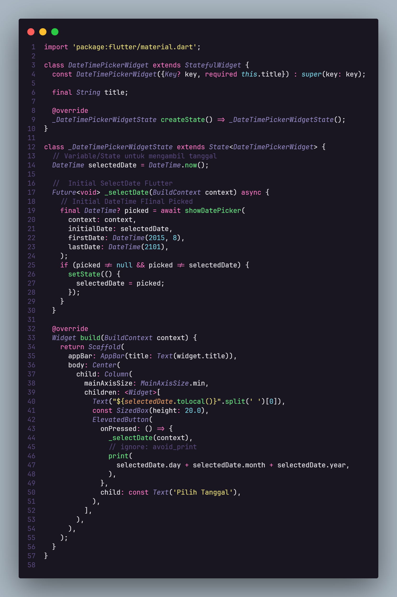

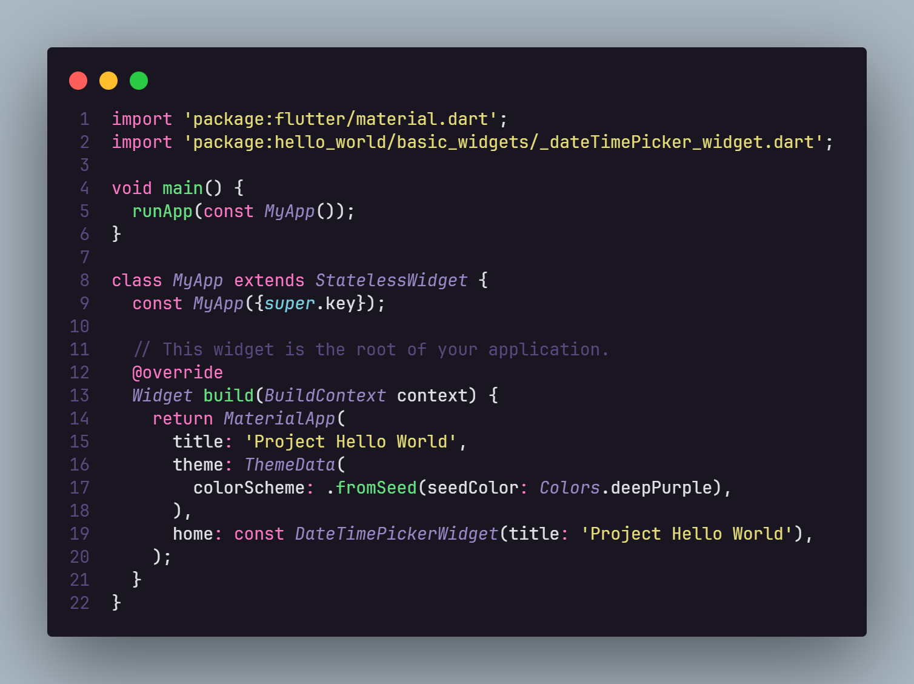


4. Selesaikan [Codelabs: Your first Flutter app](https://codelabs.developers.google.com/codelabs/flutter-codelab-first#0), lalu buatlah laporan praktikumnya dan push ke repository GitHub Anda!

Laporan Codelabs

[Lihat README Modul TextField](./Codelabs.md)

5. `README.md` berisi: capture hasil akhir tiap praktikum (side-by-side, bisa juga berupa file GIF agar terlihat proses perubahan ketika ada aksi dari pengguna) dengan menampilkan **NIM dan Nama** Anda sebagai ciri pekerjaan Anda.
6. Kumpulkan berupa link repository/commit GitHub Anda kepada dosen yang telah disepakati!