# Laporan Praktikum #06 Layout Navigasi

## Identitas Mahasiswa

| Atribut | Nilai                   |
| ------- | ----------------------- |
| Nama    | Dimas Adit Thalia Putra |
| NIM     | 244107060037            |
| Kelas   | SIB-2E                  |

---

## Praktikum 1: Membangun Layout di Flutter

### Apa yang akan Anda pelajari
- Cara kerja mekanisme tata letak Flutter.
- Cara menata widget secara vertikal dan horizontal.
- Cara membuat tata letak Flutter.

Selesaikan langkah-langkah praktikum berikut ini menggunakan editor Visual Studio Code (VS Code) atau Android Studio atau code editor lain kesukaan Anda.

> **Perhatian:** Diasumsikan Anda telah berhasil melakukan setup environment Flutter SDK, VS Code, Flutter Plugin, dan Android SDK pada pertemuan pertama.


### Langkah 1: Buat Project Baru
Buatlah sebuah project flutter baru dengan nama **layout_flutter**. Atau sesuaikan style laporan praktikum yang Anda buat.

### Langkah 2: Buka file `lib/main.dart`
Buka file `main.dart` lalu ganti dengan kode berikut. Isi nama dan NIM Anda di `text title`.

```dart
import 'package:flutter/material.dart';

void main() => runApp(const MyApp());

class MyApp extends StatelessWidget {
  const MyApp({super.key});

  @override
  Widget build(BuildContext context) {
    return MaterialApp(
      title: 'Flutter layout: Dimas Adit Thalia Putra 244107060037',
      home: Scaffold(
        appBar: AppBar(
          title: const Text('Flutter layout demo'),
        ),
        body: const Center(
          child: Text('Hello World'),
        ),
      ),
    );
  }
}
```
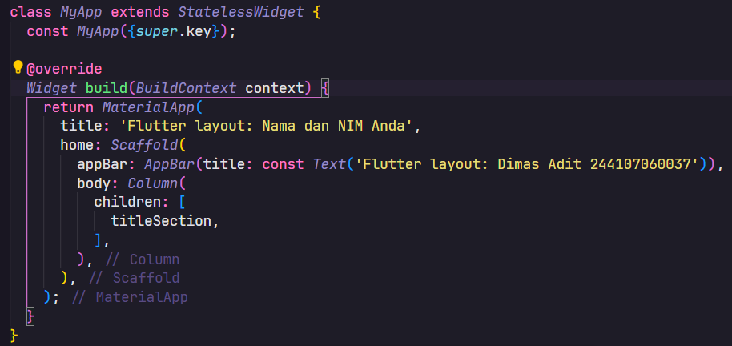

### Langkah 3: Identifikasi layout diagram
Langkah pertama adalah memecah tata letak menjadi elemen dasarnya:
- Identifikasi baris dan kolom.
- Apakah tata letaknya menyertakan kisi-kisi (grid)?
- Apakah ada elemen yang tumpang tindih?
- Apakah UI memerlukan tab?
- Perhatikan area yang memerlukan alignment, padding, atau borders.

Pertama, identifikasi elemen yang lebih besar. Dalam contoh ini, empat elemen disusun menjadi sebuah kolom: sebuah gambar, dua baris, dan satu blok teks.

Selanjutnya, buat diagram setiap baris. Baris pertama, disebut bagian Judul, memiliki 3 anak: kolom teks, ikon bintang, dan angka. Anak pertamanya, kolom, berisi 2 baris teks. Kolom pertama itu memakan banyak ruang, sehingga harus dibungkus dengan widget yang Diperluas.

Baris kedua, disebut bagian Tombol, juga memiliki 3 anak: setiap anak merupakan kolom yang berisi ikon dan teks.

Setelah tata letak telah dibuat diagramnya, cara termudah adalah dengan menerapkan pendekatan bottom-up. Untuk meminimalkan kebingungan visual dari kode tata letak yang banyak bertumpuk, tempatkan beberapa implementasi dalam variabel dan fungsi.

### Langkah 4: Implementasi title row
Pertama, Anda akan membuat kolom bagian kiri pada judul. Tambahkan kode berikut di bagian atas metode `build()` di dalam kelas `MyApp`:

```dart
Widget titleSection = Container(
  padding: const EdgeInsets.all(32),
  child: Row(
    children: [
      Expanded(
        /* soal 1*/
        child: Column(
          crossAxisAlignment: CrossAxisAlignment.start,
          children: [
            /* soal 2*/
            Container(
              padding: const EdgeInsets.only(bottom: 8),
              child: const Text(
                'Wisata Gunung di Batu',
                style: TextStyle(
                  fontWeight: FontWeight.bold,
                ),
              ),
            ),
            Text(
              'Batu, Malang, Indonesia',
              style: TextStyle(
                color: Colors.grey[500],
              ),
            ),
          ],
        ),
      ),
      /* soal 3*/
      Icon(
        Icons.star,
        color: Colors.red[500],
      ),
      const Text('41'),
    ],
  ),
);
```

**Penjelasan Soal:**
- **Soal 1:** Letakkan widget `Column` di dalam widget `Expanded` agar menyesuaikan ruang yang tersisa di dalam widget `Row`. Tambahkan properti `crossAxisAlignment` ke `CrossAxisAlignment.start` sehingga posisi kolom berada di awal baris.

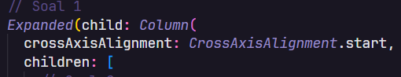

- **Soal 2:** Letakkan baris pertama teks di dalam `Container` sehingga memungkinkan Anda untuk menambahkan padding = 8. Teks ‘Batu, Malang, Indonesia' di dalam `Column`, set warna menjadi abu-abu.

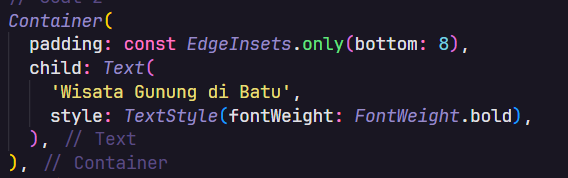

- **Soal 3:** Dua item terakhir di baris judul adalah ikon bintang, set dengan warna merah, dan teks "41". Seluruh baris ada di dalam `Container` dan beri padding di sepanjang setiap tepinya sebesar 32 piksel. Kemudian ganti isi `body text ‘Hello World'` dengan variabel `titleSection`.

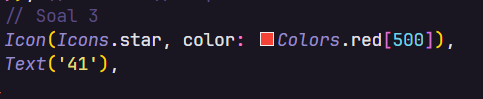

## Praktikum 2: Implementasi button row
Selesaikan langkah-langkah praktikum berikut ini dengan melanjutkan dari praktikum sebelumnya.

### Langkah 1: Buat method Column _buildButtonColumn
Bagian tombol berisi 3 kolom yang menggunakan tata letak yang sama—sebuah ikon di atas baris teks. Kolom pada baris ini diberi jarak yang sama, dan teks serta ikon diberi warna primer.

Karena kode untuk membangun setiap kolom hampir sama, buatlah metode pembantu pribadi bernama `buildButtonColumn()`, yang mempunyai parameter warna, `IconData` dan `String` label, sehingga dapat mengembalikan kolom dengan widgetnya sesuai dengan warna tertentu.

```dart
class MyApp extends StatelessWidget {
  const MyApp({super.key});

  @override
  Widget build(BuildContext context) {
    // ···
  }

  Column _buildButtonColumn(Color color, IconData icon, String label) {
    return Column(
      mainAxisSize: MainAxisSize.min,
      mainAxisAlignment: MainAxisAlignment.center,
      children: [
        Icon(icon, color: color),
        Container(
          margin: const EdgeInsets.only(top: 8),
          child: Text(
            label,
            style: TextStyle(
              fontSize: 12,
              fontWeight: FontWeight.w400,
              color: color,
            ),
          ),
        ),
      ],
    );
  }
}
```
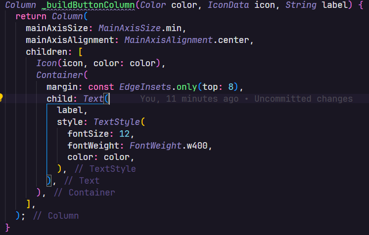

### Langkah 2: Buat widget buttonSection
Buat Fungsi untuk menambahkan ikon langsung ke kolom. Teks berada di dalam `Container` dengan margin hanya di bagian atas, yang memisahkan teks dari ikon.

Bangun baris yang berisi kolom-kolom ini dengan memanggil fungsi dan set warna, `IconData`, dan teks khusus melalui parameter ke kolom tersebut. Sejajarkan kolom di sepanjang sumbu utama menggunakan `MainAxisAlignment.spaceEvenly` untuk mengatur ruang kosong secara merata sebelum, di antara, dan setelah setiap kolom. Tambahkan kode berikut tepat di bawah deklarasi `titleSection` di dalam metode `build()`:

```dart
Color color = Theme.of(context).primaryColor;

Widget buttonSection = Row(
  mainAxisAlignment: MainAxisAlignment.spaceEvenly,
  children: [
    _buildButtonColumn(color, Icons.call, 'CALL'),
    _buildButtonColumn(color, Icons.near_me, 'ROUTE'),
    _buildButtonColumn(color, Icons.share, 'SHARE'),
  ],
);
```
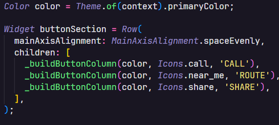

### Langkah 3: Tambah button section ke body
Tambahkan variabel `buttonSection` ke dalam `body` seperti berikut:

```dart
body: ListView(
  children: [
    titleSection,
    buttonSection,
  ],
),
```
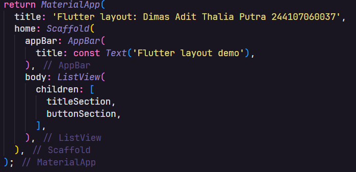

**Hasil Akhir Praktikum 2:**
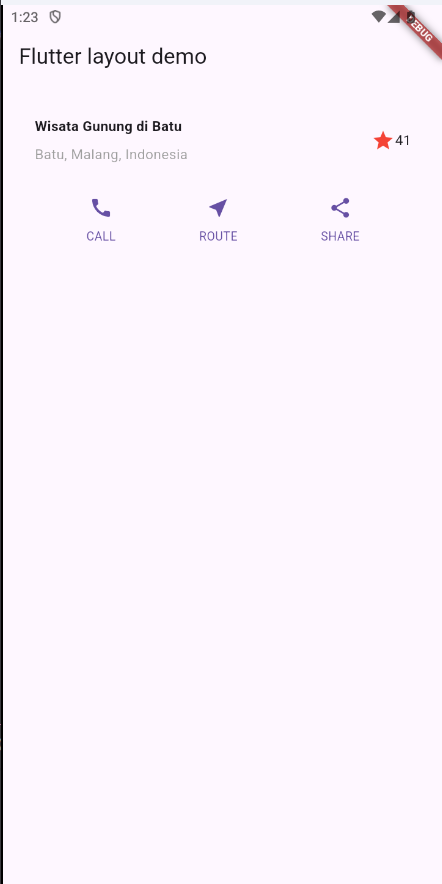

## Praktikum 3: Implementasi text section
Selesaikan langkah-langkah praktikum berikut ini dengan melanjutkan dari praktikum sebelumnya.

### Langkah 1: Buat widget textSection
Tentukan bagian teks sebagai variabel. Masukkan teks ke dalam `Container` dan tambahkan padding di sepanjang setiap tepinya. Tambahkan kode berikut tepat di bawah deklarasi `buttonSection`:

```dart
Widget textSection = Container(
  padding: const EdgeInsets.all(32),
  child: const Text(
    'Carilah teks di internet yang sesuai '
    'dengan foto atau tempat wisata yang ingin '
    'Anda tampilkan. '
    'Tambahkan nama dan NIM Anda sebagai '
    'identitas hasil pekerjaan Anda. '
    'Selamat mengerjakan 🙂.',
    softWrap: true,
  ),
);
```
Dengan memberi nilai `softWrap = true`, baris teks akan memenuhi lebar kolom sebelum membungkusnya pada batas kata.

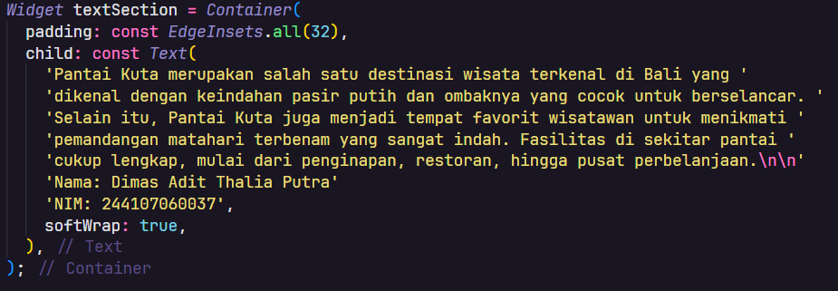

### Langkah 2: Tambahkan variabel text section ke body
Tambahkan widget variabel `textSection` ke dalam `body` seperti berikut:

```dart
body: ListView(
  children: [
    titleSection,
    buttonSection,
    textSection,
  ],
),
```
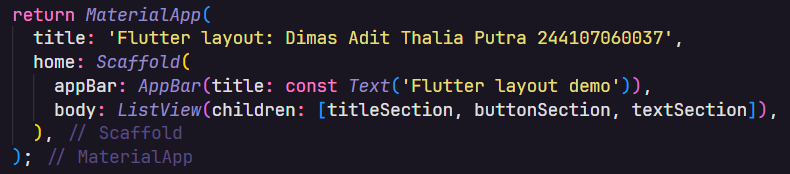

**Hasil Akhir Praktikum 3:**
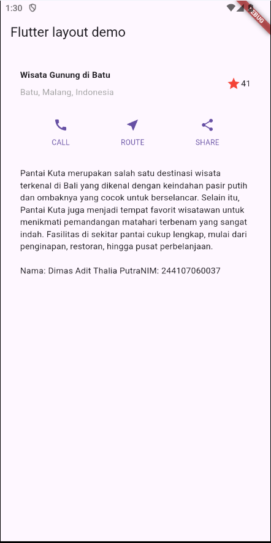

## Praktikum 4: Implementasi image section
Selesaikan langkah-langkah praktikum berikut ini dengan melanjutkan dari praktikum sebelumnya.

### Langkah 1: Siapkan aset gambar
Anda dapat mencari gambar di internet yang ingin ditampilkan. Buatlah folder `images` di root project `layout_flutter`. Masukkan file gambar tersebut ke folder `images`, lalu set nama file tersebut ke file `pubspec.yaml` seperti berikut:

Contoh nama file gambar di atas adalah `pantai.jpg`

> **Tips:**
> - Perhatikan bahwa `pubspec.yaml` sensitif terhadap huruf besar-kecil, jadi tulis `assets:` dan URL gambar seperti yang ditunjukkan di atas.
> - File pubspec juga sensitif terhadap spasi, jadi gunakan indentasi yang tepat.
> - Anda mungkin perlu memulai ulang program yang sedang berjalan agar perubahan pubspec dapat diterapkan.

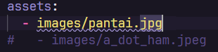

### Langkah 2: Tambahkan gambar ke body
Tambahkan aset gambar ke dalam `body` seperti berikut:

```dart
body: ListView(
  children: [
    Image.asset(
      'images/lake.jpg',
      width: 600,
      height: 240,
      fit: BoxFit.cover,
    ),
    titleSection,
    buttonSection,
    textSection,
  ],
),
```
`BoxFit.cover` memberi tahu kerangka kerja bahwa gambar harus sekecil mungkin tetapi menutupi seluruh kotak rendernya.

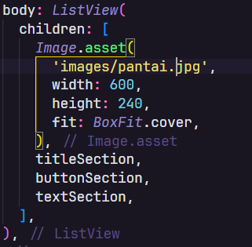

### Langkah 3: Terakhir, ubah menjadi ListView
Pada langkah terakhir ini, atur semua elemen dalam `ListView`, bukan `Column`, karena `ListView` mendukung scroll yang dinamis saat aplikasi dijalankan pada perangkat yang resolusinya lebih kecil.

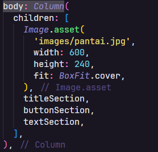

**Hasil Akhir Praktikum 4:**
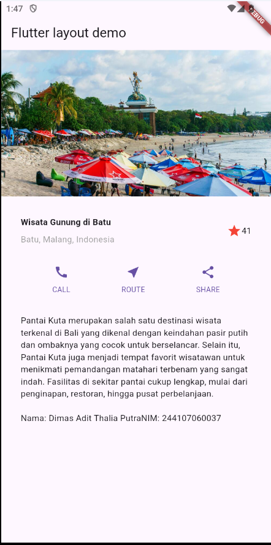

## Tugas Praktikum 1
1. Selesaikan Praktikum 1 sampai 4, lalu dokumentasikan dan push ke repository Anda berupa screenshot setiap hasil pekerjaan beserta penjelasannya di file README.md!
2. Silakan implementasikan di project baru "basic_layout_flutter" dengan mengakses sumber ini: https://docs.flutter.dev/codelabs/layout-basics

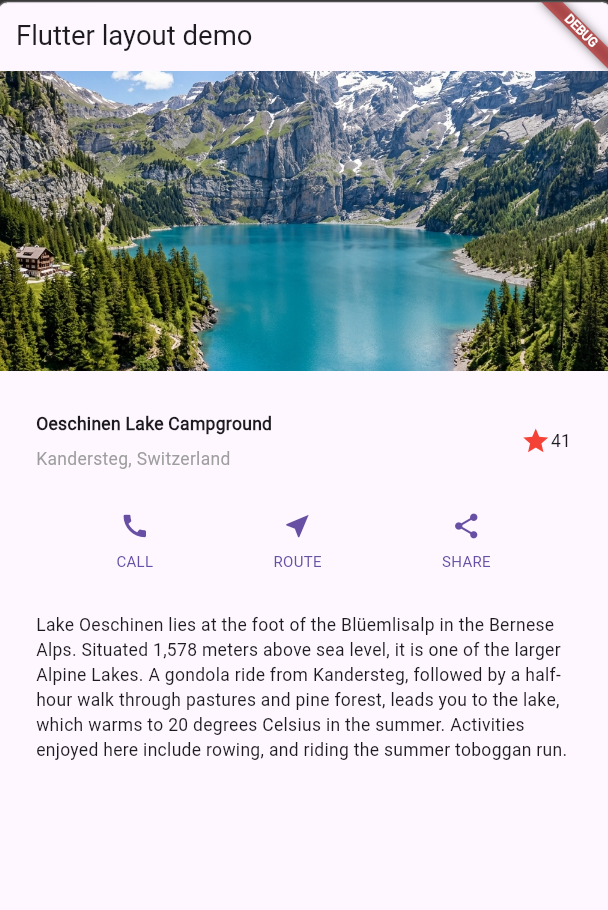

3. Kumpulkan link commit repository GitHub Anda kepada dosen yang telah disepakati!

---

## Praktikum 5: Membangun Navigasi di Flutter
Pada praktikum ini Anda akan belajar mengenai pembangunan aplikasi bergerak multi halaman. Aplikasi yang dikembangkan berupa kasus daftar barang belanja. Anda akan belajar untuk berpindah halaman dan mengirimkan data ke halaman lainnya.

### Langkah 1: Siapkan project baru
Sebelum melanjutkan praktikum, buatlah sebuah project baru Flutter dengan nama belanja dan susunan folder seperti pada gambar berikut. Penyusunan ini dimaksudkan untuk mengorganisasi kode dan widget yang lebih mudah

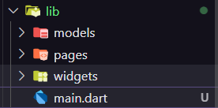

### Langkah 2: Mendefinisikan Route
Buatlah dua buah file dart dengan nama `home_page.dart` dan `item_page.dart` pada folder `pages`. Deklarasikan class `HomePage` dan `ItemPage` sebagai `StatelessWidget`.

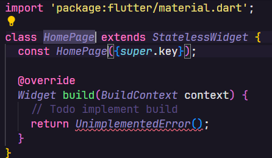

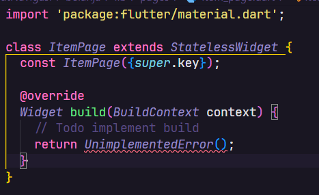

### Langkah 3: Lengkapi Kode di main.dart
Definisikan Route untuk kedua halaman tersebut di `main.dart`. Gunakan `initialRoute` untuk menetapkan halaman awal.

```dart
import 'package:flutter/material.dart';
import 'package:belanja/pages/home_page.dart';
import 'package:belanja/pages/item_page.dart';

void main() {
  runApp(MaterialApp(
    initialRoute: '/',
    routes: {
      '/': (context) => HomePage(),
      '/item': (context) => ItemPage(),
    },
  ));
}
```
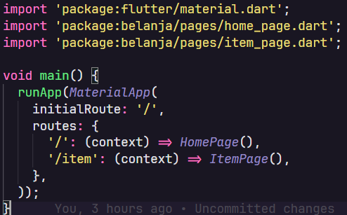

### Langkah 4: Membuat data model
Buatlah file `item.dart` pada folder `models` untuk mendefinisikan atribut data yang dibutuhkan (nama dan harga).

```dart
class Item {
  String name;
  int price;

  Item({required this.name, required this.price});
}
```

Terjadi error saat instansiasi class Item karena penggunaan parameter bernama (named parameters) di dalam kurung kurawal {} secara default bersifat opsional. Dalam aturan Null Safety Flutter, variabel name dan price yang bertipe non-nullable (tidak boleh kosong) wajib memiliki nilai.

Solusinya adalah harus menambahkan kata kunci required pada constructor agar compiler memastikan data tersebut selalu diisi saat objek Item dibuat. Selain itu, untuk mendukung penggunaan constructor const di halaman lain, variabel tersebut sebaiknya ditambahkan kata kunci final.

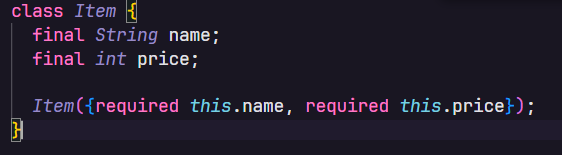

### Langkah 5: Lengkapi kode di class HomePage
Pada `HomePage`, definisikan List of Item yang akan ditampilkan dalam `ListView`.

```dart
final List<Item> items = [
  Item(name: 'Sugar', price: 5000),
  Item(name: 'Salt', price: 2000),
];
```
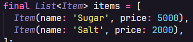

### Langkah 6: Membuat ListView dan itemBuilder
Gunakan `itemBuilder` pada `ListView` untuk menampilkan data secara dinamis menggunakan widget `Card`.

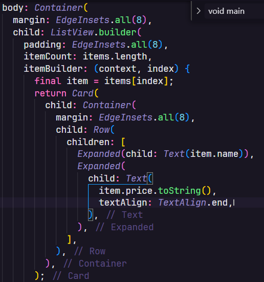

### Langkah 7: Menambahkan aksi pada ListView
Bungkus widget `Card` dengan `InkWell` dan tambahkan `onTap` untuk navigasi ke halaman `/item` sambil membawa data item tersebut.

```dart
InkWell(
  onTap: () {
    Navigator.pushNamed(context, '/item', arguments: item);
  },
  child: Card(
    // ... isi card
  ),
)
```
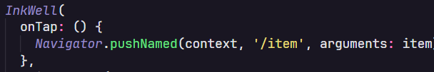

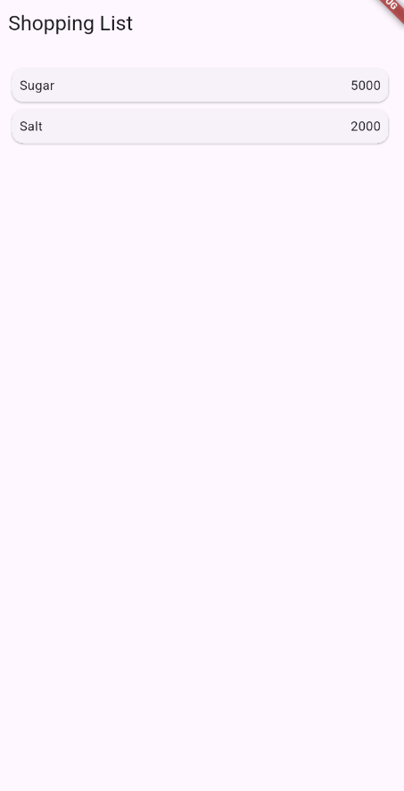

---

## Tugas Praktikum 2
1.Untuk melakukan pengiriman data ke halaman berikutnya, cukup menambahkan informasi arguments pada penggunaan Navigator. Perbarui kode pada bagian Navigator menjadi seperti berikut:
```dart
Navigator.pushNamed(context, '/item', arguments: item);
```

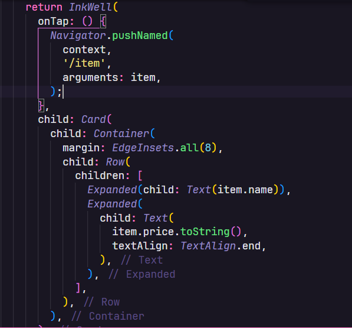

2. Pembacaan nilai yang dikirimkan pada halaman sebelumnya dapat dilakukan menggunakan ModalRoute. Tambahkan kode berikut pada blok fungsi build dalam halaman ItemPage. Setelah nilai didapatkan, Anda dapat menggunakannya seperti penggunaan variabel pada umumnya. ([Reference](https://docs.flutter.dev/cookbook/navigation/navigate-with-arguments))
```dart
final itemArgs = ModalRoute.of(context)!.settings.arguments as Item;
```
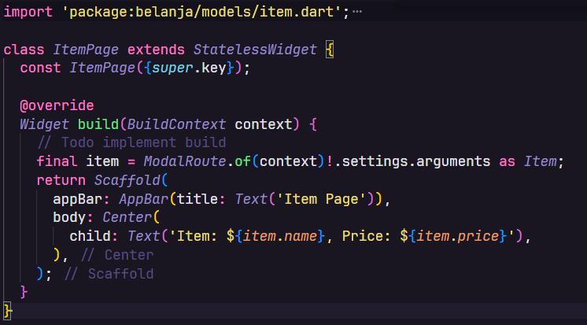
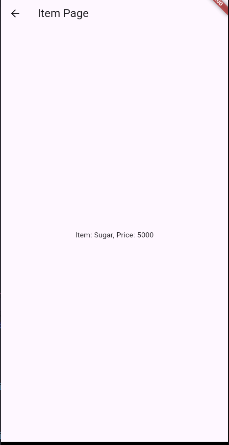

3. Pada hasil akhir dari aplikasi belanja yang telah anda selesaikan, tambahkan atribut foto produk, stok, dan rating. Ubahlah tampilan menjadi GridView seperti di aplikasi marketplace pada umumnya.

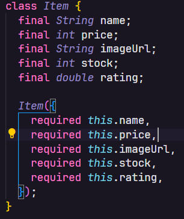
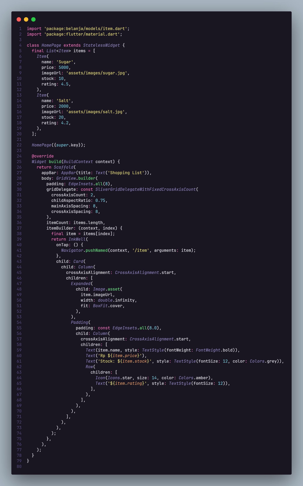
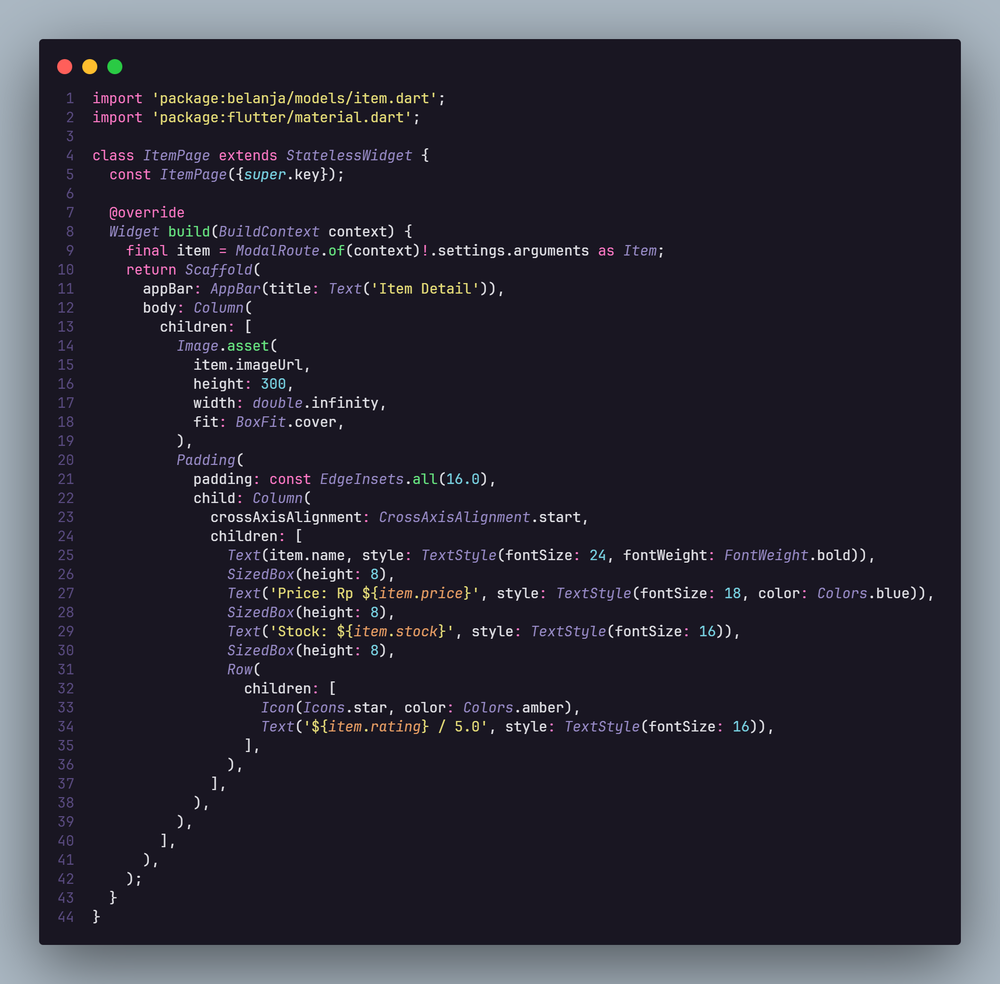
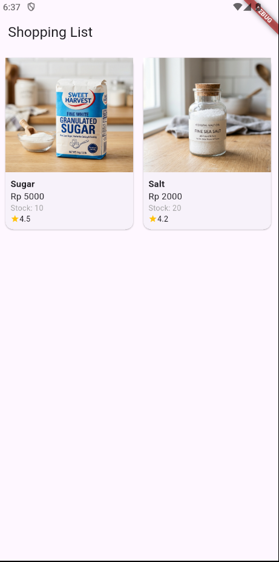
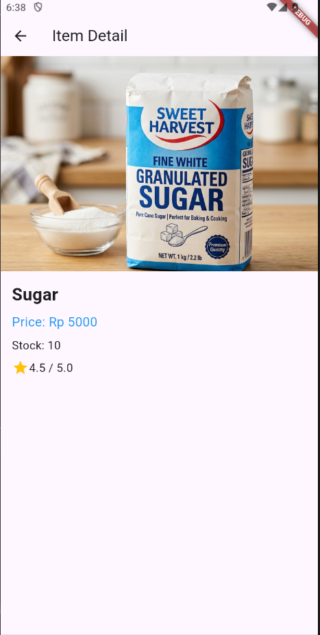

4. Silakan implementasikan Hero widget pada aplikasi belanja Anda dengan mempelajari dari sumber ini: https://docs.flutter.dev/cookbook/navigation/hero-animations

home_page.dart
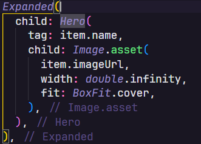
item_page.dart
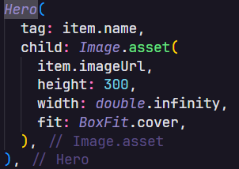

Hasil


5. Sesuaikan dan modifikasi tampilan sehingga menjadi aplikasi yang menarik. Selain itu, pecah widget menjadi kode yang lebih kecil. Tambahkan Nama dan NIM di footer aplikasi belanja Anda.

*** CODE CHANGE ***
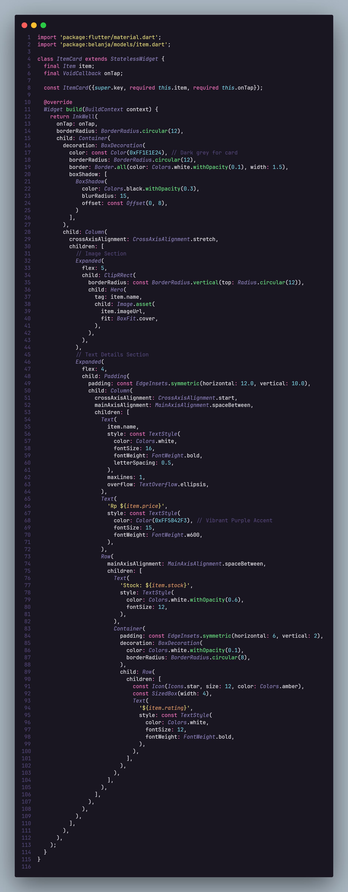
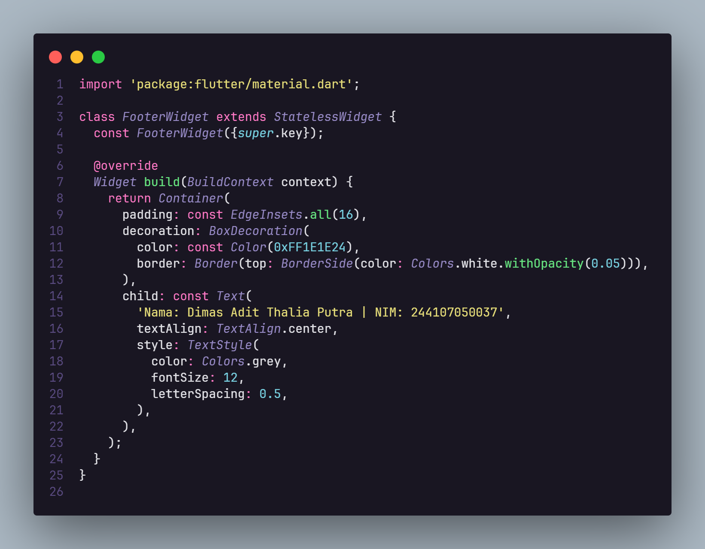
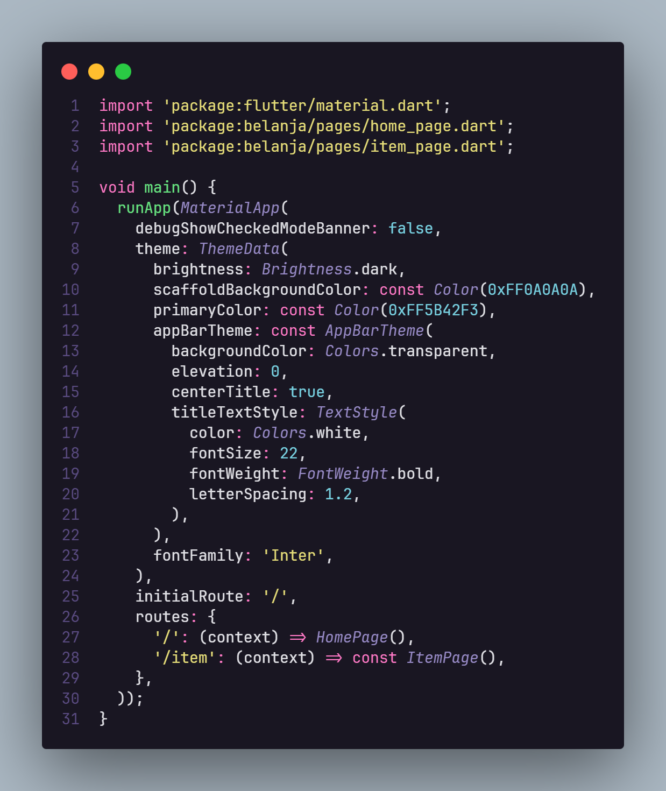
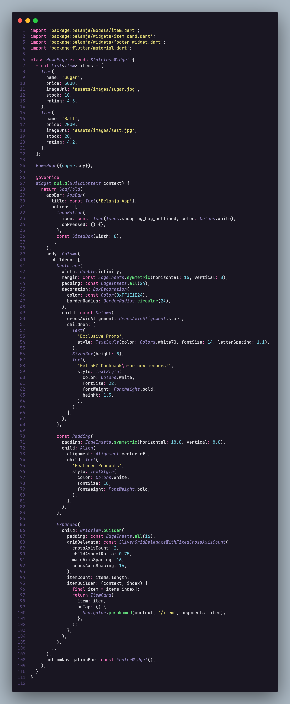
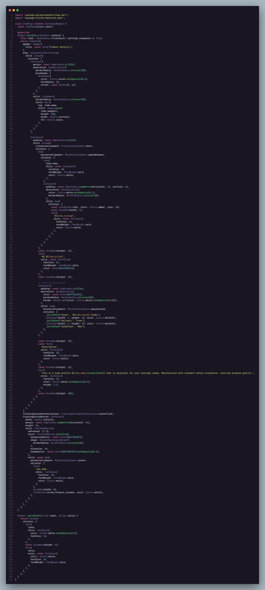

*** RESULT ***


6. Selesaikan Praktikum 5: Navigasi dan Rute tersebut. Cobalah modifikasi menggunakan plugin go_router, lalu dokumentasikan dan push ke repository Anda berupa screenshot setiap hasil pekerjaan beserta penjelasannya di file README.md. Kumpulkan link commit repository GitHub Anda kepada dosen yang telah disepakati!

**Implementasi `go_router` pada Aplikasi Belanja:**

1. **Konfigurasi Dependensi (`pubspec.yaml`)**:
   Menambahkan `go_router` ke dalam `dependencies`.
   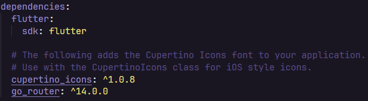

2. **Setup Routing Utama (`main.dart`)**:
   Mengganti `MaterialApp` standar dengan `MaterialApp.router` dan mendefinisikan rute (`/` dan `/item`) menggunakan `GoRouter`.
   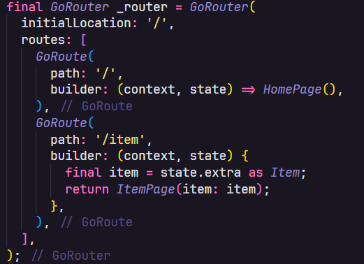

3. **Navigasi dengan Argumen (`home_page.dart`)**:
   Mengubah `Navigator.pushNamed` menjadi `context.push` (agar tersimpan di _stack_ dan otomatis memunculkan tombol back di app bar) dengan melemparkan objek `Item` pada parameter `extra`.
   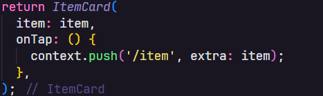

4. **Menerima Argumen (`item_page.dart`)**:
   Alih-alih mengambil item melalui sintaks `ModalRoute` dari context, sekarang `ItemPage` menerima argumennya secara langsung lewat constructor.
   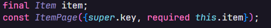

**Screenshot Hasil:**

