# Laporan Praktikum #11 Pemrograman Asynchronous

## Identitas Mahasiswa

| Atribut | Nilai                   |
| ------- | ----------------------- |
| Nama    | Dimas Adit Thalia Putra |
| NIM     | 244107060037            |
| Kelas   | SIB-2E                  |

---

## Praktikum 1: Mengunduh Data dari Web Service (API)

Selesaikan langkah-langkah praktikum berikut ini menggunakan editor Visual Studio Code (VS Code) atau Android Studio atau code editor lain kesukaan Anda. Jawablah di laporan praktikum Anda pada setiap soal yang ada di beberapa langkah praktikum ini.

### **Langkah 1: Buat Project Baru**

Buatlah sebuah project flutter baru dengan nama **books** di folder **src week-11** repository GitHub Anda.

Kemudian Tambahkan dependensi `http` dengan mengetik perintah berikut di terminal.

```bash
flutter pub add http
```

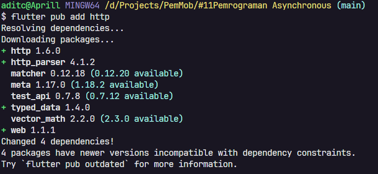

### Langkah 2: Cek file **`pubspec.yaml`**

Jika berhasil install plugin, pastikan plugin `http` telah ada di file `pubspec` ini seperti berikut.

```yaml
dependencies:
  flutter:
    sdk: flutter
  http: ^1.1.0
```

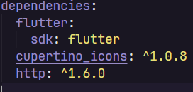

**Jika Anda menggunakan macOS**, Anda harus mengaktifkan fitur networking pada file `macos/Runner/DebugProfile.entitlements` dan `macos/Runner/Release.entitlements` dengan menambahkan kode berikut:


### Langkah 3: Buka file **`main.dart`**

Ketiklah kode seperti berikut ini.

> **Soal 1**
>
> Tambahkan **nama panggilan Anda** pada `title` app sebagai identitas hasil pekerjaan Anda.

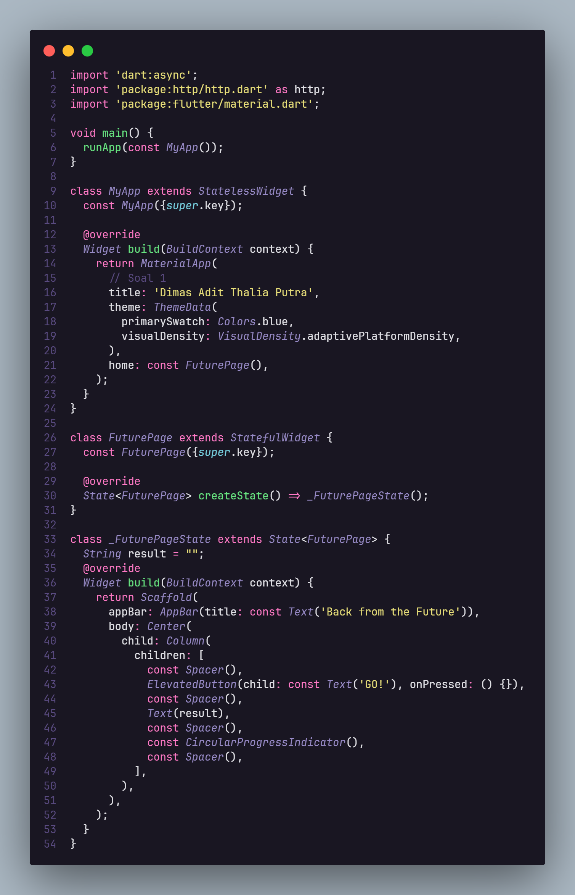

> **Catatan:**
>
> Tidak ada yang spesial dengan kode di `main.dart` tersebut. Perlu diperhatikan di kode tersebut terdapat widget `CircularProgressIndicator` yang akan menampilkan animasi berputar secara terus-menerus, itu pertanda bagus bahwa aplikasi Anda responsif (tidak freeze/lag). Ketika animasi terlihat berhenti, itu berarti UI menunggu proses lain sampai selesai.

### Langkah 4: Tambah method **`getData()`**

Tambahkan method ini ke dalam `class _FuturePageState` yang berguna untuk mengambil data dari API Google Books.

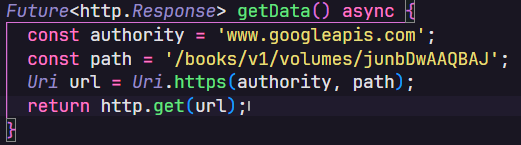

> **Soal 2**
>
> - Carilah judul buku favorit Anda di Google Books, lalu ganti ID buku pada variabel `path` di kode tersebut. Caranya ambil di URL browser Anda seperti gambar berikut ini.
>
> 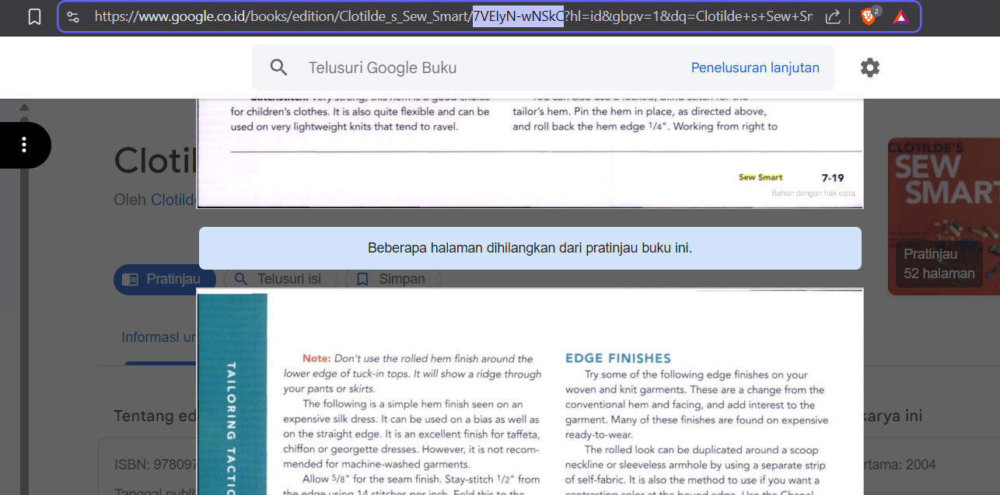
> 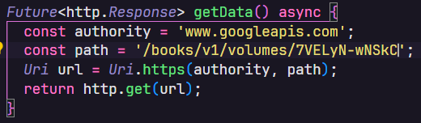
>
> - Kemudian cobalah akses di browser URI tersebut dengan lengkap seperti ini. Jika menampilkan data JSON, maka Anda telah berhasil. Lakukan _capture_ milik Anda dan tulis di `README` pada laporan praktikum. Lalu lakukan commit dengan pesan "**W11: Soal 2**".
>
> 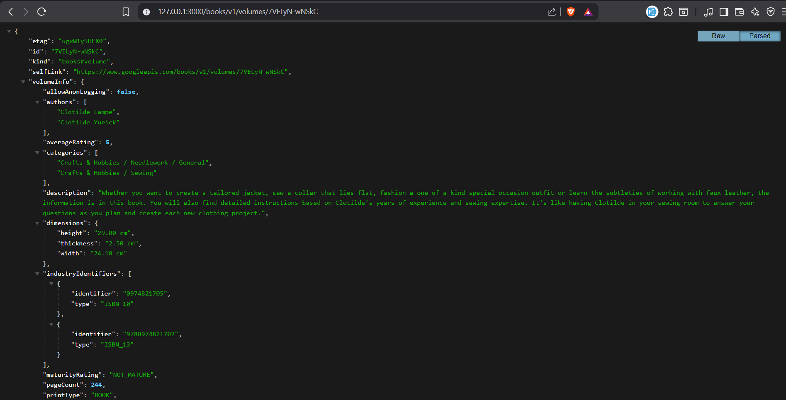

### Langkah 5: Tambah kode di **`ElevatedButton`**

Tambahkan kode pada `onPressed` di `ElevatedButton` seperti berikut.

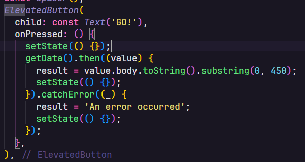

Lakukan run aplikasi Flutter Anda. Anda akan melihat tampilan akhir seperti gambar berikut. Jika masih terdapat error, silakan diperbaiki hingga bisa running.

> **Soal 3**
>
> - Jelaskan maksud kode langkah 5 tersebut terkait `substring` dan `catchError`!
>
> **_Jawaban_**

- `substring()`: digunakan untuk mengambil sebagian kecil string berdasarkan indeks awal dan akhir yang diberikan. Pada kode tersebut, digunakan untuk mengambil 450 karakter pertama dari string yang dikembalikan oleh Future `getData()`. Jika string terlalu panjang, maka akan dipotong menjadi 450 karakter.
- `catchError()`: digunakan untuk menangani error yang terjadi pada Future (`getData()`), jika tidak ada error maka akan mengembalikan nilai dari Future, jika ada error maka akan mengembalikan nilai dari error.

> - Capture hasil praktikum Anda berupa GIF dan lampirkan di README. Lalu lakukan commit dengan pesan "**W11: Soal 3**".

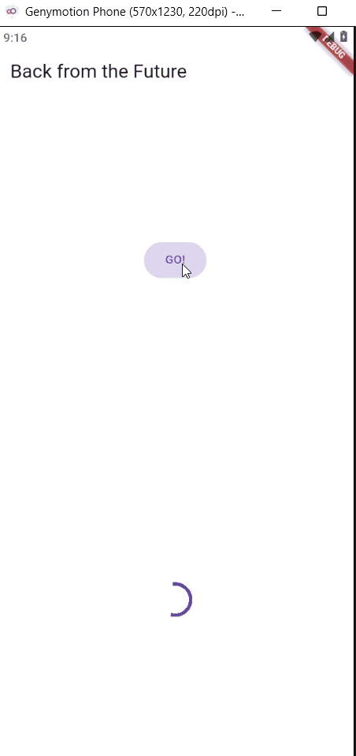

---

## Praktikum 2: Menggunakan await/async untuk menghindari callbacks

Ada alternatif penggunaan Future yang lebih clean, mudah dibaca dan dirawat, yaitu pola **async/await**. Intinya pada dua kata kunci ini:

- `async` digunakan untuk menandai suatu method sebagai asynchronous dan itu harus ditambahkan di depan kode function.
- `await` digunakan untuk memerintahkan menunggu sampai eksekusi suatu function itu selesai dan mengembalikan sebuah `value`. Untuk `then` bisa digunakan pada jenis method apapun, sedangkan `await` hanya bekerja di dalam method `async`.

### Langkah 1: Buka file **`main.dart`**

Tambahkan tiga method berisi kode seperti berikut di dalam `class _FuturePageState`.

```dart
Future<int> returnOneAsync() async {
  await Future.delayed(const Duration(seconds: 3));
  return 1;
}

Future<int> returnTwoAsync() async {
  await Future.delayed(const Duration(seconds: 3));
  return 2;
}

Future<int> returnThreeAsync() async {
  await Future.delayed(const Duration(seconds: 3));
  return 3;
}
```

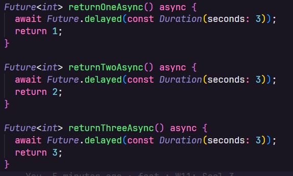

### Langkah 2: Tambah method **`count()`**

Lalu tambahkan lagi method ini di bawah ketiga method sebelumnya.

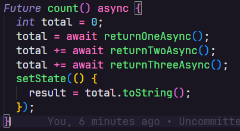

### Langkah 3: Panggil **`count()`**

Lakukan _comment_ kode sebelumnya, ubah isi kode `onPressed()` menjadi seperti berikut.

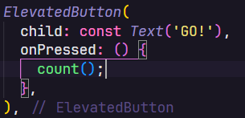

### **Langkah 4: Run**

Akhirnya, **run** atau tekan **F5** jika aplikasi belum running. Maka Anda akan melihat seperti gambar berikut, hasil angka 6 akan tampil setelah delay 9 detik.

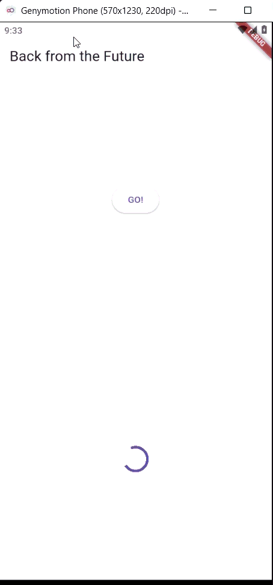

> **Soal 4**
>
> 1. Jelaskan maksud kode langkah 1 dan 2 tersebut!

**_Jawaban_**

- `Future<int> returnOneAsync() async` Mendefinisikan sebuah fungsi asynchronous yang akan mengembalikan nilai integer setelah selesai dieksekusi. Keyword `await` digunakan untuk menunggu fungsi `Future.delayed` selesai sebelum mengembalikan nilai 1.
- `Future<int> returnTwoAsync() async` Sama seperti fungsi sebelumnya, namun akan mengembalikan nilai integer 2 setelah selesai dieksekusi.
- `Future<int> returnThreeAsync()` Sama seperti fungsi sebelumnya, namun akan mengembalikan nilai integer 3 setelah selesai dieksekusi.
- `Future count()` Mendefinisikan sebuah fungsi asynchronous yang akan mengembalikan nilai integer (hasil penjumlahan dari ketiga fungsi sebelumnya) setelah selesai dieksekusi. Keyword `await` digunakan untuk menunggu fungsi `returnOneAsync()`, `returnTwoAsync()`, dan `returnThreeAsync()` selesai sebelum mengembalikan nilai 1.

> **Asynchronous** adalah konsep pemrograman yang memungkinkan aplikasi tetap responsif dengan menjalankan tugas-tugas lain (seperti operasi I/O, network request, atau delay) secara konkuren tanpa harus memblokir/menghentikan eksekusi program utama. Di dalam ekosistem **Dart**, mekanisme ini diimplementasikan dengan sangat elegan menggunakan kombinasi kata kunci `async` dan `await`.
>
> 🔗 **Referensi Resmi:** [Dart Dev - Async-Await](https://dart.dev/libraries/async/async-await)

> 2. Capture hasil praktikum Anda berupa GIF dan lampirkan di README. Lalu lakukan commit dengan pesan "**W11: Soal 4**".

---

## Praktikum 3: Menggunakan Completer di Future

Menggunakan Future dengan `then`, `catchError`, `async`, dan `await` mungkin sudah cukup untuk banyak kasus, tetapi ada alternatif melakukan operasi async di Dart dan Flutter yaitu dengan `class Completer`.

**Completer** membuat object Future yang mana Anda dapat menyelesaikannya nanti (late) dengan return sebuah value atau error.

Setelah Anda menyelesaikan praktikum 2, Anda dapat melanjutkan praktikum 3 ini. Selesaikan langkah-langkah praktikum berikut ini menggunakan editor Visual Studio Code (VS Code) atau Android Studio atau code editor lain kesukaan Anda. Jawablah di laporan praktikum Anda pada setiap soal yang ada di beberapa langkah praktikum ini.

### Langkah 1: Buka **`main.dart`**

Pastikan telah impor package async berikut.

```dart
import 'package:async/async.dart';
```

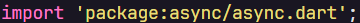

### Langkah 2: Tambahkan variabel dan method

Tambahkan variabel late dan method di `class _FuturePageState` seperti ini.

```dart
late Completer completer;

Future getNumber() {
  completer = Completer<int>();
  calculate();
  return completer.future;
}

Future calculate() async {
  await Future.delayed(const Duration(seconds : 5));
  completer.complete(42);
}
```

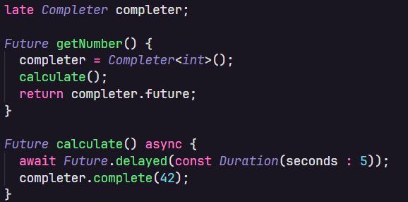

### Langkah 3: Ganti isi kode **`onPressed()`**

Tambahkan kode berikut pada fungsi `onPressed()`. Kode sebelumnya bisa Anda _comment_.

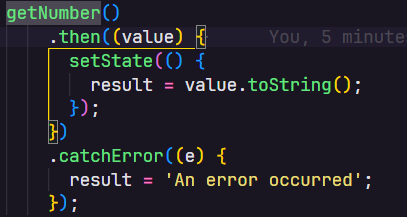

### Langkah 4: Run

Terakhir, **run** atau tekan **F5** untuk melihat hasilnya jika memang belum running. Bisa juga lakukan **hot restart** jika aplikasi sudah running. Maka hasilnya akan seperti gambar berikut ini. Setelah 5 detik, maka angka 42 akan tampil.

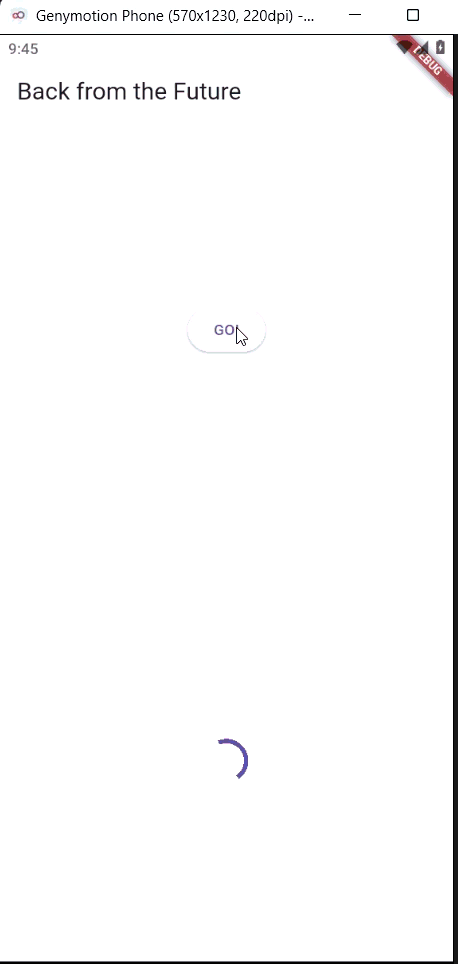

> **Soal 5**
>
> - Jelaskan maksud kode langkah 2 tersebut!

**_Jawaban_**
Kode pada Langkah 2 mengimplementasikan kelas **`Completer`** sebagai mekanisme kontrol alur kerja asinkron untuk menyelesaikan (_resolve_) objek `Future` secara manual dalam ekosistem Dart. Berikut adalah analisis akademis mengenai struktur kode tersebut:

1. **`late Completer completer;`**
   Mendeklarasikan variabel `completer` bertipe `Completer` dengan menggunakan modifier `late`. Hal ini merepresentasikan teknik penangguhan inisialisasi (_late initialization_), di mana alokasi memori objek ditangguhkan hingga runtime mengeksekusi metode `getNumber()`, alih-alih diinisialisasi secara instan saat siklus hidup objek kelas dimulai.

2. **Metode `getNumber()`**
   - `completer = Completer<int>();`: Melakukan instansiasi objek `Completer` baru dengan tipe parameter generik `<int>`. Hal ini menegaskan bahwa nilai hasil akhir (_resolved value_) dari operasi asinkron tersebut wajib berupa tipe data integer.
   - `calculate();`: Memicu pemanggilan metode `calculate()` secara _non-blocking_ untuk menjalankan operasi asinkron di latar belakang tanpa menghambat alur eksekusi thread utama.
   - `return completer.future;`: Mengembalikan properti `.future` dari objek `completer`. Properti ini bertindak sebagai representasi komitmen (_promise_) atas nilai masa depan. Komponen pemanggil (misalnya _event listener_ `onPressed()`) dapat mendaftarkan fungsi callback menggunakan metode `.then()` untuk mendengarkan perubahan status _Future_ dari _pending_ menjadi _fulfilled_.

3. **Metode `calculate()`**
   - Dideklarasikan dengan modifier `async` untuk memungkinkannya mengelola eksekusi instruksi asinkron secara sekuensial menggunakan operator `await`.
   - `await Future.delayed(const Duration(seconds: 5));`: Menangguhkan alur eksekusi kode di bawahnya selama 5 detik untuk mensimulasikan latensi operasi I/O (seperti request API atau querying data) tanpa membekukan antarmuka pengguna (_UI freezing_).
   - `completer.complete(42);`: Setelah durasi jeda terpenuhi, completer secara manual memanggil fungsi `.complete(42)`. Aksi ini memindahkan status _Future_ dari _pending_ menjadi _fulfilled_ serta mendistribusikan nilai `42` kepada _listener_ eksternal untuk memperbarui keadaan (_state_) melalui `setState()`.

> - Capture hasil praktikum Anda berupa GIF dan lampirkan di README. Lalu lakukan commit dengan pesan "**W11: Soal 5**".

### Langkah 5: Ganti method **`calculate()`**

Gantilah isi code method `calculate()` seperti kode berikut, atau Anda dapat membuat `calculate2()`

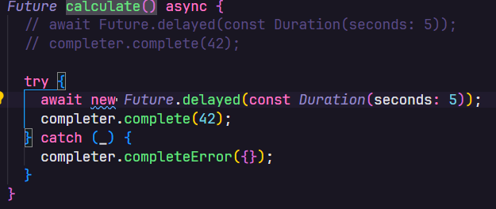

### Langkah 6: Pindah ke **`onPressed()`**

Ganti menjadi kode seperti berikut.

```dart
getNumber().then((value) {
  setState(() {
    result = value.toString();
  });
}).catchError((e) {
  result = 'An error occurred';
});
```

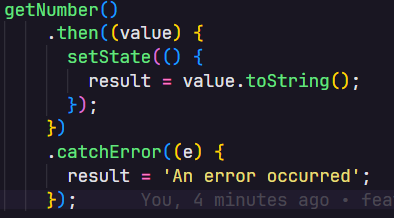

> **Soal 6**
>
> - Jelaskan maksud perbedaan kode langkah 2 dengan langkah 5-6 tersebut!

**_Jawaban_**
Perbedaan antara implementasi pada Langkah 2 dengan Langkah 5-6 terdapat pada implementasi alur kerja asinkron dari yang awalnya bersifat optimistik (_optimistic flow_) menjadi alur kerja yang tangguh (_robust flow_) melalui integrasi manajemen _error_ (_exception handling_). Perbedaan signifikan dari kedua pendekatan tersebut dapat dianalisis sebagai berikut:

- **Penerapan Manajemen Pengecualian (_Exception Handling_):**
  - **Langkah 2 (Pendekatan Optimistik):** Metode `calculate()` dirancang dengan asumsi ideal bahwa proses asinkron akan selalu berhasil dieksekusi. Ketidakberadaan blok pelindung (_protective block_) membuat aplikasi rentan terhadap kegagalan runtime. Jika terjadi gangguan selama proses _delay_, pengecualian tidak akan tertangkap (_unhandled exception_), berpotensi mengakibatkan kebocoran memori (_memory leak_), atau membuat objek `Completer` terjebak dalam status _pending_ selamanya (_hanging future_).
  - **Langkah 5 (Pendekatan Defensif):** Blok pelindung `try-catch` diintegrasikan dalam metode `calculate()`. Struktur ini secara aktif memantau jalannya instruksi asinkron. Apabila runtime mendeteksi adanya kegagalan, kendali eksekusi program akan dialihkan secara aman ke blok `catch` untuk meminimalkan dampak fatal (_fatal crash_) pada aplikasi.

- **Dualitas Transisi Status Future (_State Transition of Future_):**
  - **Langkah 2:** Objek `Completer` hanya didefinisikan untuk memicu transisi status _Future_ satu arah, yaitu dari _pending_ menuju _fulfilled_ (berhasil) secara manual melalui fungsi `completer.complete(42)`.
  - **Langkah 5-6:** Objek `Completer` dikonfigurasi untuk menangani dualitas status _Future_ (berhasil atau gagal). Melalui instruksi `completer.completeError({})`, sistem mampu mengirimkan sinyal penolakan (_rejection_) secara eksplisit ke subsistem pemanggil. Pola arsitektur ini selaras dengan konsep _Resolve/Reject_ standar industri untuk merepresentasikan status akhir dari komputasi asinkron secara formal.

- **Resiliensi Antarmuka Pengguna (_UI Resiliency_ & _State Management_):**
  - **Langkah 2:** Antarmuka pengguna (_UI_) hanya siap menerima data ketika proses berhasil melalui rantaian method `.then()`. Jika terjadi _error_ di latar belakang, aplikasi akan kehilangan responsivitas karena tidak adanya pembaruan status (_state update_) untuk kasus kegagalan.
  - **Langkah 6:** Rantai pemanggilan _Future_ pada event handler `onPressed()` diperluas dengan menambahkan blok `.catchError((e) { ... })`. Penambahan ini bertindak sebagai _fallback mechanism_. Ketika sinyal `completeError` dipicu oleh metode `calculate()`, aplikasi akan secara otomatis merespons kegagalan tersebut dengan mengubah _state_ `result` menjadi `'An error occurred'`. Hal ini menjamin antarmuka pengguna tetap interaktif dan informatif di segala skenario eksekusi.

> - Capture hasil praktikum Anda berupa GIF dan lampirkan di README. Lalu lakukan commit dengan pesan "**W11: Soal 6**".


---

## Praktikum 4: Memanggil Future secara paralel

Ketika Anda membutuhkan untuk menjalankan banyak Future secara bersamaan, ada sebuah class yang dapat Anda gunakan yaitu: `FutureGroup`.

`FutureGroup` tersedia di package `async`, yang mana itu harus diimpor ke file dart Anda, seperti berikut.

```dart
import 'package:async/async.dart';
```

**FutureGroup** adalah sekumpulan dari Future yang dapat run secara paralel. Ketika run secara paralel, maka konsumsi waktu menjadi lebih hemat (cepat) dibanding run method async secara single setelah itu method async lainnya.

Ketika semua code async paralel selesai dieksekusi, maka FutureGroup akan return value sebagai sebuah `List`, sama juga ketika ingin menambahkan operasi paralel dalam bentuk `List`.

> **Perhatian:** Diasumsikan Anda telah berhasil menyelesaikan Praktikum 3.

### Langkah 1: Buka file **`main.dart`**

Tambahkan method ini ke dalam `class _FuturePageState`

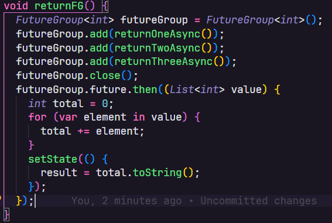

### Langkah 2: Edit **`onPressed()`**

Anda bisa hapus atau comment kode sebelumnya, kemudian panggil method dari langkah 1 tersebut.

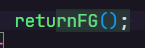

### Langkah 3: Run

Anda akan melihat hasilnya dalam 3 detik berupa angka 6 lebih cepat dibandingkan praktikum sebelumnya menunggu sampai 9 detik.


> **Soal 7**
>
> - Capture hasil praktikum Anda berupa GIF dan lampirkan di README. Lalu lakukan commit dengan pesan "**W11: Soal 7**".

### Langkah 4: Ganti variabel **`futureGroup`**

Anda dapat menggunakan FutureGroup dengan `Future.wait` seperti kode berikut.

```dart
final futures = Future.wait<int>([
  returnOneAsync(),
  returnTwoAsync(),
  returnThreeAsync(),
]);
```

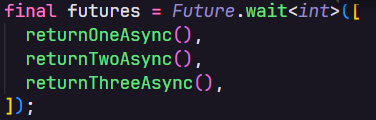


> **Soal 8**
>
> - Jelaskan maksud perbedaan kode langkah 1 dan 4!

**_Jawaban_**
Perbedaan utama antara FutureGroup dan Future.wait terletak pada cara pengelolaan koleksi proses asinkron. FutureGroup bersifat dinamis karena objek Future dapat ditambahkan secara bertahap menggunakan .add() dan perlu ditutup dengan .close() sebelum dijalankan. Sebaliknya, Future.wait menggunakan daftar Future yang sudah ditentukan sejak awal sehingga lebih sederhana dan praktis. Selain itu, FutureGroup memerlukan package eksternal async dan kode yang lebih panjang, sedangkan Future.wait merupakan fitur bawaan Dart yang lebih ringkas, efisien, dan umum digunakan untuk mengeksekusi operasi asinkron secara paralel sederhana.

---

## Praktikum 5: Menangani Respon Error pada Async Code

Ada beberapa teknik untuk melakukan _handle error_ pada code async. Pada praktikum ini Anda akan menggunakan 2 cara, yaitu `then()` callback dan pola `async/await`.

Setelah Anda menyelesaikan praktikum 4, Anda dapat melanjutkan praktikum 5 ini. Selesaikan langkah-langkah praktikum berikut ini menggunakan editor Visual Studio Code (VS Code) atau Android Studio atau code editor lain kesukaan Anda. Jawablah di laporan praktikum Anda pada setiap soal yang ada di beberapa langkah praktikum ini.

> **Perhatian:** Diasumsikan Anda telah berhasil menyelesaikan Praktikum 4.

### Langkah 1: Buka file **`main.dart`**

Tambahkan method ini ke dalam `class _FuturePageState`

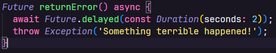

### Langkah 2: **ElevatedButton**

Ganti dengan kode berikut

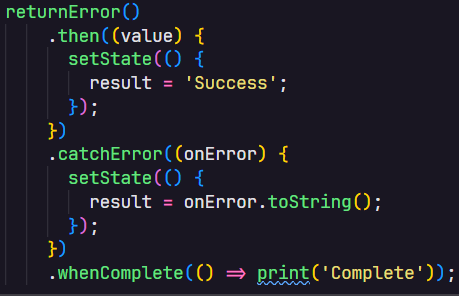

### Langkah 3: Run

Lakukan run dan klik tombol **GO!** maka akan menghasilkan seperti gambar berikut.

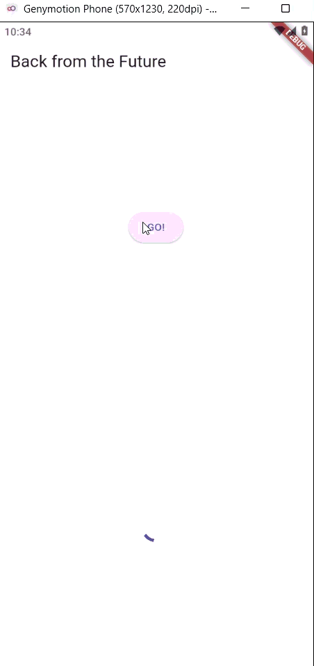

Pada bagian debug console akan melihat teks `Complete` seperti berikut.

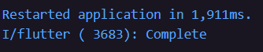

> **Soal 9**
>
> - Capture hasil praktikum Anda berupa GIF dan lampirkan di README. Lalu lakukan commit dengan pesan "**W11: Soal 9**".

### Langkah 4: Tambah method **`handleError()`**

Tambahkan kode ini di dalam `class _FuturePageState`

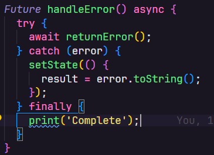

> **Soal 10**
>
> - Panggil method `handleError()` tersebut di `ElevatedButton`, lalu run. Apa hasilnya? Jelaskan perbedaan kode langkah 1 dan 4!

**_Jawaban_**
Call `handleError()` function pada elevated button
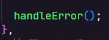

hasil run
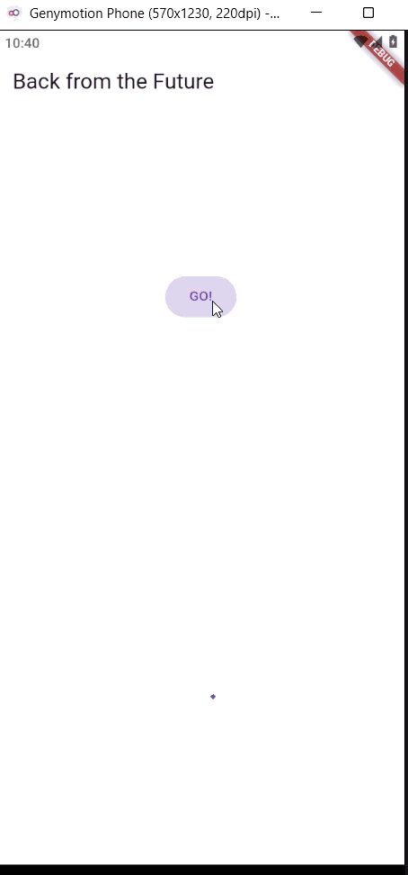
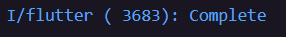

Ketika tombol GO! ditekan, aplikasi menjalankan proses asinkron dengan delay selama 2 detik, kemudian menampilkan pesan error "Exception: Something terrible happened!" pada antarmuka pengguna (UI), sementara pada debug console muncul teks "Complete". Meskipun menghasilkan keluaran yang sama, implementasi pada Langkah 1 & 2 dan Langkah 4 memiliki perbedaan pada cara penanganan error asinkron.

Pada Langkah 2, penanganan error menggunakan pendekatan callback chaining melalui method `.then()`, `.catchError()`, dan `.whenComplete()`. Sementara itu, Langkah 4 menggunakan kombinasi `async/await` dengan blok `try-catch-finally` yang lebih terstruktur. Dari sisi keterbacaan kode, penggunaan `try-catch-finally` dinilai lebih mudah dipahami dan dipelihara karena alur program menyerupai proses sinkron. Selain itu, fungsi dari masing-masing blok juga setara, yaitu `try` sebagai pengganti `.then()`, `catch` sebagai pengganti `.catchError()`, dan `finally` sebagai pengganti `.whenComplete()`.

---

## Praktikum 6: Menggunakan Future dengan StatefulWidget

Seperti yang Anda telah pelajari, `Stateless` widget tidak dapat menyimpan informasi (state), `StatefulWidget` dapat mengelola variabel dan properti dengan method `setState()`, yang kemudian dapat ditampilkan pada UI. `State` adalah informasi yang dapat berubah selama life cycle widget itu berlangsung.

Ada **4 method utama** dalam life cycle `StatefulWidget`:

- `initState()`: dipanggil sekali ketika state dibangun. Bisa dikatakan ini juga sebagai konstruktor class.
- `build()`: dipanggil setiap kali ada perubahan state atau UI. Method ini melakukan destroy UI dan membangun ulang dari nol.
- `deactive()` dan `dispose()`: digunakan untuk menghapus widget dari tree, pada beberapa kasus dimanfaatkan untuk menutup koneksi ke database atau menyimpan data sebelum berpindah screen.

### Langkah 1: install plugin geolocator

Tambahkan plugin geolocator dengan mengetik perintah berikut di terminal.

```bash
flutter pub add geolocator
```

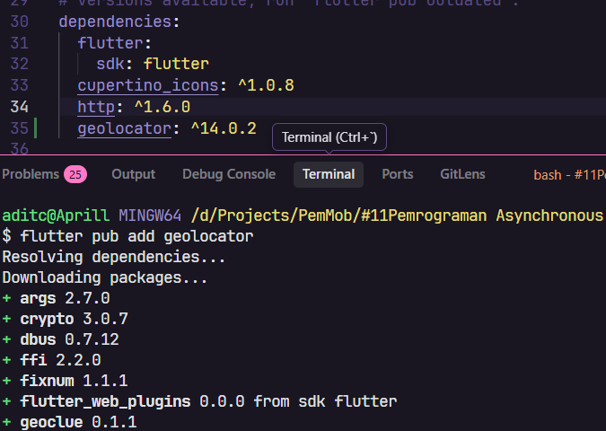

### Langkah 2: Tambah permission GPS

Jika Anda menargetkan untuk platform **Android**, maka tambahkan baris kode berikut di file `android/app/src/main/AndroidManifest.xml`

```xml
<uses-permission android:name="android.permission.ACCESS_FINE_LOCATION"/>
<uses-permission android:name="android.permission.ACCESS_COARSE_LOCATION"/>
```

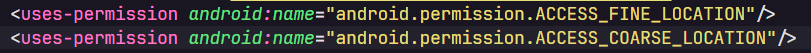

Jika Anda menargetkan untuk platform **iOS**, maka tambahkan kode ini ke file `Info.plist`

```xml
<key>NSLocationWhenInUseUsageDescription</key>
<string>This app needs to access your location</string>
```

### Langkah 3: Buat file **`geolocation.dart`**

Tambahkan file baru ini di folder lib project Anda.

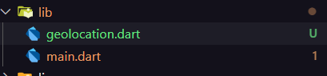

### Langkah 4: Buat StatefulWidget

Buat `class LocationScreen` di dalam file `geolocation.dart`

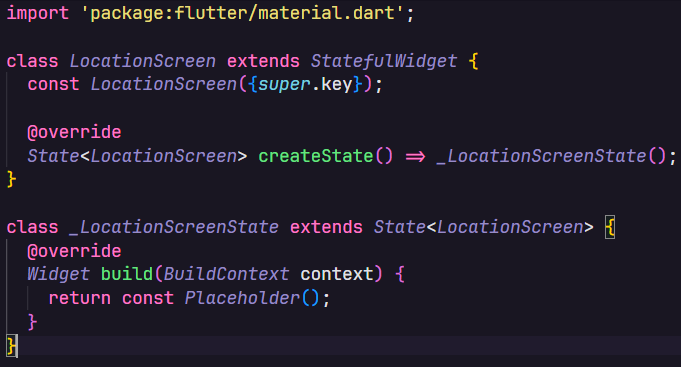

### Langkah 5: Isi kode **`geolocation.dart`**

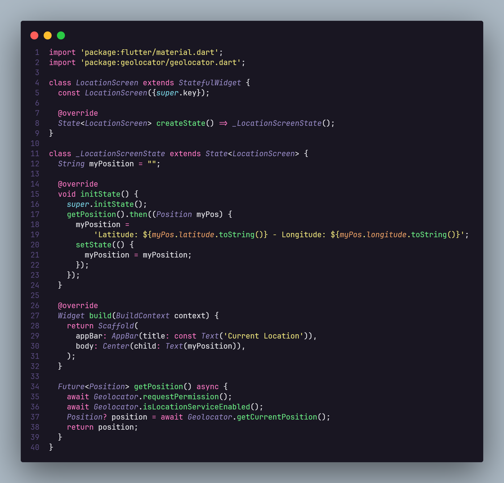

> **Soal 11**
>
> - Tambahkan **nama panggilan Anda** pada tiap properti `title` sebagai identitas pekerjaan Anda.

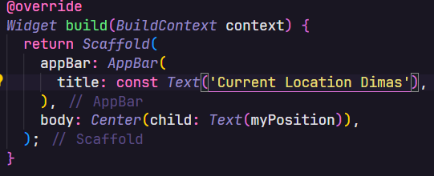

### Langkah 6: Edit **`main.dart`**

Panggil screen baru tersebut di file main Anda seperti berikut.

```dart
home: LocationScreen(),
```

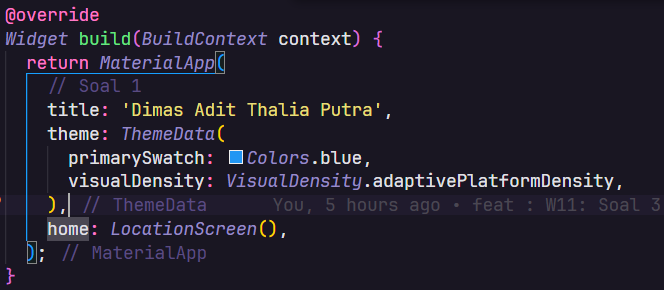

### Langkah 7: Run

Run project Anda di **device** atau **emulator** (**bukan browser**), maka akan tampil seperti berikut ini.

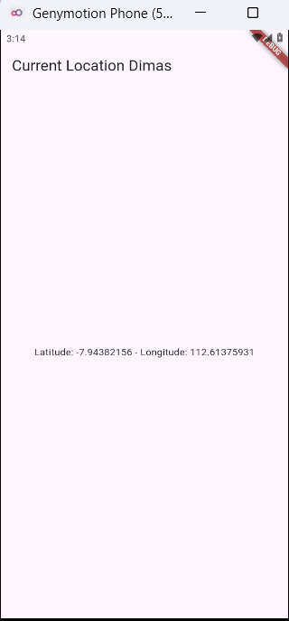

### Langkah 8: Tambahkan animasi loading

Tambahkan widget loading seperti kode berikut. Lalu hot restart, perhatikan perubahannya.

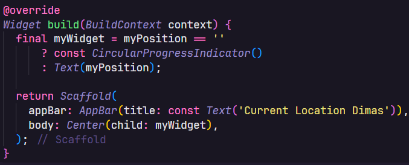

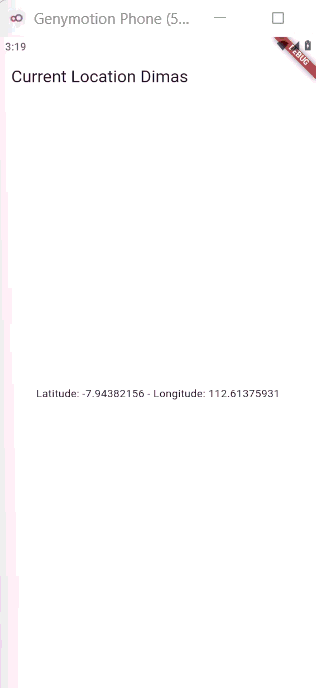

> **Soal 12**
>
> - Jika Anda tidak melihat animasi loading tampil, kemungkinan itu berjalan sangat cepat. Tambahkan delay pada method `getPosition()` dengan kode `await Future.delayed(const Duration(seconds: 3));`

**_Jawaban:_**

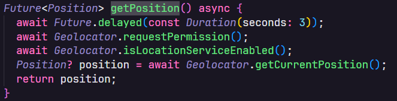

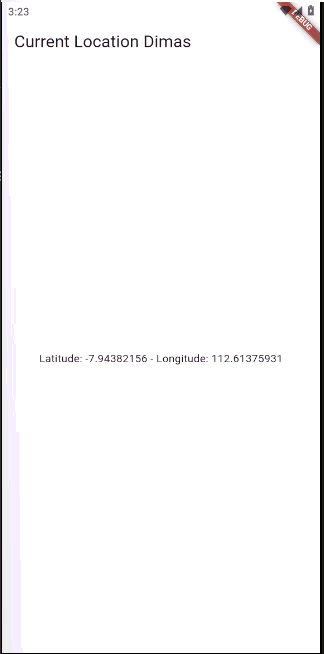

> - Apakah Anda mendapatkan koordinat GPS ketika run di browser? Mengapa demikian?

**_Jawaban:_**
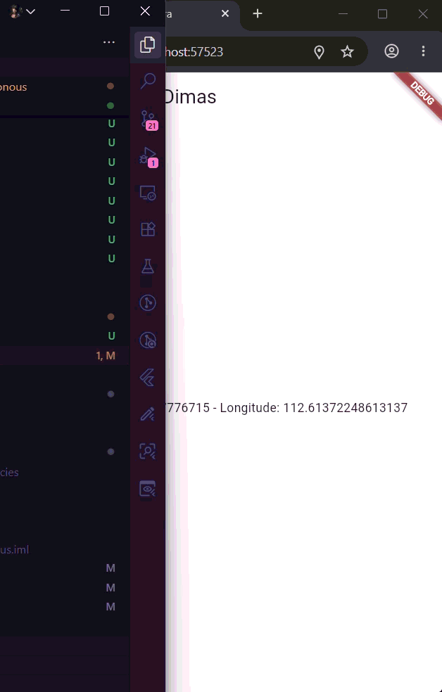

Secara teknis, aplikasi tetap dapat memperoleh koordinat lokasi (latitude dan longitude) ketika dijalankan **melalui browser**, selama pengguna memberikan izin akses lokasi dan aplikasi berjalan pada lingkungan yang aman, seperti **localhost** atau **protokol HTTPS**.

Hal tersebut terjadi karena plugin geolocator pada platform web memanfaatkan **HTML5 Geolocation API** (navigator.geolocation) yang disediakan oleh browser. Ketika aplikasi meminta akses lokasi, browser akan menampilkan **notifikasi izin** kepada pengguna untuk menjaga privasi dan keamanan data lokasi.

Berbeda dengan perangkat **mobile** yang menggunakan sensor GPS secara langsung, browser pada desktop umumnya menentukan lokasi berdasarkan **estimasi jaringan**, seperti **Wi-Fi triangulation**, **alamat IP**, atau **layanan lokasi dari browser**. Oleh karena itu, tingkat akurasi koordinat pada browser biasanya lebih rendah dibandingkan GPS pada perangkat mobile.

Selain itu, browser modern hanya mengizinkan penggunaan fitur geolokasi pada **secure context**, yaitu lingkungan yang menggunakan HTTPS atau localhost. Jika aplikasi dijalankan menggunakan **protokol HTTP** biasa, maka akses terhadap fitur geolokasi akan diblokir secara otomatis oleh browser.

> - Capture hasil praktikum Anda berupa GIF dan lampirkan di README. Lalu lakukan commit dengan pesan "**W11: Soal 12**".

---

## Praktikum 7: Manajemen Future dengan FutureBuilder

Pola ketika menerima beberapa data secara async dan melakukan update pada UI sebenarnya itu tergantung pada ketersediaan data. Secara umum fakta di Flutter, ada sebuah widget yang membantu Anda untuk memudahkan manajemen future yaitu widget `FutureBuilder`.

Anda dapat menggunakan FutureBuilder untuk manajemen future bersamaan dengan update UI ketika ada update Future. FutureBuilder memiliki status future sendiri, sehingga Anda dapat mengabaikan penggunaan `setState`, Flutter akan membangun ulang bagian UI ketika update itu dibutuhkan.

Untuk lebih memahami widget FutureBuilder, mari kita coba dengan praktikum ini.

### Langkah 1: Modifikasi method **`getPosition()`**

Buka file `geolocation.dart` kemudian ganti isi method dengan kode ini.

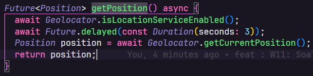

### Langkah 2: Tambah variabel

Tambah variabel ini di `class _LocationScreenState`

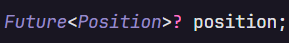

### Langkah 3: Tambah **`initState()`**

Tambah method ini dan set variabel `position`

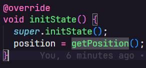

### Langkah 4: Edit method **`build()`**

Ketik kode berikut dan sesuaikan. Kode lama bisa Anda comment atau hapus.

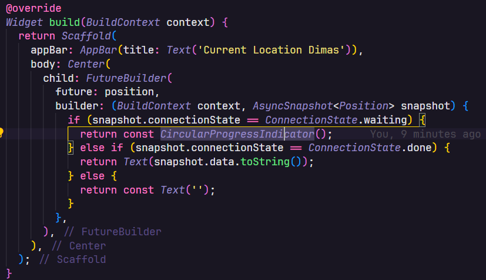


> **Soal 13**
>
> - Apakah ada perbedaan UI dengan praktikum sebelumnya? Mengapa demikian?

**_Jawaban:_**
Secara visual, tidak terdapat perbedaan antarmuka antara praktikum sebelumnya dengan langkah ini. Aplikasi tetap menampilkan animasi loading saat proses pencarian koordinat berlangsung, kemudian menampilkan informasi lokasi setelah data berhasil diperoleh. Hal ini karena perubahan yang dilakukan hanya berfokus pada pengelolaan state di sisi backend, bukan pada desain UI.

Pada praktikum sebelumnya, pembaruan tampilan dilakukan secara manual menggunakan `setState()` dan operator ternary. Sedangkan pada langkah ini digunakan `FutureBuilder`, yang dapat memantau status proses asynchronous secara otomatis, seperti kondisi `waiting` dan `done`, kemudian menampilkan widget yang sesuai. Penggunaan `FutureBuilder` membuat kode menjadi lebih terstruktur, efisien, dan meminimalkan risiko kesalahan dalam pengelolaan state, meskipun tampilan aplikasi tetap sama.

> - Capture hasil praktikum Anda berupa GIF dan lampirkan di README. Lalu lakukan commit dengan pesan "**W11: Soal 13**".
> - Seperti yang Anda lihat, menggunakan FutureBuilder lebih efisien, clean, dan reactive dengan Future bersama UI.

### Langkah 5: Tambah handling error

Tambahkan kode berikut untuk menangani ketika terjadi error. Kemudian hot restart.

```dart
else if (snapshot.connectionState == ConnectionState.done) {
  if (snapshot.hasError) {
     return Text('Something terrible happened!');
  }
  return Text(snapshot.data.toString());
}
```

> **Soal 14**
> - Apakah ada perbedaan UI dengan langkah sebelumnya? Mengapa demikian?

***Jawaban:***
Tampilan UI pada langkah ini masih sama seperti langkah sebelumnya, yaitu menampilkan animasi loading saat proses pengambilan lokasi berlangsung, kemudian berubah menjadi teks koordinat setelah data berhasil diperoleh. Perbedaan utama terlihat ketika terjadi kegagalan dalam proses pengambilan data lokasi.

Pada langkah sebelumnya, error yang terjadi dapat menyebabkan aplikasi mengalami crash atau menampilkan halaman error bawaan karena aplikasi tetap mencoba merender data yang bermasalah atau kosong. Sedangkan pada langkah ini telah ditambahkan pengecekan menggunakan snapshot.hasError, sehingga aplikasi dapat menangani error dengan lebih baik dan menampilkan pesan "Something terrible happened!" pada antarmuka pengguna. Dengan demikian, aplikasi menjadi lebih stabil dan responsif terhadap kegagalan proses asynchronous.

> - Capture hasil praktikum Anda berupa GIF dan lampirkan di README. Lalu lakukan commit dengan pesan "**W11: Soal 14**".

---

## Praktikum 8: Navigation route dengan Future Function

Praktikum kali ini Anda akan melihat manfaat Future untuk Navigator dalam transformasi Route menjadi sebuah function async. Anda akan melakukan push screen baru dan fungsi await menunggu data untuk melakukan update warna background pada screen.

### Langkah 1: Buat file baru **`navigation_first.dart`**
Buatlah file baru ini di project lib Anda.

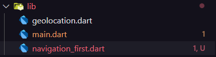

### Langkah 2: Isi kode **`navigation_first.dart`**

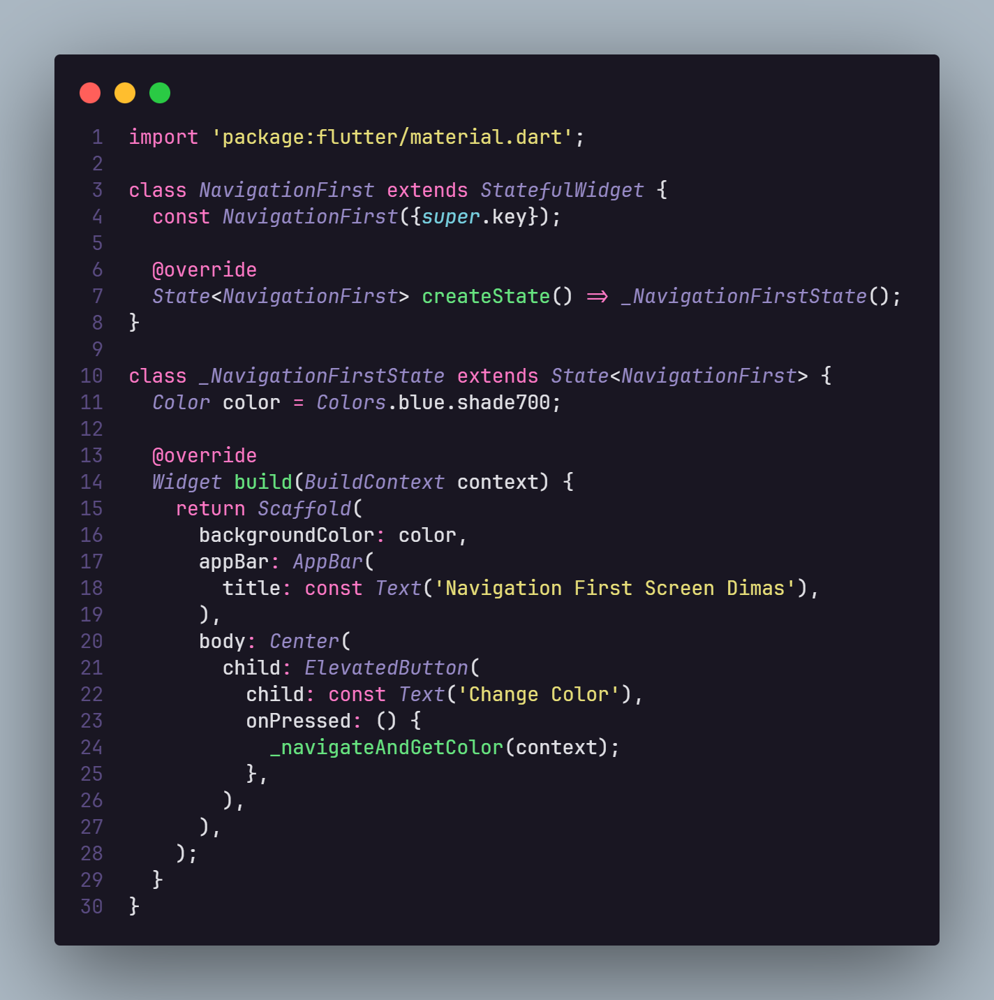

> **Soal 15**
> * Tambahkan **nama panggilan Anda** pada tiap properti `title` sebagai identitas pekerjaan Anda.

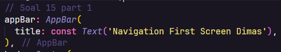

> * Silakan ganti dengan warna tema favorit Anda.

### Langkah 3: Tambah method di **`class _NavigationFirstState`**
Tambahkan method ini.
```dart
Future _navigateAndGetColor(BuildContext context) async {
   color = await Navigator.push(context,
        MaterialPageRoute(builder: (context) => const NavigationSecond()),) ?? Colors.blue;
   setState(() {});
}
```

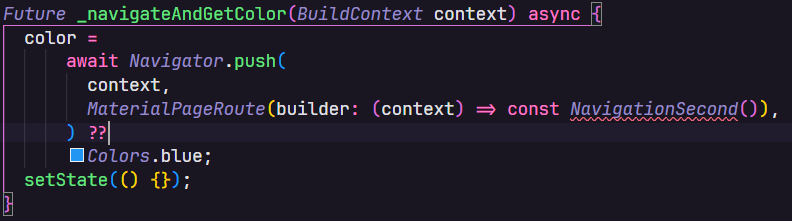

### Langkah 4: Buat file baru **`navigation_second.dart`**
Buat file baru ini di project lib Anda. Silakan jika ingin mengelompokkan view menjadi satu folder dan sesuaikan impor yang dibutuhkan.

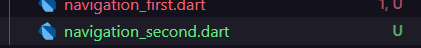

### Langkah 5: Buat class NavigationSecond dengan StatefulWidget

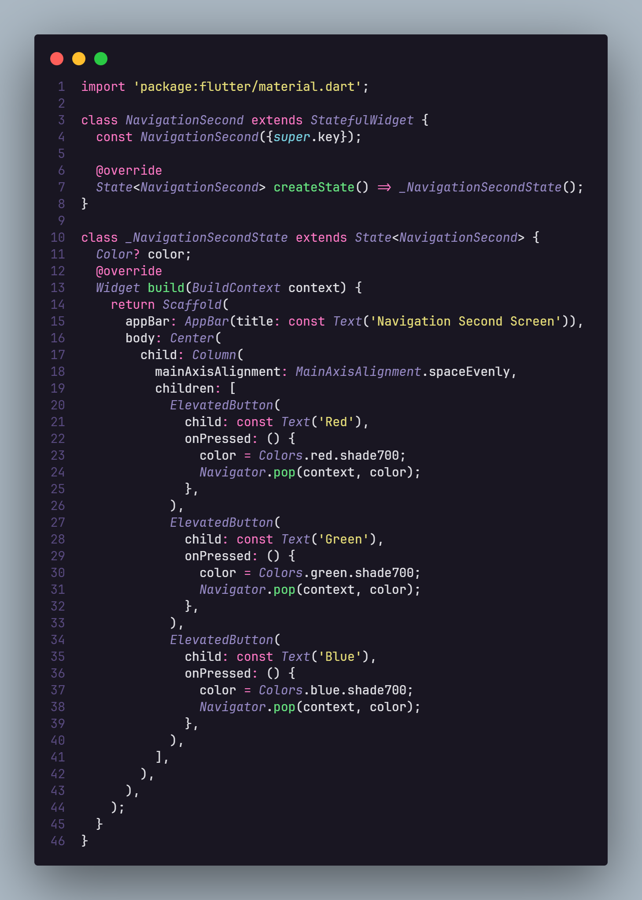

### Langkah 6: Edit **`main.dart`**
Lakukan edit properti home.
```dart
home: const NavigationFirst(),
```

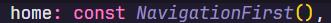

### Langkah 8: Run
Lakukan run, jika terjadi error silakan diperbaiki.

***Terjadi Error:***
> Saat menambahkan variable `Color color` pada class `_NavigationSecondState` error terjadi karena variabel `color` tidak memiliki nilai awal (null), sehingga memicu kesalahan kompilasi. Solusinya adalah dengan menambahkan kata `late` sebelum variabel `color`, menggunakan `?` untuk menandakan bahwa variabel `color` bisa bernilai null, atau memberikan nilai default pada variabel `color`.

> **Soal 16**
> * Cobalah klik setiap button, apa yang terjadi ? Mengapa demikian ?

> ***Jawaban:***
Saat button ditekan, aplikasi berpindah ke layar kedua. Di layar kedua, terdapat tiga buah tombol dengan warna berbeda (merah, kuning, dan hijau). Setelah memilih salah satu warna, aplikasi kembali ke layar pertama, dan warna background layar pertama berubah sesuai dengan warna yang dipilih pada layar kedua.

Perilaku ini terjadi karena method `_navigateAndGetColor` menggunakan `await Navigator.push()`. Ini berarti eksekusi kode pada method tersebut akan berhenti sementara (pause) saat berpindah ke layar kedua. Saat pengguna menekan salah satu tombol di layar kedua, nilai yang dikembalikan (warna yang dipilih) disimpan dalam variabel `color`. Setelah nilai diterima, eksekusi method dilanjutkan, dan `setState(() {})` dipanggil untuk memperbarui tampilan layar pertama dengan warna baru yang diterima.

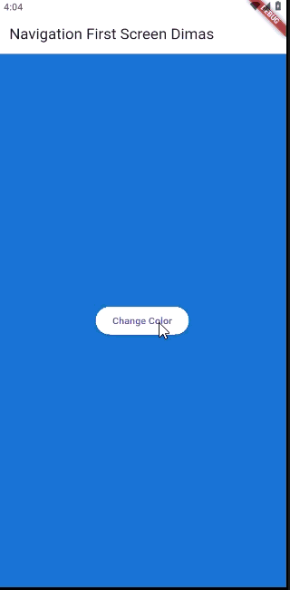

> * Gantilah 3 warna pada langkah 5 dengan warna favorit Anda!

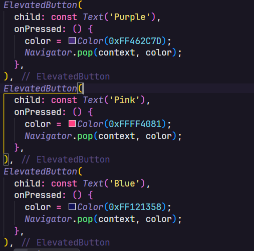;


> * Capture hasil praktikum Anda berupa GIF dan lampirkan di README. Lalu lakukan commit dengan pesan "**W11: Soal 16**".